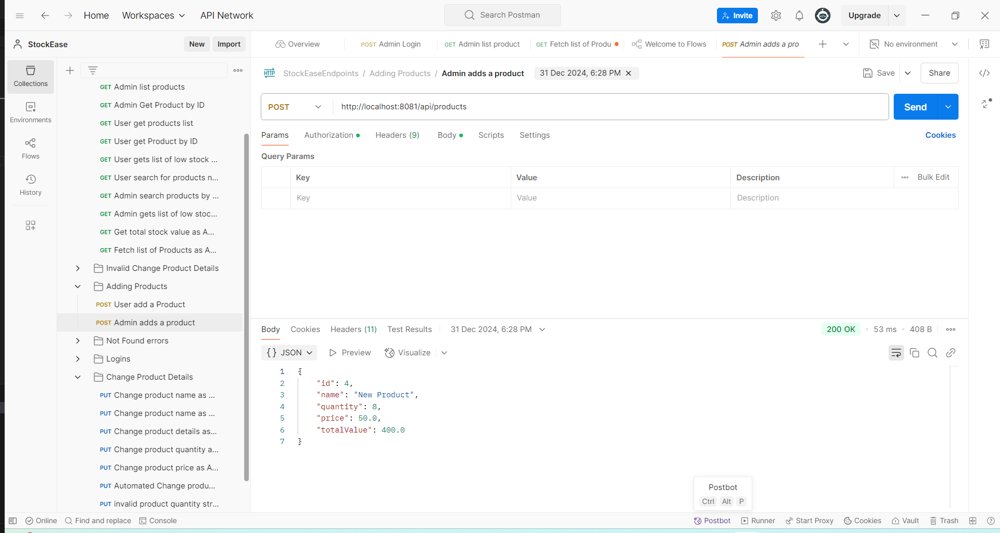
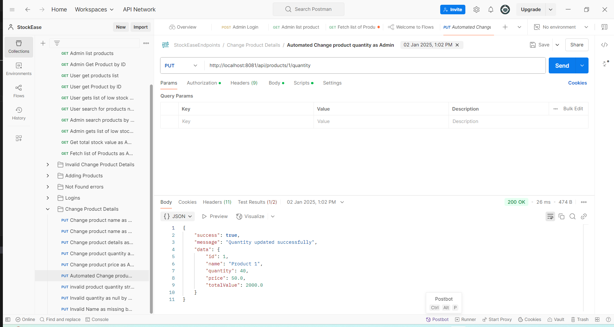
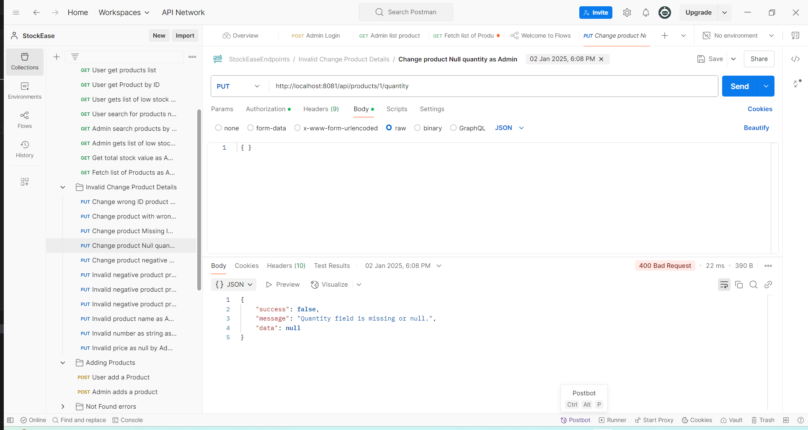

# StockEase Backend

## About
StockEase is a backend service for managing stock-related data efficiently. Built with **Spring Boot** and integrated with **PostgreSQL**, this project showcases authentication, role-based access control, and CRUD operations for products. 

## 📖 Table of Contents
- [📌 About](#-about)
- [🚀 Features](#-features)
- [🖼️ Screenshots](#-screenshots)
- [🛠️ Installation](#-installation)
- [📌 Usage](#-usage)
- [🧑‍💻 Available Scripts](#-available-scripts)
- [⚙️ Technologies](#-technologies)
- [🔗 API Integration](#-api-integration)
- [🤝 Contributing](#-contributing)

## 🚀 Features
- ✅ **User Authentication with JWT** 🔑
- ✅ **Role-Based Access Control (Admin & User)** 👥
- ✅ **CRUD Operations for Products** 📝
- ✅ **Paginated Product Fetching** 📑
- ✅ **Total Stock Value Calculation** 💰
- ✅ **Industry-Standard Testing with Mockito** 🧪

# Screenshots
Here are some screenshots from Postman showing some API answers:

### Example API Response in Postman:

### Adding a Product


### Updating Product Quantity



### Example of a missing input from the user.



## 🛠️ Installation
### **1. Clone the Repository**
```bash
git clone https://github.com/yourusername/StockEase.git
cd StockEase
```

### **2. Set Up Database Credentials**
Create an `application.properties` file inside `src/main/resources/` and configure it:
```properties
spring.datasource.url=jdbc:postgresql://DATABASE_HOST/DATABASE_NAME
spring.datasource.username=YOUR_DB_USER
spring.datasource.password=YOUR_DB_PASSWORD
```
Replace placeholders with actual values.

### **3. Run the Application**
Use Maven to build and start the application:
```bash
mvn spring-boot:run
```

## 📌 Usage
This portfolio backend is designed to:
- **Handle stock-related data** including adding, updating, deleting, and fetching product details.
- **Provide secured endpoints** with JWT authentication.
- **Manage user roles** to restrict access to admin and user functionalities.
- **Integrate with a frontend application** for full-stack functionality.

## 🧑‍💻 Available Scripts
- `mvn spring-boot:run` - Runs the application.
- `mvn test` - Runs unit tests with **Mockito**.
- `mvn package` - Builds the application.

##  Technologies ⚙️
- **Spring Boot**
- **Java**
- **Spring Security** 
- **PostgreSQL** 
- **JWT** (JSON Web Token) 
- **Mockito** 
- **Jakarta Persistence API (JPA)** 
- Jakarta Validation API (Data Validation)
- **Hibernate Core** (ORM Implementation)
- Hibernate Validator 
- **Lombok** 
- Spring Boot DevTools 
- Jakarta Servlet API (HTTP Request Handling)
- **REST API** 
- **Maven** (Build Tool)

## Documentation

## 🔗 API Integration
This backend provides a **REST API** for interacting with stock data. You can find the full API documentation here:

📌 **[Index API Documentation](src/main/docs/api.md)**

## 🤝 Contributing
Contributions are welcome! If you'd like to improve this project, feel free to:
- Fork the repository
- Create a new branch
- Make your changes
- Submit a pull request

For any issues or improvements, please open a GitHub issue. 🚀


