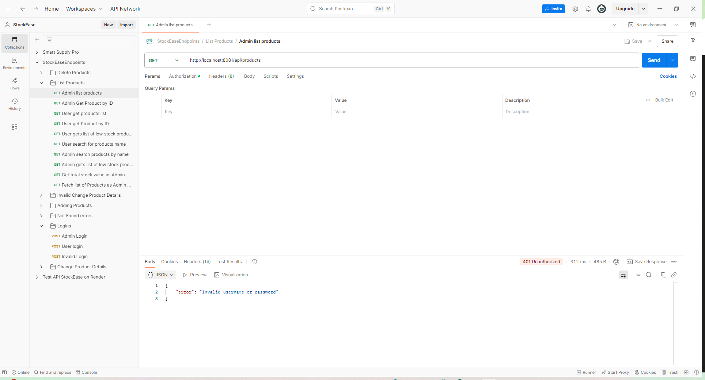
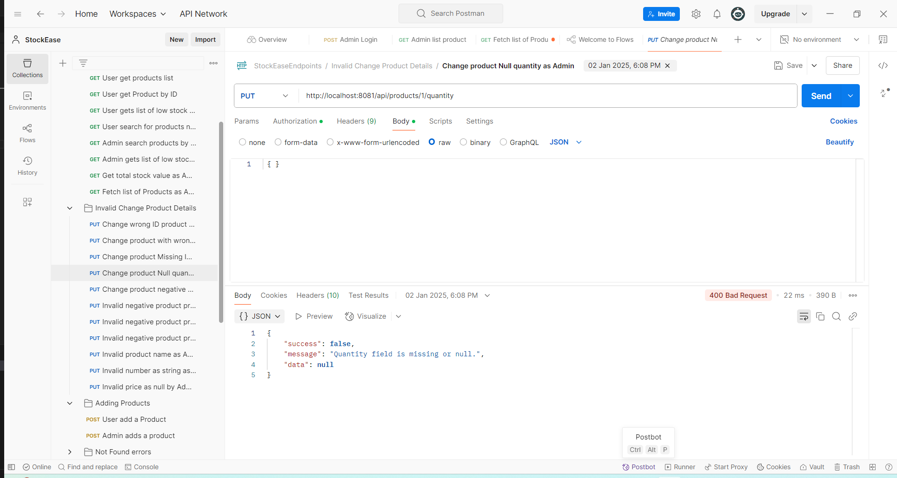

# StockEase Backend

**Enterprise Inventory Management System — Java Spring Boot & PostgreSQL**

Managing inventory manually in manufacturing environments leads to stock discrepancies, delayed decisions, and lost revenue. StockEase is a production-ready REST API built to replace that with structured, role-controlled access to real-time stock data — backed by JWT authentication, Flyway-managed schema versioning, and a full CI/CD pipeline. Built to enterprise standards as a portfolio project, with complete architecture documentation, OpenAPI specifications, and automated test coverage.

---

## 📖 Table of Contents

1. [Technical Highlights](#technical-highlights)
2. [Screenshots](#screenshots)
3. [Tech Stack](#tech-stack)
4. [API Documentation](#api-documentation)
5. [Architecture & Documentation](#architecture--documentation)
6. [Testing & Coverage](#testing--coverage)
7. [CI/CD](#cicd)
8. [Available Scripts](#available-scripts)
9. [Deployment](#deployment)
10. [Contributing](#contributing)

---

## ⚙️ Technical Highlights

- **Flyway for schema versioning** instead of Hibernate DDL auto — gives full, auditable control over production migrations with no surprises on deploy
- **Stateless JWT authentication** — no server-side session storage; tokens are validated on every request via a custom `JwtFilter`, keeping the service horizontally scalable
- **Role-based access control** with Spring Security `@PreAuthorize` — Admin and User roles enforced at the method level, not just at the route level
- **Global exception handling** via `@RestControllerAdvice` — all error responses are structured and consistent; no try/catch blocks in controllers
- **Bean Validation on DTOs** with `@Valid` — input validation is declared at the DTO layer, keeping controllers clean
- **Custom `FlywayConfiguration`** — Flyway is wired manually to run before JPA context initialization, preventing startup failures on a cold database

---

## 📸 Screenshots

### Authentication Flow — 401 Unauthorized vs. 200 OK

### Validation Error Response

---

## 🧰 Tech Stack

**Backend**
- Java 17 with Spring Boot 3.x
- Spring Security — JWT authentication and role-based access control
- PostgreSQL — data persistence via JPA/Hibernate and Flyway migrations
- REST APIs documented via OpenAPI YAML specifications
- Docker — multi-stage containerized builds
- JUnit 5 + Mockito — unit and integration testing
- JaCoCo — code coverage reporting

**DevOps & Infrastructure**
- GitHub Actions — automated CI/CD pipelines
- Koyeb — serverless container deployment
- Neon — managed PostgreSQL (production)
- GitHub Pages — architecture documentation and coverage reporting

---

## 📡 API Documentation

- [Interactive API Reference](https://keglev.github.io/stockease/api-docs.html) — full OpenAPI specification with live endpoint explorer
- [Authentication Endpoints](https://keglev.github.io/stockease/api-docs.html#tag/Authentication) — login, registration, token handling
- [Product Management Endpoints](https://keglev.github.io/stockease/api-docs.html#tag/Products) — CRUD operations, pagination, filtering

---

## 🏗️ Architecture & Documentation

- [Architecture Overview](https://keglev.github.io/stockease/) — service catalog, layer structure, and design patterns
- [Security Architecture](https://keglev.github.io/stockease/architecture/security.html) — JWT flow, filter chain, and role enforcement
- [Deployment & Infrastructure](https://keglev.github.io/stockease/architecture/deployment/infrastructure.html) — environment configuration and deployment strategy

---

## 🧪 Testing & Coverage

- JUnit 5 with Mockito for unit testing
- Spring MockMvc for controller layer testing with Spring Security integration
- Testcontainers for integration testing with a real PostgreSQL instance
- JaCoCo for code coverage analysis

📚 [Testing Architecture Documentation](https://keglev.github.io/stockease/architecture/testing-architecture.html)

📊 [Coverage Report (JaCoCo)](https://keglev.github.io/stockease/coverage/index.html)

---

## ⚙️ CI/CD

Each push to `main` triggers the full pipeline:

- Maven build and test suite execution with coverage reporting
- Docker image build and push to registry
- Automated deployment to Koyeb
- Health check verification before marking the deployment live

📖 [CI/CD Pipeline Documentation](https://keglev.github.io/stockease/architecture/deployment/ci-pipeline.html)

---

## 🧑‍💻 Available Scripts

- `./mvnw spring-boot:run` — runs the application in development mode
- `./mvnw test` — executes the complete test suite with coverage
- `./mvnw verify` — builds and verifies the application package
- `./mvnw clean package` — creates production-ready JAR file

---

## 🚀 Deployment

StockEase backend is deployed to Koyeb using a Docker container built by GitHub Actions. The production database is hosted on Neon (managed PostgreSQL).

🌍 **Live Application (Frontend):** [https://stockeasefrontend.vercel.app](https://stockeasefrontend.vercel.app)

---

## 🤝 Contributing

Contributions are welcome. To contribute:

1. Fork the repository
2. Create a feature branch
3. Make your changes
4. Submit a pull request

For issues or feature requests, [open a GitHub issue](https://github.com/Keglev/stockease/issues).

---

**Repository:** [Keglev/stockease](https://github.com/Keglev/stockease)
