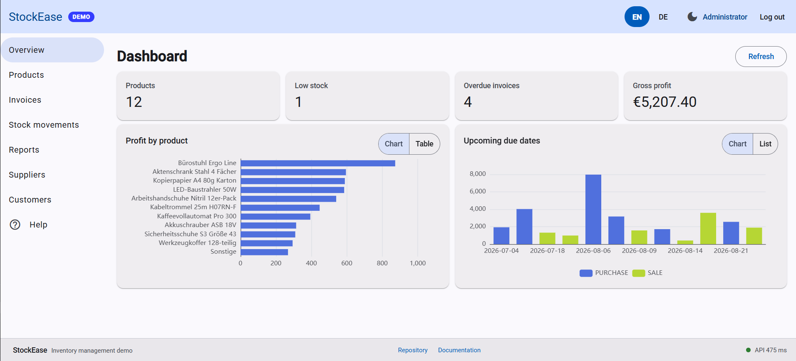
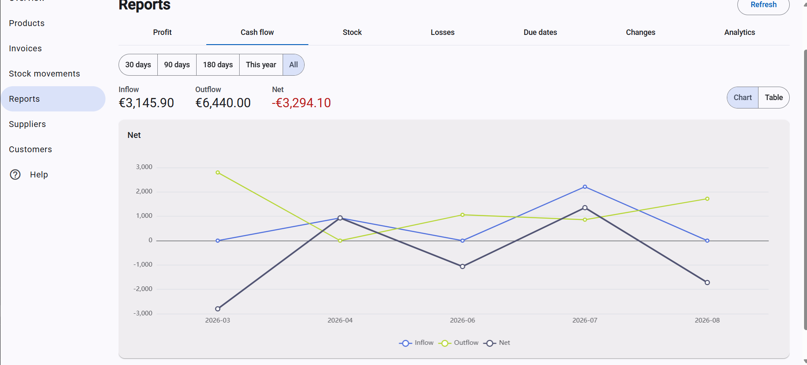

# StockEase

**Inventory management for a small trading business - Spring Boot backend, Angular frontend, PostgreSQL.**

## About

**StockEase** is the technical name of this repository and its codebase. The product ships to users as **Bestandskontrolle**, live at **[bestandskontrolle.vercel.app](https://bestandskontrolle.vercel.app)**.

It is a portfolio project built to the standards of a commercial codebase: enforced module boundaries, migration-owned schema, an append-only booking model, bilingual documentation, and a test suite that proves the invariants rather than reporting a number.

## Description

Managing inventory by hand produces stock discrepancies, late decisions, and invoices nobody can reconcile. StockEase replaces that with a full merchandise cycle: product master data, suppliers and customers, purchase and sales invoices, the stock movements those invoices produce, a change audit trail, and read-only reporting over all of it.

The backend is a modular monolith with boundaries enforced by a test on every build. Stock is never written directly - closing an invoice publishes an event, and a synchronous listener books the movements inside the same transaction, so a sale that exceeds stock rolls back the entire close. The frontend is an Angular application in production, bilingual in English and German, with the interface language switching at runtime.

**Last updated:** August 2026 - **Status:** backend and frontend in production; documentation complete for both tiers.

## Contents

1. [Screenshots](#screenshots)
2. [Project status](#project-status)
3. [Features](#features)
4. [Security](#security)
5. [Documentation](#documentation)
6. [Testing and code quality](#testing-and-code-quality)
7. [AI-assisted development](#ai-assisted-development)
8. [Tech stack](#tech-stack)
9. [CI/CD](#cicd)
10. [Available scripts](#available-scripts)
11. [Deployment](#deployment)
12. [License](#license)

## Screenshots

**Dashboard** - headline figures and two report visualizations.

**Cash flow report** - payment-basis inflow and outflow over a selected period.

Both screens exist in English and German, light and dark. The full set is on the [landing page](https://bestandskontrolle.vercel.app).

## Project status

**Complete and in production**

- [x] Domain model, service layer and enforced module boundaries
- [x] Purchase and sales invoicing with the full lifecycle
- [x] Event-driven stock booking, with rollback proven by integration test
- [x] Change audit trail and read-only reporting
- [x] Stateless JWT authentication with role-based access control
- [x] Angular frontend covering every domain area, bilingual EN/DE
- [x] arc42 architecture documentation for both tiers, plus 43 decision records
- [x] CI gating both suites, coverage thresholds, and an i18n drift check
- [x] Every operator-facing refusal carries a machine-readable code and renders in the reader's language - 50 codes across 7 exception families (ADR 041)
- [x] Automated deployment for backend, frontend and documentation

## Features

- **Products** - master data with SKU and purchase price, soft delete with restore, and a per-product change history.
- **Suppliers and customers** - registers with contact details, deletion vetoed while an open invoice references them.
- **Invoices** - purchase and sales documents with an open/closed/returned lifecycle. Never edited: corrections are deletion while open, or a return once closed.
- **Stock movements** - an append-only ledger. Stock enters only by closing a purchase invoice; losses are recorded with a reason from a fixed taxonomy.
- **Reports** - profit by product and supplier, cash flow on a payment basis, stock value and history, losses by remark, due dates and overdue exposure, and a change log. Every table exports to CSV in the reader's own number format.
- **Bilingual interface** - English and German, switched at runtime without a reload, with dates and currency formatted per reader preference.
- **Demo access** - one-click entry as administrator or user, against data that resets weekly.

## Security

- **Stateless JWT** signed with HMAC-SHA256, no server-side session, two-hour expiry chosen to bound the window in which a role changed in the database can outlive the token that was minted from the old one.
- **Role-based access control** with two roles, enforced by 48 method-level authorization checks across 52 endpoints rather than by URL patterns alone.
- **BCrypt** password hashing; the seeded administrator was removed by migration once demo accounts existed.
- **A written threat model.** Token storage in the browser is a decision with its exposure stated, its risks accepted for a demo whose data resets weekly, and the production path documented - see the decision record on client token storage.
- **Idle sign-out** after 30 minutes with a warning, landing on the same destination a server-side rejection uses.

## Documentation

- **[Architecture site](https://keglev.github.io/stockease/)** - arc42 documentation for both tiers, module reference, and 40 Architecture Decision Records. Backend entry pages are bilingual EN/DE.
- **[Backend API reference](https://keglev.github.io/stockease/backend/api/index.html)** - the REST contract, generated from the OpenAPI specification by Redocly and published by CI. Neither the specification nor a Swagger UI is generated from code; ADR 038 records why.
- **[OpenAPI specification](docs/backend/api/openapi.yaml)** - the document itself, for readers who want to consume the contract rather than read it: it generates the frontend's types and is what the reference above is built from.
- **[Backend coverage report](https://keglev.github.io/stockease/backend/coverage/index.html)** - JaCoCo, republished by CI on every run that changes it.
- **[Frontend coverage report](https://keglev.github.io/stockease/frontend/coverage/index.html)** - Vitest with V8 instrumentation.
- **[Frontend API reference](https://keglev.github.io/stockease/frontend/api/index.html)** - TypeDoc over the Angular sources.
- [Frontend source tree](frontend/README.md) - how `core/`, `shared/`, `features/` and the i18n sources are laid out.

## Testing and code quality

**Backend** - 658 test methods across 120 files, combining unit tests, Spring slices, and integration tests against real PostgreSQL through Testcontainers rather than an in-memory substitute. Module boundaries are verified on every build; a violation fails CI.

**Frontend** - 1033 tests across 95 files under Vitest, at 99.1% statement coverage. Component specs assert on rendered output through the real template, and dependencies are substituted at injection seams rather than by mocking modules.

Coverage thresholds gate both suites as regression floors set below what the suites achieve, so they fail on genuine loss rather than on an honest refactor. A separate check re-assembles the translation bundles from their authored sources and refuses any difference, which makes a hand-edited artifact impossible to merge.

## AI-assisted development

This project is developed with AI assistance, in a division of labour worth stating plainly.

Two tools are used. A chat-based model acts as architect and reviewer: it is where designs are argued, alternatives rejected, and specifications written. An editor-integrated agent executes code changes against those written specifications and reports back what it did and where it deviated.

Every architecture and domain decision is the owner's. The owner writes the standards the code is held to, reviews every diff, and merges every pull request. The agent implements to a specification and does not decide scope; where the specification turns out to be wrong about the code, it stops and says so rather than forcing the change.

That clause is exercised, not decorative. PR #309 restored three applied migrations after an edit to their comments broke Flyway's checksum validation in production; PR #310's CI guard had to be rewritten when its proof turned out to have run in a full clone where the runner's shallow one fails; PR #312 shipped four corrections instead of five because the fifth figure the specification supplied did not survive re-measurement. Each is in the pull request record with the stop and the reason.

The controls are what make this verifiable rather than a claim. Every change arrives as a reviewed pull request. CI gates the full suite and coverage thresholds on both tiers, so a regression cannot be merged. A new test is not trusted until it has been observed to fail for the right reason. Existing test assertions are not changed as a side effect of other work; changing one is its own decision, recorded as such.

The commit history and the pull request record are the evidence. Both are public, and each pull request states what was verified, what was measured, and what was left undone.

## Tech stack

**Backend**

- Java 21, Spring Boot 4.x, Spring Modulith
- Spring Security (JWT), Spring Data JPA, Flyway
- PostgreSQL 16 (Supabase in production)
- JUnit 5, Mockito, Testcontainers, JaCoCo
- Maven, multi-stage Docker build

**Frontend**

- TypeScript 6, Angular 22 - standalone components and signals, no NgModules
- Angular Material and CDK, themed with Material 3 system tokens
- Apache ECharts, used directly
- ngx-translate for runtime translation
- Vitest with jsdom, ESLint, TypeDoc

**Infrastructure**

- GitHub Actions - test, deploy and documentation pipelines
- Koyeb for the containerized backend; Vercel CDN for the frontend
- GitHub Pages for documentation and coverage reports

## CI/CD

Every pull request runs a required check under one shared job name, so whichever tier a change touches reports under the name branch protection demands. Backend changes run the full suite against real PostgreSQL; frontend changes run lint, an i18n drift check, a production build, and the suite with coverage; documentation changes build the site and run a link checker.

The backend check also refuses any pull request that modifies, deletes or renames a migration the base branch already carries. Flyway checksums each migration over the whole file, comments included, and validates those checksums at startup against what it recorded when the migration ran - so editing an applied migration, even only its comments, stops the application booting. New migrations are always allowed; changing an old one is the thing that has to be caught before merge rather than at deploy.

On merge to `main`, the test workflows hand off. The backend deploy triggers a Koyeb redeploy and polls until the service reports healthy. The frontend deploy builds the bundle on the runner and publishes it prebuilt, so what ships is exactly the artifact that passed the gate. The documentation pipeline rebuilds the site and publishes it with whichever coverage reports that run produced.

## Available scripts

Backend, from `backend/`:

    ./mvnw test                 # full suite; requires Docker for Testcontainers
    ./mvnw spring-boot:run      # requires PostgreSQL connection details in the environment
    ./mvnw clean package        # production JAR

Frontend, from `frontend/`:

    npm start                   # dev server on http://localhost:4200
    npm run test:coverage       # suite with coverage, non-interactive
    npm run lint                # ESLint over TypeScript and templates
    npm run i18n:build          # assemble the shipped translation bundles
    npm run i18n:check          # verify the shipped bundles match their sources

Documentation, from the repository root:

    bash .github/scripts/docs/build-docs.sh .    # requires pandoc and the Redocly CLI

## Deployment

There is one environment: production. Pull requests get the full check suite and no deployment; there is no staging tier, which is an accepted free-tier constraint for a system whose data resets weekly.

- **Backend** - Docker image built by Koyeb from the repository's Dockerfile, fronted by a health probe.
- **Frontend** - static bundle on Vercel's CDN, with a rewrite that lets client-side routing survive a direct visit to a deep link.
- **Database** - PostgreSQL on Supabase, its schema owned by 23 Flyway migrations (V1-V23) with Hibernate in validate-only mode.
- **Documentation** - GitHub Pages, published from a build artifact rather than a committed site.

## License

Released under the MIT License. See [LICENSE](LICENSE).

---

This is a portfolio project, but issues and suggestions are welcome via [GitHub issues](https://github.com/Keglev/stockease/issues).
