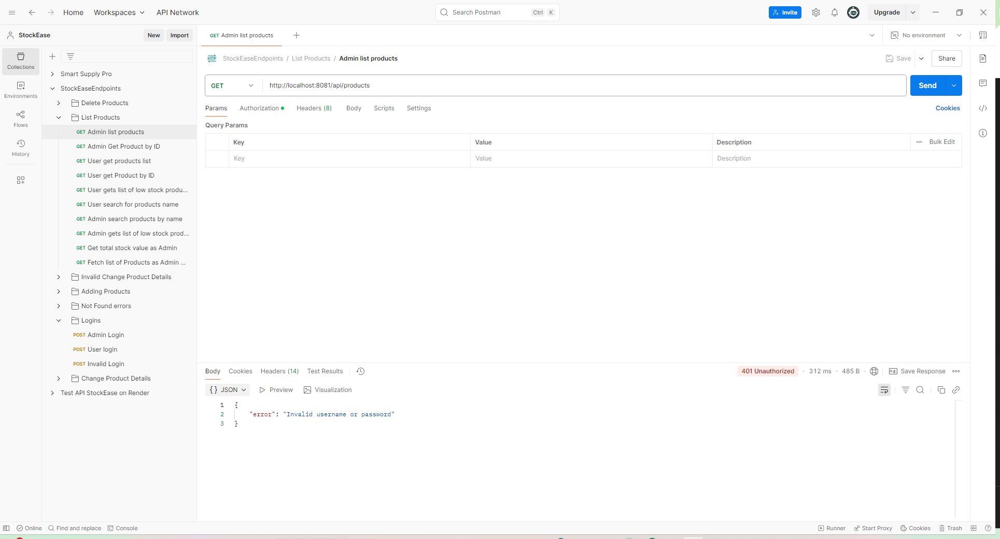
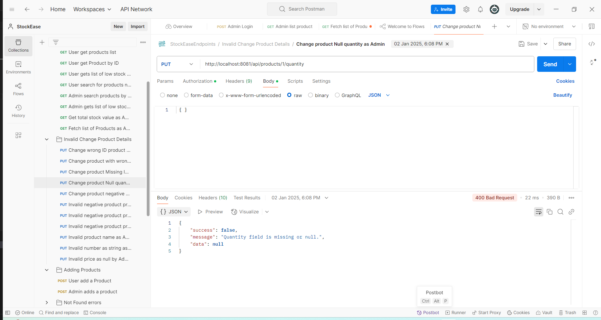

# StockEase

**Enterprise Inventory Management System - Java Spring Boot, Angular (in progress), PostgreSQL**

**StockEase** is the technical name of this repository and its codebase. The product ships to users as **Bestandskontrolle**, live at **[bestandskontrolle.vercel.app](https://bestandskontrolle.vercel.app)**.

Managing inventory manually in manufacturing environments leads to stock discrepancies, delayed decisions, and lost revenue. StockEase replaces that with a production-grade backend for products, suppliers, customers, purchase and sales invoicing, stock movements, and audit trails - built as a modular monolith with strict module boundaries, event-driven stock booking, and a fully documented architecture. Developed to enterprise standards as a portfolio project, with bilingual (EN/DE) arc42 documentation, Architecture Decision Records, and automated test coverage.

## Repository Structure

This is a monorepo:

    backend/    Spring Boot application (Java 21, Maven)
    frontend/   Angular application (rewrite in progress)
    docs/       Architecture documentation source (arc42, ADRs, EN/DE)

## Project Status

- **Backend:** production-ready and deployed. Domain model, service layer, security, and reporting are complete; the extended REST API layer is the current work in progress.
- **Frontend:** an Angular rewrite is in development. The previous React implementation remains available as a [frozen live demo](https://stockeasefrontend.vercel.app) from the archived legacy repository.
- **Documentation:** the full architecture site is live; the interactive API reference is being regenerated alongside the new API layer.

## Technical Highlights

- **Modular monolith with Spring Modulith** - eight modules with compiler- and test-enforced boundaries; cross-module communication via exposed services and application events, verified by modularity tests
- **Event-driven stock booking** - closing an invoice is the booking act: a synchronous listener records stock movements inside the same transaction, so insufficient stock rolls back the entire close
- **Flyway as the single schema owner** - Hibernate runs in validate-only mode; every schema change is a versioned, auditable migration (V1-V14), including PostgreSQL partial unique indexes for soft-delete-aware uniqueness
- **Testcontainers on real PostgreSQL** - the test suite runs against the same database engine as production, not an in-memory substitute
- **Stateless JWT authentication with role-based access control** - Spring Security with method-level authorization
- **Immutable business documents** - invoices are never edited; corrections flow through deletion (while open) or the return process (after closing), with a full audit trail

## Tech Stack

**Backend**
- Java 21, Spring Boot 4.x, Spring Modulith
- Spring Security (JWT), Spring Data JPA, Flyway
- PostgreSQL (Supabase in production)
- JUnit 5, Mockito, Testcontainers, JaCoCo
- Docker multi-stage build, Maven

**Frontend**
- Angular (in progress)

**DevOps and Infrastructure**
- GitHub Actions (test, deploy, and documentation pipelines)
- Koyeb (containerized backend deployment)
- GitHub Pages (documentation and coverage reporting)

## Documentation

- [Architecture site (EN/DE)](https://keglev.github.io/stockease/) - arc42 documentation, module reference, Architecture Decision Records, and diagrams
- [Test coverage report](https://keglev.github.io/stockease/backend/coverage/index.html) - JaCoCo, published from CI

## Screenshots

### Authentication Flow - 401 Unauthorized vs. 200 OK

### Validation Error Response

## Running Locally

    cd backend
    ./mvnw test                # full test suite (requires Docker for Testcontainers)
    ./mvnw spring-boot:run     # requires a PostgreSQL connection via environment variables
    ./mvnw clean package       # production JAR

## CI/CD

Every pull request runs the full test suite as a required check. On merge to main, the test workflow hands off to a guarded deploy workflow (Koyeb, with health verification) and to the documentation pipeline, which rebuilds and publishes the architecture site and coverage report.

## Contributing

This is a portfolio project, but issues and suggestions are welcome via [GitHub issues](https://github.com/Keglev/stockease/issues).
