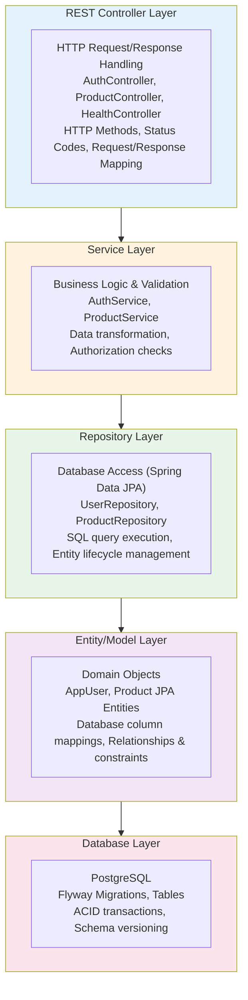

# Backend Architecture - StockEase

## Overview

The StockEase backend is an enterprise-grade REST API built with Spring Boot 3.5.7, providing secure inventory management capabilities with comprehensive testing coverage and containerized deployment.

**Tech Stack**: Spring Boot 3.5.7 • Java 17 LTS • PostgreSQL 17.5 • Spring Security • JWT  
**Deployment**: Koyeb (https://stockease-backend-production.koyeb.app)  
**API Spec**: OpenAPI 3.0 via SpringDoc (/v3/api-docs)

---

## Layered Architecture

The backend follows a **three-tier layered architecture** with clear separation of concerns:



---

## Request Lifecycle

```mermaid
graph TD
    A[HTTP Request] --> B[Spring DispatcherServlet]
    B --> C[Security Filter Chain]
    
    C --> C1[CorsFilter: CORS validation]
    C1 --> C2[SecurityContextPersistenceFilter: JWT parsing]
    C2 --> C3[JwtAuthenticationFilter: Token validation]
    
    C3 --> D{Authentication successful?}
    D -->|Yes| E[Route to @RequestMapping handler]
    D -->|No| X[Return 401 Unauthorized]
    
    E --> F[Controller Method Execution]
    F --> F1[@PathVariable & @RequestParam binding]
    F1 --> F2[@RequestBody deserialization JSON → DTO]
    F2 --> F3[Spring Validation @Valid]
    
    F3 --> G[Invoke Service Method]
    G --> G1[Business logic execution]
    G1 --> G2[Authorization checks @PreAuthorize]
    G2 --> G3[Data validation]
    
    G3 --> H[Invoke Repository Method]
    H --> H1[Query execution]
    H1 --> H2[Entity lazy/eager loading]
    H2 --> H3[Transaction management]
    
    H3 --> I[Service processes results]
    I --> I1[Transform entities to DTOs]
    I1 --> I2[Handle errors & exceptions]
    I2 --> I3[Return response object]
    
    I3 --> J[Controller builds HTTP response]
    J --> J1[ResponseEntity construction]
    J1 --> J2[HTTP status code assignment]
    J2 --> J3[Header setup]
    
    J3 --> K[Response Serialization]
    K --> K1[DTO → JSON conversion Jackson]
    K1 --> K2[Content-Type application/json]
    
    K2 --> L[HTTP Response with Status & Body]
    
    style A fill:#e3f2fd
    style L fill:#c8e6c9
    style X fill:#ffcdd2
```

---

## Project Structure

```
backend/
├── src/main/java/com/stocks/stockease/
│   ├── controller/                   # REST Endpoints (HTTP Layer)
│   │   ├── AuthController.java
│   │   ├── ProductController.java
│   │   └── HealthController.java
│   │
│   ├── service/                      # Business Logic Layer
│   │   ├── AuthService.java
│   │   ├── ProductService.java
│   │   └── HealthService.java
│   │
│   ├── repository/                   # Data Access Layer (Spring Data JPA)
│   │   ├── UserRepository.java
│   │   └── ProductRepository.java
│   │
│   ├── model/                        # Entity Classes (JPA Entities)
│   │   ├── AppUser.java
│   │   ├── Product.java
│   │   └── BaseEntity.java
│   │
│   ├── dto/                          # Data Transfer Objects
│   │   ├── AuthDTO.java
│   │   ├── ProductDTO.java
│   │   └── ErrorResponseDTO.java
│   │
│   ├── security/                     # Security Configuration & JWT
│   │   ├── JwtTokenProvider.java
│   │   ├── SecurityConfig.java
│   │   ├── JwtAuthenticationFilter.java
│   │   └── CustomAuthenticationEntryPoint.java
│   │
│   ├── exception/                    # Custom Exceptions
│   │   ├── ResourceNotFoundException.java
│   │   ├── UnauthorizedException.java
│   │   ├── ValidationException.java
│   │   └── GlobalExceptionHandler.java
│   │
│   ├── config/                       # Configuration Classes
│   │   ├── CorsConfig.java
│   │   ├── JpaConfig.java
│   │   └── OpenApiConfig.java
│   │
│   └── StockEaseApplication.java     # Spring Boot Entry Point
│
├── src/main/resources/
│   ├── application.properties        # Default configuration
│   ├── application-dev.properties    # Development profile
│   ├── application-prod.properties   # Production profile
│   └── db/migration/                 # Flyway migrations
│       ├── V1__baseline.sql
│       └── V2__create_schema.sql
│
├── src/test/java/com/stocks/stockease/
│   ├── controller/
│   │   ├── AuthControllerTest.java
│   │   ├── ProductControllerTest.java
│   │   ├── ProductCreateControllerTest.java
│   │   ├── ProductUpdateControllerTest.java
│   │   ├── ProductDeleteControllerTest.java
│   │   ├── ProductFetchControllerTest.java
│   │   ├── ProductPaginationControllerTest.java
│   │   └── ProductInvalidUpdateControllerTest.java
│   │
│   └── (Corresponding service/repository tests)
│
├── src/test/resources/
│   ├── application-test.properties   # Test configuration
│   └── test-data.sql                 # Test fixtures
│
├── pom.xml                           # Maven configuration
├── Dockerfile                        # Container image
├── mvnw / mvnw.cmd                   # Maven wrapper
└── README.md
```

---

## Controller Layer

### AuthController
```java
@RestController
@RequestMapping("/api/auth")
@CrossOrigin(origins = "...", maxAge = 3600)
public class AuthController {
    
    @PostMapping("/register")
    public ResponseEntity<?> register(@Valid @RequestBody RegisterRequest req) {
        // Create new user
        // Encrypt password with BCrypt
        // Save to database
        // Return user DTO
    }
    
    @PostMapping("/login")
    public ResponseEntity<?> login(@Valid @RequestBody LoginRequest req) {
        // Authenticate user
        // Generate JWT token
        // Return token + user info
    }
    
    @GetMapping("/validate")
    @PreAuthorize("isAuthenticated()")
    public ResponseEntity<?> validateToken() {
        // Return current user info if token valid
    }
}
```

**Endpoints**:
- `POST /api/auth/register` - Register new user
- `POST /api/auth/login` - Authenticate and get JWT
- `GET /api/auth/validate` - Validate current token

### ProductController
```java
@RestController
@RequestMapping("/api/products")
@CrossOrigin(origins = "...", maxAge = 3600)
public class ProductController {
    
    @GetMapping
    @PreAuthorize("hasAnyRole('ADMIN', 'USER')")
    public ResponseEntity<List<ProductDTO>> getAllProducts() {
        // Return all products
    }
    
    @GetMapping("/paged")
    public ResponseEntity<Page<ProductDTO>> getProductsPaged(
        @RequestParam(defaultValue = "0") int page,
        @RequestParam(defaultValue = "10") int size) {
        // Return paginated products
    }
    
    @GetMapping("/{id}")
    public ResponseEntity<ProductDTO> getProductById(@PathVariable Long id) {
        // Return single product or 404
    }
    
    @PostMapping
    @PreAuthorize("hasRole('ADMIN')")
    public ResponseEntity<ProductDTO> createProduct(
        @Valid @RequestBody CreateProductRequest req) {
        // Create product (Admin only)
    }
    
    @PutMapping("/{id}")
    @PreAuthorize("hasRole('ADMIN')")
    public ResponseEntity<ProductDTO> updateProduct(
        @PathVariable Long id,
        @Valid @RequestBody UpdateProductRequest req) {
        // Update product (Admin only)
    }
    
    @DeleteMapping("/{id}")
    @PreAuthorize("hasRole('ADMIN')")
    public ResponseEntity<?> deleteProduct(@PathVariable Long id) {
        // Delete product (Admin only)
    }
}
```

**Endpoints**:
- `GET /api/products` - List all products
- `GET /api/products/paged` - Paginated list
- `GET /api/products/{id}` - Get single product
- `POST /api/products` - Create (Admin)
- `PUT /api/products/{id}` - Update (Admin)
- `DELETE /api/products/{id}` - Delete (Admin)

### HealthController
```java
@RestController
@RequestMapping("/api/health")
public class HealthController {
    
    @GetMapping
    public ResponseEntity<HealthStatus> health() {
        // Check database connectivity
        // Return UP/DOWN status
    }
}
```

---

## Service Layer

### AuthService
```java
@Service
public class AuthService {
    
    public UserDTO register(RegisterRequest request) {
        // Validate username not taken
        if (userRepository.existsByUsername(request.getUsername())) {
            throw new ValidationException("Username already exists");
        }
        
        // Create and save user
        AppUser user = new AppUser();
        user.setUsername(request.getUsername());
        user.setPassword(passwordEncoder.encode(request.getPassword()));
        user.setRole("ROLE_USER");
        
        userRepository.save(user);
        return mapToDTO(user);
    }
    
    public AuthResponse login(LoginRequest request) {
        // Authenticate user
        Authentication auth = authenticationManager.authenticate(
            new UsernamePasswordAuthenticationToken(
                request.getUsername(),
                request.getPassword()
            )
        );
        
        // Generate JWT token
        String token = jwtTokenProvider.generateToken(auth);
        
        return new AuthResponse(token, getCurrentUser());
    }
    
    public boolean validateToken(String token) {
        return jwtTokenProvider.validateToken(token);
    }
}
```

### ProductService
```java
@Service
public class ProductService {
    
    @Transactional(readOnly = true)
    public Page<ProductDTO> getProductsPaged(int page, int size) {
        PageRequest pageReq = PageRequest.of(page, size, Sort.by("name"));
        return productRepository.findAll(pageReq)
            .map(this::mapToDTO);
    }
    
    @Transactional(readOnly = true)
    public ProductDTO getProductById(Long id) {
        return productRepository.findById(id)
            .map(this::mapToDTO)
            .orElseThrow(() -> new ResourceNotFoundException("Product not found"));
    }
    
    @Transactional
    public ProductDTO createProduct(CreateProductRequest request) {
        // Validate input
        validateProductInput(request);
        
        // Create entity
        Product product = new Product();
        product.setName(request.getName());
        product.setQuantity(request.getQuantity());
        product.setPrice(request.getPrice());
        product.setTotalValue(request.getPrice() * request.getQuantity());
        
        // Save and return
        Product saved = productRepository.save(product);
        return mapToDTO(saved);
    }
    
    @Transactional
    public ProductDTO updateProduct(Long id, UpdateProductRequest request) {
        Product product = productRepository.findById(id)
            .orElseThrow(() -> new ResourceNotFoundException("Product not found"));
        
        // Update fields
        if (request.getName() != null) product.setName(request.getName());
        if (request.getQuantity() != null) product.setQuantity(request.getQuantity());
        if (request.getPrice() != null) product.setPrice(request.getPrice());
        
        // Recalculate total
        product.setTotalValue(product.getPrice() * product.getQuantity());
        
        Product updated = productRepository.save(product);
        return mapToDTO(updated);
    }
    
    @Transactional
    public void deleteProduct(Long id) {
        if (!productRepository.existsById(id)) {
            throw new ResourceNotFoundException("Product not found");
        }
        productRepository.deleteById(id);
    }
}
```

---

## Repository Layer

### Spring Data JPA Repositories
```java
public interface UserRepository extends JpaRepository<AppUser, Long> {
    Optional<AppUser> findByUsername(String username);
    boolean existsByUsername(String username);
}

public interface ProductRepository extends JpaRepository<Product, Long> {
    List<Product> findByNameContainingIgnoreCase(String name);
    Page<Product> findAll(Pageable pageable);
    List<Product> findByQuantityLessThan(int threshold);
}
```

**Built-in methods** from JpaRepository:
- `save()` - Create/Update
- `findById()` - Get by PK
- `findAll()` - Get all
- `delete()` - Delete by entity
- `deleteById()` - Delete by PK

**Custom queries** (derived from method names):
- `findByUsername()` - WHERE username = ?
- `findByQuantityLessThan()` - WHERE quantity < ?
- `findByNameContainingIgnoreCase()` - WHERE name ILIKE ?

---

## Entity Layer

### JPA Entities
```java
@Entity
@Table(name = "app_user")
public class AppUser {
    
    @Id
    @GeneratedValue(strategy = GenerationType.IDENTITY)
    private Long id;
    
    @Column(unique = true, nullable = false)
    private String username;
    
    @Column(nullable = false)
    private String password;  // BCrypt hashed
    
    @Column(nullable = false)
    private String role;  // ROLE_ADMIN, ROLE_USER
    
    @CreationTimestamp
    private LocalDateTime createdAt;
    
    @UpdateTimestamp
    private LocalDateTime updatedAt;
}

@Entity
@Table(name = "product")
public class Product {
    
    @Id
    @GeneratedValue(strategy = GenerationType.IDENTITY)
    private Long id;
    
    @Column(nullable = false)
    private String name;
    
    @Column(nullable = false)
    private Integer quantity;
    
    @Column(nullable = false)
    private BigDecimal price;
    
    @Column(nullable = false)
    private BigDecimal totalValue;  // quantity * price
    
    @CreationTimestamp
    private LocalDateTime createdAt;
    
    @UpdateTimestamp
    private LocalDateTime updatedAt;
    
    @PrePersist
    @PreUpdate
    private void calculateTotalValue() {
        this.totalValue = price.multiply(new BigDecimal(quantity));
    }
}
```

---

## Security Layer

### JWT Token Provider
```java
@Component
public class JwtTokenProvider {
    
    @Value("${app.jwt.secret}")
    private String jwtSecret;
    
    @Value("${app.jwt.expiration:86400000}")  // 24 hours default
    private int jwtExpiration;
    
    public String generateToken(Authentication authentication) {
        AppUser user = (AppUser) authentication.getPrincipal();
        
        Date now = new Date();
        Date expiryDate = new Date(now.getTime() + jwtExpiration);
        
        return Jwts.builder()
            .setSubject(user.getId().toString())
            .claim("username", user.getUsername())
            .claim("role", user.getRole())
            .setIssuedAt(now)
            .setExpiration(expiryDate)
            .signWith(SignatureAlgorithm.HS512, jwtSecret)
            .compact();
    }
    
    public Long getUserIdFromJWT(String token) {
        Claims claims = Jwts.parser()
            .setSigningKey(jwtSecret)
            .parseClaimsJws(token)
            .getBody();
        
        return Long.parseLong(claims.getSubject());
    }
    
    public boolean validateToken(String token) {
        try {
            Jwts.parser()
                .setSigningKey(jwtSecret)
                .parseClaimsJws(token);
            return true;
        } catch (JwtException | IllegalArgumentException e) {
            return false;
        }
    }
}
```

### Security Configuration
```java
@Configuration
@EnableWebSecurity
@EnableGlobalMethodSecurity(prePostEnabled = true)
public class SecurityConfig {
    
    @Bean
    public SecurityFilterChain filterChain(HttpSecurity http) throws Exception {
        http
            .cors()
            .and()
            .csrf().disable()
            .exceptionHandling()
                .authenticationEntryPoint(new CustomAuthenticationEntryPoint())
            .and()
            .authorizeRequests()
                .antMatchers("/api/auth/**", "/api/health", "/v3/api-docs/**").permitAll()
                .antMatchers("/api/products", "/api/products/**").authenticated()
                .anyRequest().authenticated()
            .and()
            .sessionManagement()
                .sessionCreationPolicy(SessionCreationPolicy.STATELESS);
        
        http.addFilterBefore(jwtAuthenticationFilter(), UsernamePasswordAuthenticationFilter.class);
        
        return http.build();
    }
    
    @Bean
    public JwtAuthenticationFilter jwtAuthenticationFilter() {
        return new JwtAuthenticationFilter();
    }
    
    @Bean
    public PasswordEncoder passwordEncoder() {
        return new BCryptPasswordEncoder();
    }
}
```

---

## Exception Handling

### Global Exception Handler
```java
@RestControllerAdvice
public class GlobalExceptionHandler {
    
    @ExceptionHandler(ResourceNotFoundException.class)
    public ResponseEntity<ErrorResponse> handleNotFound(ResourceNotFoundException e) {
        return ResponseEntity
            .status(HttpStatus.NOT_FOUND)
            .body(new ErrorResponse("NOT_FOUND", e.getMessage()));
    }
    
    @ExceptionHandler(ValidationException.class)
    public ResponseEntity<ErrorResponse> handleValidation(ValidationException e) {
        return ResponseEntity
            .status(HttpStatus.BAD_REQUEST)
            .body(new ErrorResponse("VALIDATION_ERROR", e.getMessage()));
    }
    
    @ExceptionHandler(UnauthorizedException.class)
    public ResponseEntity<ErrorResponse> handleUnauthorized(UnauthorizedException e) {
        return ResponseEntity
            .status(HttpStatus.UNAUTHORIZED)
            .body(new ErrorResponse("UNAUTHORIZED", e.getMessage()));
    }
    
    @ExceptionHandler(Exception.class)
    public ResponseEntity<ErrorResponse> handleGenericException(Exception e) {
        return ResponseEntity
            .status(HttpStatus.INTERNAL_SERVER_ERROR)
            .body(new ErrorResponse("SERVER_ERROR", "An unexpected error occurred"));
    }
}
```

---

## Database Migrations (Flyway)

### V1__baseline.sql
```sql
-- Baseline marker for existing schema
-- If schema already created via Hibernate, keep this empty
```

### V2__create_schema.sql
```sql
CREATE TABLE IF NOT EXISTS app_user (
    id BIGSERIAL PRIMARY KEY,
    username VARCHAR(255) NOT NULL UNIQUE,
    password VARCHAR(255) NOT NULL,
    role VARCHAR(255) NOT NULL DEFAULT 'ROLE_USER',
    created_at TIMESTAMP DEFAULT CURRENT_TIMESTAMP,
    updated_at TIMESTAMP DEFAULT CURRENT_TIMESTAMP
);

CREATE TABLE IF NOT EXISTS product (
    id BIGSERIAL PRIMARY KEY,
    name VARCHAR(255) NOT NULL,
    quantity INTEGER NOT NULL,
    price NUMERIC(10, 2) NOT NULL,
    total_value NUMERIC(10, 2) NOT NULL,
    created_at TIMESTAMP DEFAULT CURRENT_TIMESTAMP,
    updated_at TIMESTAMP DEFAULT CURRENT_TIMESTAMP
);

CREATE INDEX idx_username ON app_user(username);
CREATE INDEX idx_product_name ON product(name);
```

---

## Configuration

### application.properties
```properties
# Server
server.port=8081
server.servlet.context-path=/

# Database
spring.datasource.url=${SPRING_DATASOURCE_URL}
spring.datasource.username=${SPRING_DATASOURCE_USERNAME}
spring.datasource.password=${SPRING_DATASOURCE_PASSWORD}
spring.datasource.driver-class-name=org.postgresql.Driver

# Hibernate
spring.jpa.hibernate.ddl-auto=validate
spring.jpa.properties.hibernate.dialect=org.hibernate.dialect.PostgreSQLDialect
spring.jpa.show-sql=false
spring.jpa.properties.hibernate.format_sql=true

# Connection Pool (HikariCP)
spring.datasource.hikari.maximumPoolSize=10
spring.datasource.hikari.minimumIdle=2
spring.datasource.hikari.connectionTimeout=60000

# CORS
spring.web.cors.allowed-origins=https://stockease-frontend.onrender.com,http://localhost:5173
spring.web.cors.allowed-methods=GET,POST,PUT,DELETE,OPTIONS
spring.web.cors.allowed-headers=*
spring.web.cors.allow-credentials=true

# JWT
app.jwt.secret=${JWT_SECRET}
app.jwt.expiration=86400000

# Logging
logging.level.com.stocks.stockease=INFO
logging.level.org.springframework=WARN
```

---

## Testing

### Test Structure (65+ Tests)
```
src/test/java/com/stocks/stockease/controller/
├── AuthControllerTest
├── ProductControllerTest
├── ProductCreateControllerTest
├── ProductUpdateControllerTest
├── ProductDeleteControllerTest
├── ProductFetchControllerTest
├── ProductPaginationControllerTest
└── ProductInvalidUpdateControllerTest
```

### Example Test
```java
@SpringBootTest
@AutoConfigureMockMvc
public class ProductControllerTest {
    
    @Autowired
    private MockMvc mockMvc;
    
    @MockBean
    private ProductService productService;
    
    @Test
    public void testGetAllProducts() throws Exception {
        List<ProductDTO> products = List.of(
            new ProductDTO(1L, "Laptop", 5, 1200.0, 6000.0)
        );
        
        when(productService.getAll()).thenReturn(products);
        
        mockMvc.perform(get("/api/products")
            .header("Authorization", "Bearer token")
            .contentType(MediaType.APPLICATION_JSON))
            .andExpect(status().isOk())
            .andExpect(jsonPath("$[0].name").value("Laptop"));
    }
}
```

---

## Performance Optimization

### Database Connection Pooling (HikariCP)
```properties
spring.datasource.hikari.maximumPoolSize=10
spring.datasource.hikari.minimumIdle=2
spring.datasource.hikari.connectionTimeout=60000
spring.datasource.hikari.idleTimeout=600000
spring.datasource.hikari.maxLifetime=1800000
```

### Query Optimization
- Use pagination for large result sets
- Add indexes on frequently queried columns
- Use `@Transactional(readOnly = true)` for queries
- Avoid N+1 queries with proper joins

### Caching Strategies (Future)
```java
@Cacheable("products")
public List<ProductDTO> getAll() { ... }

@CacheEvict(value = "products", allEntries = true)
public ProductDTO createProduct(...) { ... }
```

---

## Monitoring & Observability

### Metrics to Track
- Request/response times
- Error rates and types
- Database connection pool status
- Memory and CPU usage
- JWT token validation failures

### Logging Strategy
```java
logger.debug("Query executed for product id: {}", id);
logger.warn("Attempt to update non-existent product: {}", id);
logger.error("Database connection failed", exception);
```

---

## Related Documentation

### Main Architecture Topics
- **[Architecture Overview](./overview.md)** - Executive summary and design decisions
- **[Service Layers](./layers.md)** - High-level layer architecture and patterns
- **[Security Architecture](./security.md)** - Spring Security and JWT implementation details
- **[Deployment Architecture](./deployment.md)** - How backend is containerized and deployed

### Architecture Decisions (ADRs)
- **[Database Choice](./decisions/001-database-choice.md)** - Why PostgreSQL and Flyway were selected
- **[Validation Strategy](./decisions/002-validation-strategy.md)** - Validation approach in Service layer

### Design Patterns & Practices
- **[Repository Pattern](./patterns/repository-pattern.md)** - Spring Data JPA repository implementation
- **[Security Patterns](./patterns/security-patterns.md)** - JWT tokens, BCrypt, Spring Security filters

### Infrastructure & Deployment
- **[CI/CD Pipeline](./deployment/ci-pipeline.md)** - GitHub Actions workflow for backend
- **[Staging Configuration](./deployment/staging-config.md)** - Testing configurations

### Related Frontend Docs
- **[Frontend Architecture](./frontend.md)** - How frontend integrates with these APIs

---

**Backend Documentation Version**: 1.0  
**Last Updated**: October 31, 2025  
**Status**: Production Ready
