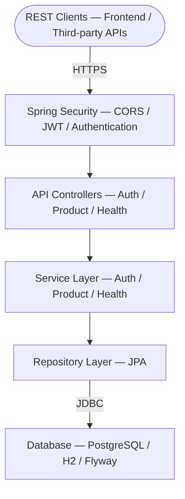

# Components

Detailed documentation of specific components in StockEase that warrant their own dedicated page beyond what is covered in the system architecture docs.

---

## Documents in This Directory

- [Analytics Service](./analytics-service.md) — Spring Boot Actuator endpoints, application metrics, logging format, and observability practices

---

## Component Interaction Overview

For controller, service, and repository code details see [Backend Architecture](../system/backend.md). For layer responsibilities and data flow see [Service Layers](../system/layers.md).

---

## Related Documentation

- [System Overview](../system/overview.md)
- [Backend Architecture](../system/backend.md)
- [Service Layers](../system/layers.md)
- [Design Patterns](../patterns/index.md)
- [Decisions (ADRs)](../decisions/index.md)

---

**Last Updated**: June 2026
**Status**: Current

[Back to Architecture Index](../index.md)
