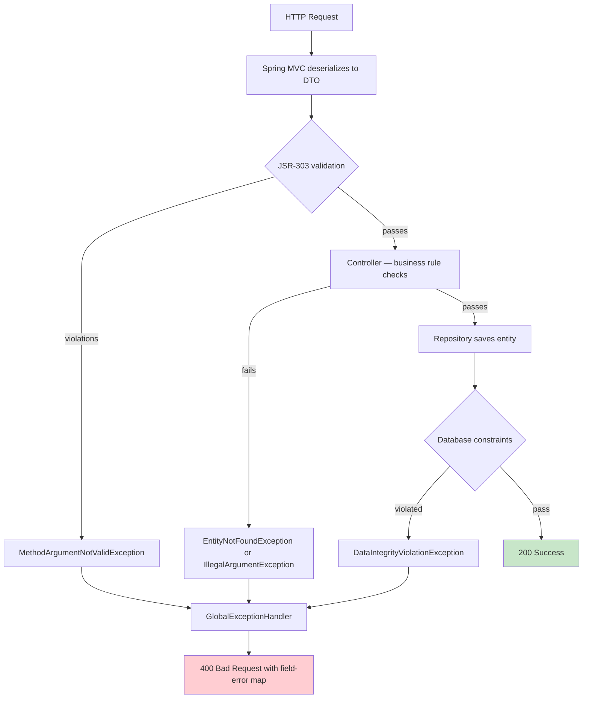

# ADR 002: Validation Strategy

**Status**: Accepted
**Date**: October 31, 2025

---

## Context

StockEase accepts user input across multiple REST endpoints. Invalid data must be rejected before it reaches the database. Decisions were needed on where to validate, how to validate, and how to return consistent errors to clients.

Requirements: prevent invalid data from entering the system, fail fast, return user-friendly and consistent error responses, enforce business rules separately from format rules, and cover security validation (injection prevention).

---

## Decision

Multi-layer validation:

1. **API layer** — JSR-303 bean validation annotations on request DTOs, triggered by `@Valid`
2. **Controller layer** — business rule checks in controller code before calling the repository (e.g. existence checks that throw `EntityNotFoundException`)
3. **Database layer** — constraints as a final safety net (UNIQUE, NOT NULL)
4. **Error handling** — `GlobalExceptionHandler` (`@RestControllerAdvice`) formats all validation failures into a consistent `ApiResponse<T>` JSON body

---

## Rationale

JSR-303 annotations keep validation rules co-located with the data they validate, are declarative and readable, and are automatically enforced by Spring MVC without boilerplate. Controller-layer checks handle rules that require a database query (e.g. product existence before update or delete). Database constraints act as the last line of defense and guarantee integrity even if application code has a bug.

A global exception handler ensures that validation failures at any layer produce the same response shape — field name, rejected value, and message — making the API predictable for frontend developers.

---

## Validation Flow



---

## Validation Rules

### CreateProductRequest
- `name` — `@NotNull @NotBlank` (must not be blank)
- `quantity` — `@NotNull @Min(0)` (must be zero or greater)
- `price` — `@NotNull @Positive` (must be greater than zero, `Double`)

### UpdateQuantityRequest
- `quantity` — `@NotNull @Min(0)`

### UpdatePriceRequest
- `price` — `@NotNull @Positive`

### UpdateNameRequest
- `name` — `@NotNull @NotBlank`

### LoginRequest
- `username` — `@NotBlank`
- `password` — `@NotBlank`

---

## Error Response Format

All error responses use the `ApiResponse<T>` envelope with `success: false`. For `@Valid` bean validation failures (`MethodArgumentNotValidException`) and parameter constraint violations (`HandlerMethodValidationException`), the `data` field is a map of field names to constraint messages:

```json
{
  "success": false,
  "message": "Validation failed for request parameters.",
  "data": {
    "name": "must not be blank",
    "price": "must be greater than 0",
    "quantity": "must be greater than or equal to 0"
  }
}
```

For all other errors (404, 401, 403, 500), `data` is `null`:

```json
{
  "success": false,
  "message": "Entity not found: Product with ID 99 not found.",
  "data": null
}
```

---

## Alternatives Considered

**Manual validation in controllers** — rejected. Produces boilerplate, is error-prone, and is not reusable across endpoints.

**Validation only at the repository/DAO layer** — rejected. Too late in the flow, API responses would be inconsistent, and it mixes concerns.

**Validation only via database constraints** — rejected. Provides no user-friendly error messages and no early rejection of malformed input.

---

## Consequences

**Positive**: declarative and readable, consistent error responses across all endpoints, Spring enforces API-layer rules automatically, field-level error map enables frontend form highlighting.

**Negative**: complex validation rules that span multiple fields are hard to express as annotations alone and require custom validator classes or explicit controller checks. Database constraints (e.g. `UNIQUE` on `username`) produce `DataIntegrityViolationException` which maps to a generic 500 — API-layer validation must catch these cases first to return a user-friendly 400.

---

## Implementation Status

- JSR-303 annotations on all request DTOs — implemented
- `GlobalExceptionHandler` with `ApiResponse<T>` error format — implemented
- Controller-layer existence checks (`EntityNotFoundException`) — implemented
- Database `UNIQUE` and `NOT NULL` constraints — implemented

---

[Back to Decisions Index](./index.md)
