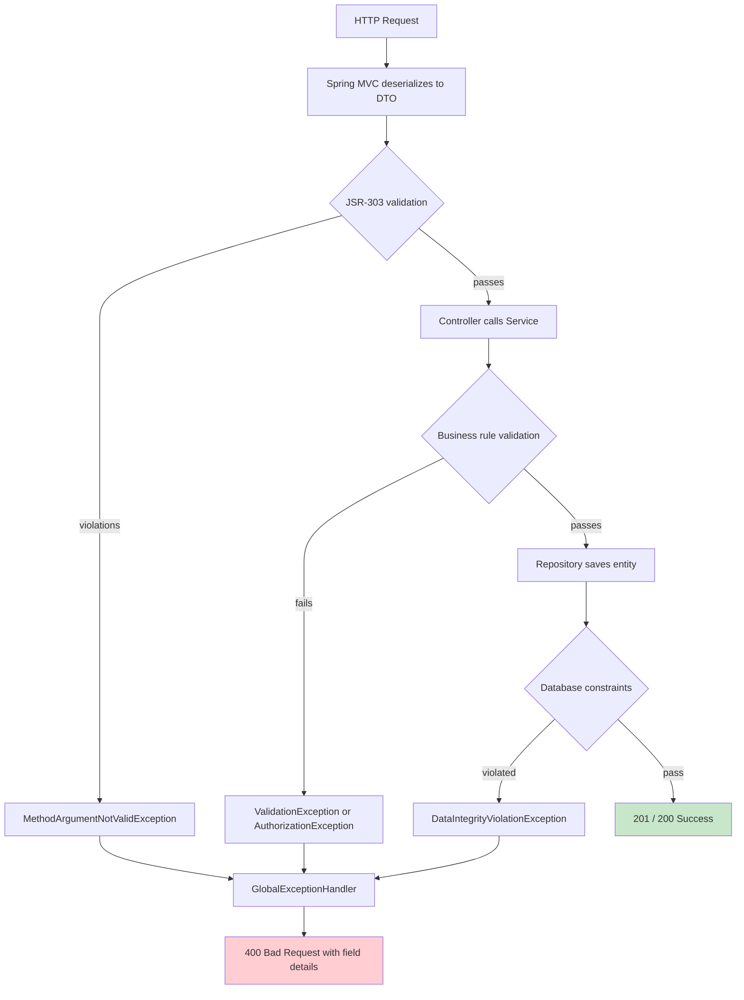

# ADR 002: Validation Strategy

**Status**: Accepted
**Date**: October 31, 2025

---

## Context

StockEase accepts user input across multiple REST endpoints. Invalid data must be rejected before it reaches the database. Decisions were needed on where to validate, how to validate, and how to return consistent errors to clients.

Requirements: prevent invalid data from entering the system, fail fast, return user-friendly and consistent error responses, enforce business rules separately from format rules, and cover security validation (injection prevention).

---

## Decision

Multi-layer validation:

1. **API layer** — JSR-303 bean validation annotations on request DTOs, triggered by `@Valid`
2. **Service layer** — business rule validation in code (uniqueness checks, authorization checks, domain constraints)
3. **Database layer** — constraints as a final safety net (UNIQUE, CHECK, NOT NULL, foreign keys)
4. **Error handling** — `GlobalExceptionHandler` (`@RestControllerAdvice`) formats all validation failures into a consistent `ErrorResponse` JSON body

---

## Rationale

JSR-303 annotations keep validation rules co-located with the data they validate, are declarative and readable, and are automatically enforced by Spring MVC without boilerplate. Service-layer validation handles rules that require database queries (SKU uniqueness) or business context (authorization). Database constraints act as the last line of defense and guarantee integrity even if application code has a bug.

A global exception handler ensures that validation failures at any layer produce the same response shape — field name, rejected value, and message — making the API predictable for frontend developers.

---

## Validation Flow



---

## Validation Rules

### Product
- `name` — required, 3–255 characters
- `price` — required, 0.01–999,999.99
- `quantity` — required, 0–1,000,000
- `sku` — required, 3–50 characters, pattern `^[A-Z0-9-]{3,50}$`, unique

### User
- `username` — required, 3–50 characters, alphanumeric + underscore, unique
- `password` — required, minimum 8 characters
- `role` — required, must be `ADMIN` or `USER`

---

## Error Response Format

```json
{
  "status": 400,
  "error": "Validation Failed",
  "timestamp": "2025-10-31T10:30:00Z",
  "path": "/api/products",
  "details": [
    {
      "field": "name",
      "message": "Name must be 3-255 characters",
      "rejectedValue": "AB"
    },
    {
      "field": "price",
      "message": "Price must be > 0",
      "rejectedValue": "-10"
    }
  ]
}
```

---

## Alternatives Considered

**Manual validation in controllers** — rejected. Produces boilerplate, is error-prone, and is not reusable across endpoints.

**Validation only at the repository/DAO layer** — rejected. Too late in the flow, API responses would be inconsistent, and it mixes concerns.

**Validation only via database constraints** — rejected. Provides no user-friendly error messages and no early rejection of malformed input.

---

## Consequences

**Positive**: declarative and readable, consistent error responses across all endpoints, Spring enforces API-layer rules automatically, business rules are clearly separated into the service layer.

**Negative**: complex validation rules are hard to express as annotations alone and require custom validator classes. Database constraints are the last resort and produce less friendly error messages if they are the first to catch a violation — this means API-layer and service-layer validation must be thorough.

---

## Implementation Status

- JSR-303 annotations on all request DTOs — implemented
- GlobalExceptionHandler with standardized error format — implemented
- Service-layer business rule validation — implemented
- Database UNIQUE, CHECK, and NOT NULL constraints — implemented

---

[Back to Decisions Index](./index.md)
