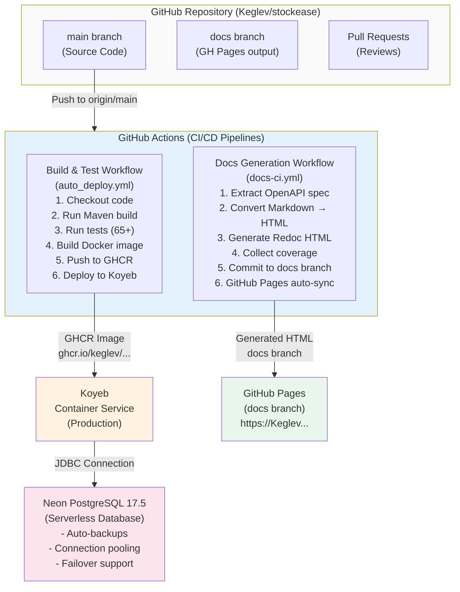
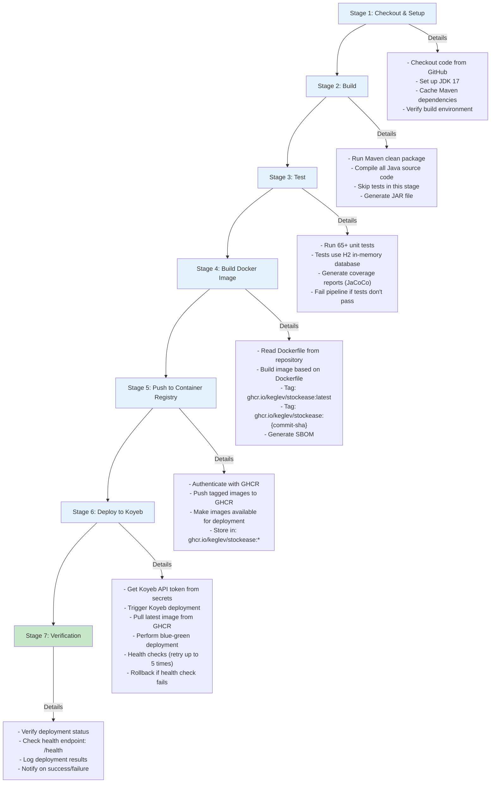
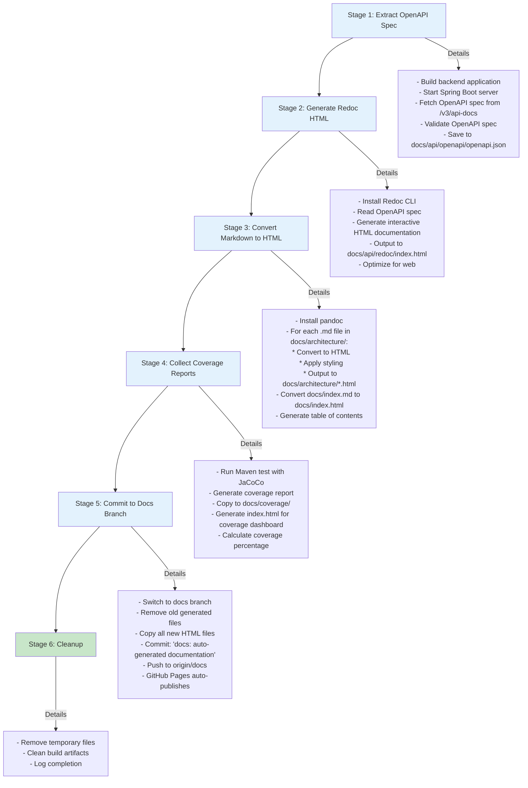
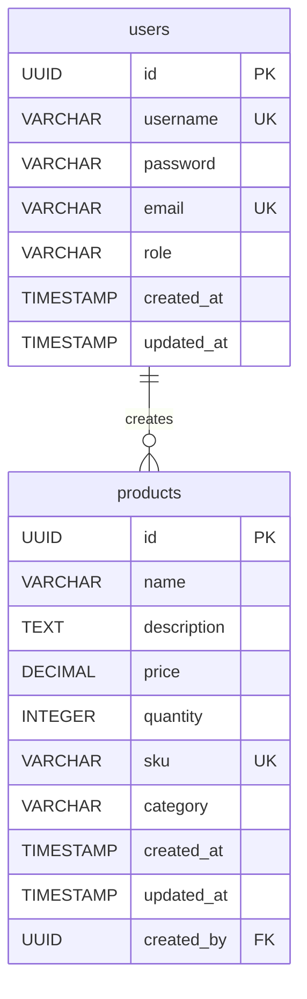
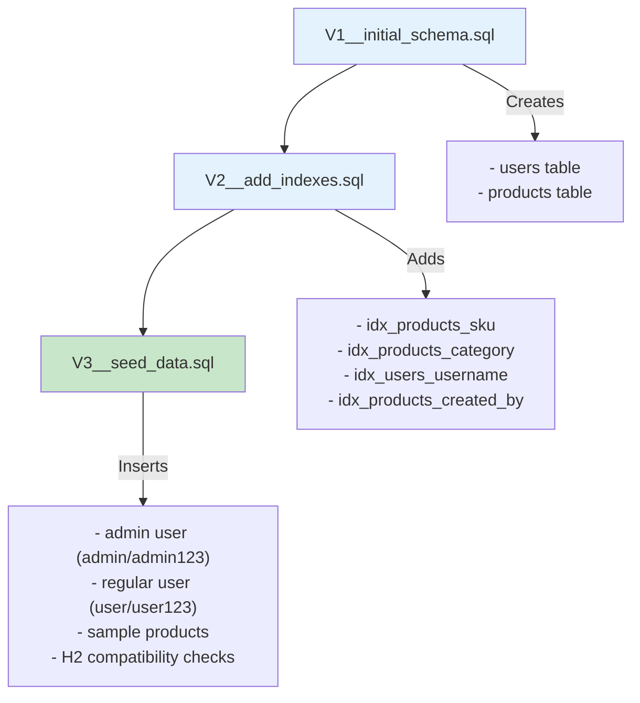
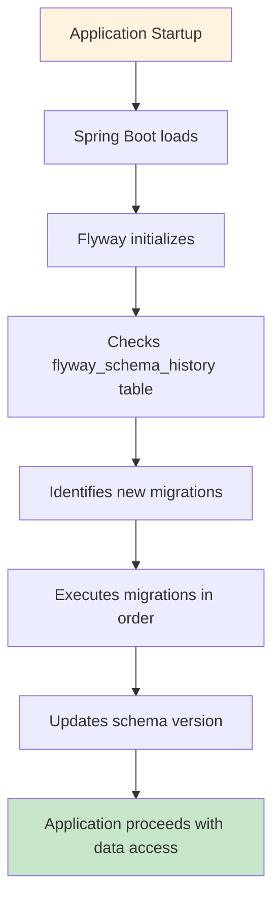

# Deployment & Infrastructure Architecture

## Deployment Topology



## CI/CD Pipeline Details

### Build & Deploy Workflow (`auto_deploy.yml`)

**Trigger Events**:
- Push to `main` branch
- Pull request creation
- Manual trigger (workflow_dispatch)

**Pipeline Stages**:



### Documentation Pipeline (`docs-ci.yml` - TO BE CREATED)

**Trigger Events**:
- Push to `main` when `/backend/docs/` changes
- Manual trigger

**Pipeline Stages**:



## Deployment Environments

### Development Environment
- **Branch**: Any feature branch
- **Triggered By**: Manual trigger or PR
- **Database**: H2 in-memory (testing only)
- **Deployment**: Skipped
- **Testing**: Full suite (65+ tests)

### Staging Environment
- **Branch**: develop (if used)
- **Deployment Target**: Separate Koyeb service
- **Database**: PostgreSQL test instance
- **Testing**: Full test suite + smoke tests
- **Duration**: 10-15 minutes

### Production Environment
- **Branch**: main
- **Deployment Target**: Koyeb production service
- **Database**: Neon PostgreSQL (production)
- **URL**: https://stockease-backend-production.koyeb.app
- **Testing**: Full test suite + health checks
- **Duration**: 3-5 minutes
- **Rollback**: Automatic if health checks fail

## Koyeb Deployment Configuration

### Service Details
```yaml
Service Name: stockease-backend-production
Status: HEALTHY
Runtime: Docker (custom image)
Region: US (Auto)
Replicas: 1-2 (auto-scaling)
Domain: stockease-backend-production.koyeb.app

Environment Variables:
  SPRING_PROFILES_ACTIVE: production
  DB_HOST: [Neon endpoint]
  DB_PORT: 5432
  DB_NAME: stockease
  DB_USER: [from secrets]
  DB_PASSWORD: [from secrets]
  JWT_SECRET: [from secrets]
  JAVA_OPTS: -Xmx512m -Xms256m

Port Mapping:
  Container Port: 8080
  Public Port: 443 (HTTPS)
  Protocol: HTTP2

Health Check:
  Endpoint: /health
  Interval: 30 seconds
  Timeout: 5 seconds
  Consecutive Failures: 3
  Consecutive Successes: 1
```

### Auto-Scaling Configuration
```yaml
Min Replicas: 1
Max Replicas: 2
Target CPU: 70%
Target Memory: 80%
Scale Up Delay: 60 seconds
Scale Down Delay: 300 seconds
```

## Database Management (Neon PostgreSQL)

### Connection Details
```
Host: [neon-project].neon.tech
Port: 5432
Database: stockease
SSL Mode: require
Connection Pooling: Enabled (connection limit: 100)
```

### Automated Backups
- **Frequency**: Automatic daily
- **Retention**: 7 days
- **Backup Type**: Full backup
- **Recovery**: Point-in-time restore available

### Database Migrations (Flyway)

**Migration Files** (in `src/main/resources/db/migration/`):
```
V1__init_schema.sql
  ├── CREATE TABLE users
  │   ├── id (UUID, PK)
  │   ├── username (VARCHAR, UNIQUE)
  │   ├── password (VARCHAR, BCrypt)
  │   ├── role (VARCHAR)
  │   ├── created_at (TIMESTAMP)
  │   └── updated_at (TIMESTAMP)
  │
  └── CREATE TABLE products
      ├── id (UUID, PK)
      ├── name (VARCHAR)
      ├── description (TEXT)
      ├── price (DECIMAL)
      ├── quantity (INTEGER)
      ├── sku (VARCHAR, UNIQUE)
      ├── category (VARCHAR)
      ├── created_at (TIMESTAMP)
      ├── updated_at (TIMESTAMP)
      └── created_by (UUID, FK → users)

V2__add_indexes.sql
  ├── CREATE INDEX idx_products_sku
  ├── CREATE INDEX idx_products_category
  ├── CREATE INDEX idx_users_username
  └── CREATE INDEX idx_products_created_by

V3__seed_data.sql
  ├── INSERT admin user (admin/admin123)
  ├── INSERT regular user (user/user123)
  ├── INSERT sample products
  └── Uses DB-agnostic existence check for H2 compatibility
```

**Migrations Overview**:



**Migration Files**:



**Migration Execution**:


```
Application Startup
  ├── Spring Boot loads
  ├── Flyway initializes
  ├── Checks flyway_schema_history table
  ├── Identifies new migrations
  ├── Executes migrations in order
  ├── Updates schema version
  └── Application proceeds with data access
```

## Containerization

### Dockerfile

```dockerfile
# Multi-stage build for optimization
FROM eclipse-temurin:17-jdk-alpine AS builder

WORKDIR /app
COPY mvnw .
COPY pom.xml .
COPY src src

# Build application
RUN ./mvnw clean package -DskipTests

# Runtime stage
FROM eclipse-temurin:17-jre-alpine

WORKDIR /app

# Copy JAR from builder
COPY --from=builder /app/target/stockease-backend-*.jar app.jar

# Health check
HEALTHCHECK --interval=30s --timeout=5s --start-period=10s --retries=3 \
    CMD wget --no-verbose --tries=1 --spider http://localhost:8080/health || exit 1

# Expose port
EXPOSE 8080

# Run application
ENTRYPOINT ["java", "-jar", "app.jar"]
```

**Image Details**:
- **Base Image**: eclipse-temurin:17-jre-alpine (122MB)
- **Final Size**: ~350MB (with JAR and dependencies)
- **Build Time**: ~2 minutes
- **Startup Time**: ~8-10 seconds

### Image Registry (GHCR)

```
Registry: ghcr.io/keglev/stockease
Authentication: GitHub PAT (Personal Access Token)

Image Tags:
  - ghcr.io/keglev/stockease:latest (always latest build)
  - ghcr.io/keglev/stockease:v1.0.0 (semantic versioning)
  - ghcr.io/keglev/stockease:sha-abc123 (commit hash)
```

## Monitoring & Observability

### Health Checks

**Endpoint**: `GET /health`

**Response** (when healthy):
```json
{
  "status": "UP",
  "components": {
    "db": {
      "status": "UP",
      "details": {
        "database": "PostgreSQL",
        "validationQuery": "isValid()"
      }
    },
    "diskSpace": {
      "status": "UP",
      "details": {
        "total": 10737418240,
        "free": 5368709120,
        "threshold": 10485760,
        "exists": true
      }
    }
  }
}
```

**Response** (when unhealthy):
```json
{
  "status": "DOWN",
  "components": {
    "db": {
      "status": "DOWN",
      "details": {
        "error": "Connection refused"
      }
    }
  }
}
```

### Application Logs

**Log Output** (captured by Koyeb):
```
[2025-10-31 10:30:00] INFO  o.s.b.StartupInfoLogger : Starting StockEaseApplication
[2025-10-31 10:30:01] INFO  o.s.d.r.c.EnableJpaRepositoriesRegistrar : Scanning JPA repositories
[2025-10-31 10:30:02] INFO  o.f.c.internal.license.VersionPrinter : Flyway Community Edition
[2025-10-31 10:30:02] INFO  o.f.c.internal.database.base.DatabaseFactory : Database: PostgreSQL 17.5
[2025-10-31 10:30:02] INFO  o.f.c.i.s.sql.PlaceholderReplacer : Locations: [classpath:db/migration]
[2025-10-31 10:30:02] INFO  o.f.c.i.c.sql.SqlScriptExecutor : Successfully validated 3 migrations
[2025-10-31 10:30:02] INFO  o.f.c.i.c.sql.SqlScriptExecutor : Current version of schema "public": 3
[2025-10-31 10:30:03] INFO  o.s.s.web.DefaultSecurityFilterChain : Will secure any request
[2025-10-31 10:30:03] INFO  o.s.b.w.e.tomcat.TomcatWebServer : Tomcat started on port(s): 8080
[2025-10-31 10:30:04] INFO  o.s.b.StartupInfoLogger : Started StockEaseApplication in 4.123s
```

### Metrics Monitoring

**Tracked Metrics**:
- **Request Count**: Requests per minute
- **Response Time**: Average, P50, P95, P99
- **Error Rate**: 4xx, 5xx errors
- **Database Connections**: Active, idle, queued
- **Memory Usage**: Heap, non-heap
- **CPU Usage**: Container CPU %

**Alerts** (future):
- Health check failures (trigger rollback)
- High error rate (>5%)
- Slow response times (>500ms avg)
- Memory pressure (>85%)
- Database connection pool exhaustion

## Disaster Recovery

### Backup Strategy
- **Database**: Automated daily backups (Neon)
- **Code**: Git repository with full history
- **Configuration**: Environment variables in GitHub Secrets
- **Docker Images**: Retained in GHCR

### Recovery Procedures

**If Deployment Fails**:
1. CI pipeline detects failure
2. Health checks fail
3. Koyeb automatically rolls back to previous version
4. Notification sent to team
5. Review logs for root cause

**If Database is Corrupted**:
1. Determine recovery point from backups
2. Create database restore job
3. Test restore in staging environment
4. Point Koyeb to restored database
5. Verify application functionality

**If Koyeb Service Goes Down**:
1. Manual trigger of deployment pipeline
2. Redeploy from latest commit
3. Verify health checks pass
4. Monitor for stability

## Performance Tuning

### JVM Configuration
```
-Xmx512m          # Max heap: 512MB
-Xms256m          # Initial heap: 256MB
-XX:+UseG1GC      # G1 garbage collection
-XX:MaxGCPauseMillis=200
```

### Database Optimization
```
Connection Pool: HikariCP
Max Connections: 10
Idle Timeout: 600 seconds
Connection Timeout: 30 seconds
```

### Caching (Future)
- Spring Cache abstraction
- Redis for session/data caching
- TTL: 1 hour for product data

## Security in Deployment

### Secrets Management
```
Environment Variables (GitHub Secrets):
  - DB_PASSWORD
  - JWT_SECRET
  - GITHUB_TOKEN (for deployments)
```

**Never Committed to Repository**:
- Database passwords
- API keys
- JWT secrets
- Personal access tokens

### Network Security
- HTTPS/TLS enforced
- CORS configured for frontend domain only
- WAF rules (via Koyeb/CloudFlare)
- DDoS protection enabled

### Image Security
- No hardcoded secrets in Docker image
- Alpine Linux for minimal attack surface
- Regular base image updates
- SBOM (Software Bill of Materials) generated

## Deployment Checklist

Before production deployment:
- [ ] All tests passing (65+)
- [ ] Code reviewed
- [ ] Secrets configured in GitHub
- [ ] Database migrations validated
- [ ] Docker image built and tested
- [ ] Health checks verified
- [ ] CORS configured correctly
- [ ] SSL certificates valid
- [ ] Backups configured
- [ ] Monitoring/alerting set up
- [ ] Documentation updated
- [ ] Rollback plan prepared

---

## Related Documentation

### Main Architecture Topics
- **[Architecture Overview](./overview.md)** - Business context and infrastructure decisions
- **[Backend Architecture](./backend.md)** - Application structure being deployed
- **[Service Layers](./layers.md)** - Layer-level considerations for deployment
- **[Security Architecture](./security.md)** - Security requirements for production deployment

### Architecture Decisions (ADRs)
- **[Database Choice](./decisions/001-database-choice.md)** - PostgreSQL for production, H2 for testing
- **[Validation Strategy](./decisions/002-validation-strategy.md)** - Validation in pre-production testing

### Design Patterns & Practices
- **[Security Patterns](./patterns/security-patterns.md)** - HTTPS/TLS, encryption, secure configuration
- **[Repository Pattern](./patterns/repository-pattern.md)** - Database connection strategies for production

### Deployment Details
- **[CI/CD Pipeline](./deployment/ci-pipeline.md)** - GitHub Actions for automated deployments
- **[Staging Configuration](./deployment/staging-config.md)** - Pre-production testing and verification

### Related Frontend Docs
- **[Frontend Architecture](./frontend.md)** - React deployment to Render

---

**Document Version**: 1.0  
**Last Updated**: October 31, 2025  
**Status**: Production Ready
