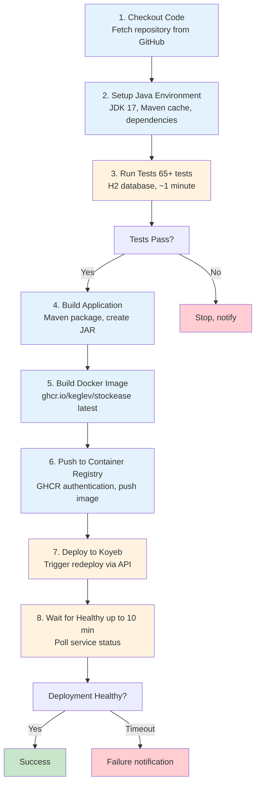

# CI/CD Pipeline Architecture

## Overview

The CI/CD pipeline automates building, testing, and deploying StockEase to production. Two workflows manage the process:
- **deploy-backend.yml**: Builds and deploys backend to Koyeb
- **docs-pipeline.yml** + **docs-coverage-deploy.yml**: Generates documentation, collects coverage, and publishes to GitHub Pages

## Deployment Workflow (deploy-backend.yml)

### Trigger Events

```yaml
on:
  push:
    branches: [ main ]
    paths-ignore:
      - 'docs/**'
      - '.gitignore'
  workflow_dispatch:  # Manual trigger
```

**Triggers on**:
- Push to main branch (excluding docs directory)
- Manual workflow dispatch

**Doesn't trigger on**:
- Changes to `/docs/` only
- Changes to `.gitignore` only

### Pipeline Stages



### Stage Details

#### Stage 1: Checkout
```yaml
- name: Checkout repository
  uses: actions/checkout@v4
```
**Duration**: ~5 seconds  
**Purpose**: Clone repository with full history

#### Stage 2: Setup Environment
```yaml
- name: Set up JDK 17 with Maven cache
  uses: actions/setup-java@v4
  with:
    distribution: temurin
    java-version: '17'
    cache: maven
```
**Duration**: ~30 seconds (first run), ~5 seconds (cached)  
**Purpose**: Install JDK 17 and Maven dependencies

#### Stage 3: Run Tests
```yaml
- name: Run backend tests
  run: ./mvnw -B -ntp test
```
**Duration**: ~30-45 seconds  
**Tests**: 65+ unit and integration tests  
**Database**: H2 in-memory  
**Failure Handling**: Stops pipeline if tests fail

#### Stage 4: Build
```yaml
- name: Verify build compiles
  run: ./mvnw -B -ntp -DskipTests package
```
**Duration**: ~20-30 seconds  
**Purpose**: Create JAR file, catch compile errors

#### Stage 5: Build Docker Image
```dockerfile
FROM eclipse-temurin:17-jre-alpine
COPY target/stockease-backend-*.jar app.jar
ENTRYPOINT ["java", "-jar", "app.jar"]
```
**Duration**: ~15-20 seconds  
**Base Image**: Alpine (122MB)  
**Final Size**: ~350MB (with JAR + libs)

#### Stage 6: Push to GHCR
```yaml
- name: Push to GHCR
  env:
    REGISTRY: ghcr.io
  run: docker push ghcr.io/keglev/stockease:latest
```
**Duration**: ~10-15 seconds  
**Authentication**: GitHub token from secrets

#### Stage 7: Deploy to Koyeb
```yaml
- name: Trigger Koyeb redeploy
  env:
    KOYEB_API_KEY: ${{ secrets.KOYEB_API_KEY }}
    KOYEB_SERVICE_ID: ${{ secrets.KOYEB_SERVICE_ID }}
  run: |
    curl -X POST https://app.koyeb.com/v1/services/$SERVICE_ID/redeploy \
      -H "Authorization: Bearer $KOYEB_API_KEY"
```
**Duration**: ~5 seconds (API call)  
**Actual Deployment**: 1-2 minutes (Koyeb pulls image, starts container)

#### Stage 8: Health Check
```yaml
- name: Wait for Koyeb service HEALTHY
  run: |
    for i in {1..60}; do
      STATUS=$(curl -H "Authorization: Bearer $API_KEY" \
        https://app.koyeb.com/v1/services/$SERVICE_ID)
      if [ "$STATUS" = "HEALTHY" ]; then
        exit 0
      fi
      sleep 10
    done
    exit 1
```
**Duration**: Up to 10 minutes (poll every 10 seconds)  
**Success Criteria**: Service reaches HEALTHY status  
**Failure Handling**: Auto-rollback if health check fails

### Total Pipeline Duration

| Stage | Duration |
|-------|----------|
| Checkout | 5s |
| Setup | 30s |
| Tests | 40s |
| Build | 25s |
| Docker | 20s |
| Push | 15s |
| Deploy (API) | 5s |
| Health Check | 10-120s |
| **Total** | **2-5 minutes** |

## Documentation Workflow (docs-pipeline.yml + docs-coverage-deploy.yml)

### Trigger Events

```yaml
on:
  push:
    branches: [ main ]
    paths:
      - 'backend/docs/**'
  workflow_dispatch:
```

**Triggers on**:
- Push to main when `/backend/docs/` changes
- Manual workflow dispatch

### Pipeline Stages

```
┌──────────────────────────────────────┐
│ 1. Checkout Code                     │
└──────────────┬───────────────────────┘
               ↓
┌──────────────────────────────────────┐
│ 2. Setup Environment                 │
│ Python, Node.js, MkDocs, ReDoc CLI   │
└──────────────┬───────────────────────┘
               ↓
┌──────────────────────────────────────┐
│ 3. Start Backend (Spring Boot)       │
│ Start application for OpenAPI /v3    │
└──────────────┬───────────────────────┘
               ↓
┌──────────────────────────────────────┐
│ 4. Extract OpenAPI Spec              │
│ Fetch /v3/api-docs.yaml              │
│ Save to docs/api/openapi/            │
└──────────────┬───────────────────────┘
               ↓
┌──────────────────────────────────────┐
│ 5. Generate Redoc HTML               │
│ redoc-cli build-docs openapi.yaml    │
│ Output: docs/api/redoc/index.html    │
└──────────────┬───────────────────────┘
               ↓
┌──────────────────────────────────────┐
│ 6. Convert Markdown to HTML          │
│ MkDocs build docs/architecture/      │
│ Output: docs/architecture/*.html     │
└──────────────┬───────────────────────┘
               ↓
┌──────────────────────────────────────┐
│ 7. Generate Coverage Reports         │
│ JaCoCo site generation               │
│ Copy to docs/coverage/               │
└──────────────┬───────────────────────┘
               ↓
┌──────────────────────────────────────┐
│ 8. Commit to gh-pages Branch         │
│ git checkout gh-pages                │
│ Copy all generated files             │
│ git commit && push                   │
└──────────────┬───────────────────────┘
               ↓
         GitHub Pages auto-publishes
    https://Keglev.github.io/stockease/
```

## Secret Management

### Required GitHub Secrets

| Secret | Purpose | Set On | Used By |
|--------|---------|--------|---------|
| `KOYEB_API_KEY` | Deploy to Koyeb | Settings → Secrets | deploy-backend.yml |
| `KOYEB_SERVICE_ID` | Target service | Settings → Secrets | deploy-backend.yml |
| `GITHUB_TOKEN` | CI/CD operations | Auto-provided | docs-pipeline.yml / docs-coverage-deploy.yml |

### No Secrets in Code

✅ **Secrets in environment variables only**:
```yaml
env:
  KOYEB_API_KEY: ${{ secrets.KOYEB_API_KEY }}
```

❌ **Never hardcode secrets**:
```yaml
env:
  KOYEB_API_KEY: abc123... # NEVER!
```

## Failure Handling

### Test Failures
```
If tests fail:
1. Pipeline stops immediately
2. GitHub marks commit as failed
3. Notification sent
4. Manual review required before retry
```

**Recovery**:
- Fix failing tests
- Commit fix to main
- Pipeline automatically re-runs

### Build Failures
```
If build fails:
1. JAR creation fails
2. Pipeline stops at build stage
3. Notification sent
4. Check compilation errors in logs
```

### Deployment Failures
```
If Koyeb health check fails:
1. Service status remains UNHEALTHY
2. Previous healthy version still running
3. Auto-rollback (no manual intervention)
4. Notification sent for investigation
```

### Health Check Timeout
```
If service doesn't reach HEALTHY in 10 minutes:
1. Deployment marked as failed
2. Service remains in unhealthy state
3. Manual investigation required
4. Can manually trigger redeploy once fixed
```

## Rollback Strategy

### Automatic Rollback
- Health checks fail → Previous version auto-deployed
- No manual intervention needed
- Happens within 1-2 minutes

### Manual Rollback
```bash
# Via Koyeb dashboard
# Or trigger auto_deploy on specific commit:
git push origin <commit-sha>:main
```

## Performance Optimization

### Caching Strategy
- Maven dependencies cached
- Docker layer caching
- GitHub Actions cache

### Parallel Execution (Future)
- Run tests in parallel
- Build multiple artifacts simultaneously

## Monitoring & Debugging

### Workflow Logs
- View at: GitHub Repo → Actions → Workflow runs
- Click run → View all jobs
- Expand any failed step to see logs

### Common Issues

| Issue | Cause | Fix |
|-------|-------|-----|
| Tests fail | Code regression | Fix failing tests, commit |
| Build timeout | Large dependencies | Increase timeout, optimize POM |
| Deploy timeout | Koyeb slow | Wait or check Koyeb status |
| Health check fails | App crashed | Check application logs on Koyeb |
| Docker push fails | Registry auth | Verify `GITHUB_TOKEN` secret |

## Best Practices

1. **Keep workflows simple** - One job per workflow
2. **Fail fast** - Stop on first error
3. **Cache aggressively** - Maven, Docker layers
4. **Use environments** - Secrets scoped per environment
5. **Monitor carefully** - Check logs regularly
6. **Document changes** - Update workflows when code changes
7. **Test locally first** - Run tests before pushing
8. **Review secrets** - Ensure no hardcoded passwords

## Future Enhancements

1. **Multi-region deployment** - Deploy to multiple Koyeb regions
2. **Staged rollout** - Blue-green deployment
3. **Canary releases** - Deploy to small percentage first
4. **Performance testing** - Run load tests pre-deployment
5. **Slack notifications** - Alert team on failures
6. **Artifact retention** - Keep previous deployments
7. **Database migrations** - Automated migration testing
8. **Security scanning** - SAST/DAST in pipeline

---

**Document Version**: 1.0  
**Last Updated**: October 31, 2025  
**Status**: Production Ready
