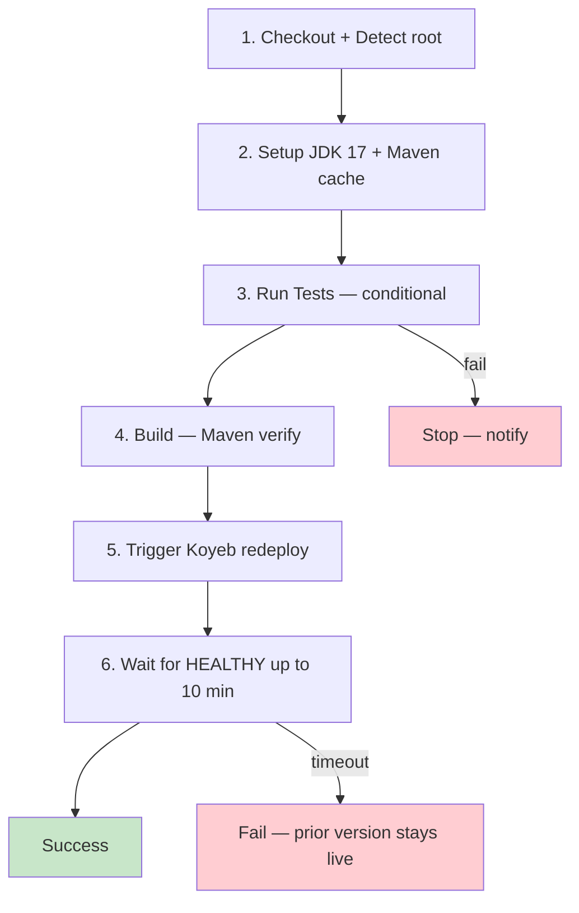

# CI/CD Pipeline

**Purpose**: Document the GitHub Actions workflows that build, test, deploy, and publish documentation for StockEase.

---

## Workflows Overview

| Workflow | File | Trigger | Purpose |
|----------|------|---------|---------|
| Backend deploy | `deploy-backend.yml` | Push to `main` (excluding docs) | Build, test, deploy to Koyeb |
| Docs generation | `docs-pipeline.yml` | Push to `main` (docs/pom.xml changes) | Generate and publish documentation |
| Coverage deploy | `docs-coverage-deploy.yml` | On `docs-pipeline.yml` success | Run JaCoCo and publish coverage |

---

## Backend Deploy Workflow

### Trigger

```yaml
on:
  push:
    branches: [main]
    paths-ignore:
      - 'docs/**'
      - '.gitignore'
      - '.github/workflows/docs-pipeline.yml'
  workflow_dispatch:
```

### Pipeline Stages


```mermaid
graph TD
    A[1. Checkout + Detect root] --> B[2. Setup JDK 17 + Maven cache]
    B --> C[3. Run Tests — conditional]
    C --> D[4. Build — Maven verify]
    D --> E[5. Trigger Koyeb redeploy]
    E --> F[6. Wait for HEALTHY up to 10 min]
    F --> G[Success]
    C -->|fail| X[Stop — notify]
    F -->|timeout| Y[Fail — prior version stays live]

    style G fill:#c8e6c9
    style X fill:#ffcdd2
    style Y fill:#ffcdd2
```

### Stage Details

| Stage | Command / Action | Duration | Notes |
|-------|-----------------|----------|-------|
| Checkout | `actions/checkout@v4` | ~5s | Full history |
| Detect root | `detect-maven-project.sh` | <5s | Sets `PROJECT_DIR` |
| Validate Dockerfile | `validate-dockerfile.sh` | <5s | Fails fast if missing |
| Setup JDK 17 | `actions/setup-java@v4` (temurin, Maven cache) | 5–30s | Cached after first run |
| Run tests | `./mvnw -B -ntp test` | ~40s | Controlled by `RUN_TESTS` env var (default `true`) |
| Build | `./mvnw -B -ntp -DskipTests -Dspringdoc.skip=true verify` | ~25s | Produces JAR |
| Koyeb redeploy | `koyeb-redeploy.sh` — `POST /v1/services/{id}/redeploy` | ~5s | Accepts 200/201/202 |
| Wait for healthy | `koyeb-wait-healthy.sh` — polls every 10s up to 60× | 10–120s | HEALTHY or READY = success |

**Total pipeline time**: 2–4 minutes.

`RUN_TESTS=false` is reserved for emergency hotfixes only. Tests must pass on all normal deployments.

---

## Documentation Workflow

### docs-pipeline.yml

**Trigger**: push to `main` when `docs/**`, `pom.xml`, or `.github/workflows/docs-pipeline.yml` changes, or manual dispatch.

**Stages**:

1. Checkout (full history) + detect project root
2. Setup Node.js 18 + install `@redocly/cli`
3. `generate-api-docs.sh` — reads `docs/api/openapi.yaml` → outputs `target/docs/api-docs.html`
4. `generate-docs.sh` — Pandoc converts `docs/architecture/` using `enterprise-docs.html` template + Lua filter
5. `generate-docs.sh` — Pandoc converts all other `docs/` markdown (guides, patterns, components)
6. `fix-directory-links.sh` — rewrites `href="path/"` to `index.html`
7. Copy site templates — `index.html` + `base.css`, `component.css`, `hub.css` → `target/docs/templates/`
8. Verify output — counts generated files, reports disk usage
9. Upload `docs-site` artifact
10. Deploy `target/docs` to `gh-pages` via `peaceiris/actions-gh-pages@v3`

### docs-coverage-deploy.yml

**Trigger**: automatically on `docs-pipeline.yml` success.

**Stages**:

1. Checkout + download `docs-site` artifact + setup JDK 17
2. `mvn -B clean test` — runs full test suite with JaCoCo
3. `generate-coverage-wrapper.sh` — creates iframe wrapper over raw JaCoCo HTML
4. Deploy `target/docs/coverage` to `gh-pages` at `/coverage` subfolder (does not overwrite root docs)

---

## Secret Management

| Secret | Purpose | Used By |
|--------|---------|---------|
| `KOYEB_API_KEY` | Authenticate Koyeb API calls | `deploy-backend.yml` |
| `KOYEB_SERVICE_ID` | Target service for redeploy | `deploy-backend.yml` |
| `GITHUB_TOKEN` | CI/CD operations, gh-pages deploy | Auto-provided by GitHub |

Secrets are injected via `${{ secrets.NAME }}` — never hardcoded in workflow files.

---

## Failure Handling

### Test Failure
Pipeline stops immediately. GitHub marks the commit as failed. Fix the failing tests, commit, and the pipeline re-runs automatically.

### Build Failure
JAR creation fails. Check compilation errors in the Actions log. Fix and push.

### Koyeb Health Check Timeout
The pipeline fails after 10 minutes. The previous healthy version remains live on Koyeb. Investigate application logs on the Koyeb dashboard, fix the issue, and trigger a new deployment.

---

## Rollback Strategy

**Automatic**: if health checks fail, Koyeb keeps the previous version running with no manual intervention needed.

**Manual**: trigger `deploy-backend.yml` via `workflow_dispatch` on a known-good commit, or use the Koyeb dashboard to redeploy a previous instance.

---

[Back to Deployment Index](./index.md)
