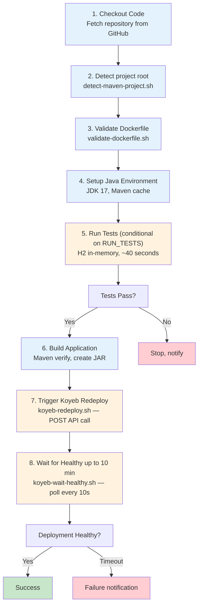

# CI/CD Pipeline Architecture

## Overview

The CI/CD pipeline automates building, testing, and deploying StockEase to production. Two workflows manage the process:
- **deploy-backend.yml**: Builds and deploys backend to Koyeb
- **docs-pipeline.yml** + **docs-coverage-deploy.yml**: Generates documentation, collects coverage, and publishes to GitHub Pages

## Deployment Workflow (deploy-backend.yml)

### Trigger Events

```yaml
on:
  push:
    branches: [main]
    paths-ignore:
      - 'docs/**'
      - '.gitignore'
      - '.github/workflows/docs-pipeline.yml'
  workflow_dispatch:
```

**Triggers on**:
- Push to main branch (excluding docs, .gitignore, and docs-pipeline.yml changes)
- Manual workflow dispatch

**Doesn't trigger on**:
- Changes to `/docs/` only
- Changes to `.gitignore` only
- Changes to `.github/workflows/docs-pipeline.yml` only

### Pipeline Stages


```mermaid
graph TD
    A["1. Checkout Code<br/>Fetch repository from GitHub"] --> B["2. Detect project root<br/>detect-maven-project.sh"]
    B --> C["3. Validate Dockerfile<br/>validate-dockerfile.sh"]
    C --> D["4. Setup Java Environment<br/>JDK 17, Maven cache"]
    D --> E["5. Run Tests (conditional on RUN_TESTS)<br/>H2 in-memory, ~40 seconds"]

    E --> F["Tests Pass?"]
    F -->|Yes| G["6. Build Application<br/>Maven verify, create JAR"]
    F -->|No| H["Stop, notify"]

    G --> I["7. Trigger Koyeb Redeploy<br/>koyeb-redeploy.sh — POST API call"]
    I --> J["8. Wait for Healthy up to 10 min<br/>koyeb-wait-healthy.sh — poll every 10s"]

    J --> K["Deployment Healthy?"]
    K -->|Yes| L[Success]
    K -->|Timeout| M["Failure notification"]

    style A fill:#e3f2fd
    style B fill:#e3f2fd
    style C fill:#e3f2fd
    style D fill:#e3f2fd
    style E fill:#fff3e0
    style G fill:#e3f2fd
    style I fill:#fff3e0
    style J fill:#fff3e0
    style L fill:#c8e6c9
    style H fill:#ffcdd2
    style M fill:#ffcdd2
```

### Stage Details

#### Stage 1: Checkout
```yaml
- name: Checkout repository
  uses: actions/checkout@v4
```
**Duration**: ~5 seconds  
**Purpose**: Clone repository with full history

#### Stage 2: Setup Environment
```yaml
- name: Set up JDK 17 with Maven cache
  uses: actions/setup-java@v4
  with:
    distribution: temurin
    java-version: '17'
    cache: maven
```
**Duration**: ~30 seconds (first run), ~5 seconds (cached)  
**Purpose**: Install JDK 17 and Maven dependencies

#### Stage 3: Run Tests
```yaml
- name: Run tests
  if: env.RUN_TESTS == 'true'
  working-directory: ${{ env.PROJECT_DIR }}
  run: ./mvnw -B -ntp test
```
**Duration**: ~30-45 seconds  
**Tests**: 65+ unit and integration tests  
**Database**: H2 in-memory  
**Conditional**: Controlled by `RUN_TESTS` env var (default `true`; set `false` only for emergency hotfixes)  
**Failure Handling**: Stops pipeline if tests fail

#### Stage 4: Build and Verify
```yaml
- name: Build and verify
  working-directory: ${{ env.PROJECT_DIR }}
  run: ./mvnw -B -ntp -DskipTests -Dspringdoc.skip=true verify
```
**Duration**: ~20-30 seconds  
**Purpose**: Create JAR file, run verify lifecycle; `-Dspringdoc.skip=true` prevents redundant OpenAPI generation at build time

#### Stage 5: Trigger Koyeb Redeploy
```yaml
- name: Trigger Koyeb redeploy
  env:
    KOYEB_API_KEY: ${{ secrets.KOYEB_API_KEY }}
    KOYEB_SERVICE_ID: ${{ secrets.KOYEB_SERVICE_ID }}
  run: bash .github/scripts/deploy/koyeb-redeploy.sh
```
**Duration**: ~5 seconds (API call)  
**Method**: `POST /v1/services/{id}/redeploy` — Koyeb pulls the latest code and rebuilds from the Dockerfile  
**Success**: HTTP 200, 201, or 202 response from Koyeb API

#### Stage 6: Wait for Healthy
```yaml
- name: Wait for service healthy
  env:
    KOYEB_API_KEY: ${{ secrets.KOYEB_API_KEY }}
    KOYEB_SERVICE_ID: ${{ secrets.KOYEB_SERVICE_ID }}
  run: bash .github/scripts/deploy/koyeb-wait-healthy.sh
```
**Duration**: Up to 10 minutes (60 polls × 10-second interval)  
**Success Criteria**: Service reaches `HEALTHY` or `READY` status  
**Failure Handling**: Pipeline fails; previous healthy version remains running on Koyeb  
**Env Overrides**: `POLL_ATTEMPTS` and `POLL_INTERVAL` can override defaults

### Total Pipeline Duration

| Stage | Duration |
|-------|----------|
| Checkout | 5s |
| Detect root + Validate | <5s |
| Setup JDK 17 | 30s |
| Tests | 40s |
| Build (verify) | 25s |
| Deploy (API) | 5s |
| Health Check | 10-120s |
| **Total** | **2-4 minutes** |

## Documentation Workflow (docs-pipeline.yml + docs-coverage-deploy.yml)

### Trigger Events

```yaml
on:
  push:
    branches: [main]
    paths:
      - 'docs/**'
      - 'pom.xml'
      - '.github/workflows/docs-pipeline.yml'
  workflow_dispatch:
```

**Triggers on**:
- Push to main when `docs/**`, `pom.xml`, or `.github/workflows/docs-pipeline.yml` changes
- Manual workflow dispatch
- `docs-coverage-deploy.yml` additionally triggers automatically when this workflow completes successfully

### Pipeline Stages

The documentation pipeline is split across two workflows that run in sequence.

#### docs-pipeline.yml

```
┌──────────────────────────────────────┐
│ 1. Checkout                          │
│ fetch-depth: 0 (full history)        │
└──────────────┬───────────────────────┘
               ↓
┌──────────────────────────────────────┐
│ 2. Detect project root               │
│ detect-maven-project.sh → PROJECT_DIR│
└──────────────┬───────────────────────┘
               ↓
┌──────────────────────────────────────┐
│ 3. Set up Node.js 18                 │
│ Install @redocly/cli                 │
└──────────────┬───────────────────────┘
               ↓
┌──────────────────────────────────────┐
│ 4. Generate API docs                 │
│ generate-api-docs.sh                 │
│ Reads docs/api/openapi.yaml (static) │
│ Output: target/docs/api-docs.html    │
└──────────────┬───────────────────────┘
               ↓
┌──────────────────────────────────────┐
│ 5. Install Pandoc + generate docs    │
│ generate-docs.sh (architecture/)     │
│ generate-docs.sh (remaining docs)    │
│ Pandoc + enterprise-docs.html tmpl   │
│ Output: target/docs/**/*.html        │
└──────────────┬───────────────────────┘
               ↓
┌──────────────────────────────────────┐
│ 6. Fix directory links               │
│ fix-directory-links.sh               │
│ Rewrites href="path/" → index.html   │
└──────────────┬───────────────────────┘
               ↓
┌──────────────────────────────────────┐
│ 7. Copy documentation index          │
│ .github/scripts/templates/index.html │
│ → target/docs/index.html             │
└──────────────┬───────────────────────┘
               ↓
┌──────────────────────────────────────┐
│ 8. Upload docs-site artifact         │
│ Retained for docs-coverage-deploy    │
└──────────────┬───────────────────────┘
               ↓
┌──────────────────────────────────────┐
│ 9. Deploy to gh-pages                │
│ peaceiris/actions-gh-pages@v3        │
│ publish_dir: target/docs             │
└──────────────┬───────────────────────┘
               ↓
         GitHub Pages auto-publishes
    https://Keglev.github.io/stockease/
```

#### docs-coverage-deploy.yml (triggered on docs-pipeline success)

```
┌──────────────────────────────────────┐
│ 1. Checkout + Download artifact      │
│ Downloads docs-site from docs-pipel. │
└──────────────┬───────────────────────┘
               ↓
┌──────────────────────────────────────┐
│ 2. Detect project root + JDK 17      │
└──────────────┬───────────────────────┘
               ↓
┌──────────────────────────────────────┐
│ 3. Run tests with JaCoCo             │
│ mvn -B clean test                    │
└──────────────┬───────────────────────┘
               ↓
┌──────────────────────────────────────┐
│ 4. Generate coverage wrapper         │
│ generate-coverage-wrapper.sh         │
│ Creates index.html iframe + raw/     │
└──────────────┬───────────────────────┘
               ↓
┌──────────────────────────────────────┐
│ 5. Deploy coverage to gh-pages       │
│ publish_dir: target/docs/coverage    │
│ destination_dir: coverage            │
│ (deploys to /coverage — not root)    │
└──────────────────────────────────────┘
```

## Secret Management

### Required GitHub Secrets

| Secret | Purpose | Set On | Used By |
|--------|---------|--------|---------|
| `KOYEB_API_KEY` | Deploy to Koyeb | Settings → Secrets | deploy-backend.yml |
| `KOYEB_SERVICE_ID` | Target service | Settings → Secrets | deploy-backend.yml |
| `GITHUB_TOKEN` | CI/CD operations | Auto-provided | docs-pipeline.yml / docs-coverage-deploy.yml |

### No Secrets in Code

✅ **Secrets in environment variables only**:
```yaml
env:
  KOYEB_API_KEY: ${{ secrets.KOYEB_API_KEY }}
```

❌ **Never hardcode secrets**:
```yaml
env:
  KOYEB_API_KEY: abc123... # NEVER!
```

## Failure Handling

### Test Failures
```
If tests fail:
1. Pipeline stops immediately
2. GitHub marks commit as failed
3. Notification sent
4. Manual review required before retry
```

**Recovery**:
- Fix failing tests
- Commit fix to main
- Pipeline automatically re-runs

### Build Failures
```
If build fails:
1. JAR creation fails
2. Pipeline stops at build stage
3. Notification sent
4. Check compilation errors in logs
```

### Deployment Failures
```
If Koyeb health check fails:
1. Service status remains UNHEALTHY
2. Previous healthy version still running
3. Auto-rollback (no manual intervention)
4. Notification sent for investigation
```

### Health Check Timeout
```
If service doesn't reach HEALTHY in 10 minutes:
1. Deployment marked as failed
2. Service remains in unhealthy state
3. Manual investigation required
4. Can manually trigger redeploy once fixed
```

## Rollback Strategy

### Automatic Rollback
- Health checks fail → Previous version auto-deployed
- No manual intervention needed
- Happens within 1-2 minutes

### Manual Rollback
```bash
# Via Koyeb dashboard
# Or trigger auto_deploy on specific commit:
git push origin <commit-sha>:main
```

## Performance Optimization

### Caching Strategy
- Maven dependencies cached
- Docker layer caching
- GitHub Actions cache

### Parallel Execution (Future)
- Run tests in parallel
- Build multiple artifacts simultaneously

## Monitoring & Debugging

### Workflow Logs
- View at: GitHub Repo → Actions → Workflow runs
- Click run → View all jobs
- Expand any failed step to see logs

### Common Issues

| Issue | Cause | Fix |
|-------|-------|-----|
| Tests fail | Code regression | Fix failing tests, commit |
| Build timeout | Large dependencies | Increase timeout, optimize POM |
| Deploy timeout | Koyeb slow | Wait or check Koyeb status |
| Health check fails | App crashed | Check application logs on Koyeb |
| Docker push fails | Registry auth | Verify `GITHUB_TOKEN` secret |

## Best Practices

1. **Keep workflows simple** - One job per workflow
2. **Fail fast** - Stop on first error
3. **Cache aggressively** - Maven, Docker layers
4. **Use environments** - Secrets scoped per environment
5. **Monitor carefully** - Check logs regularly
6. **Document changes** - Update workflows when code changes
7. **Test locally first** - Run tests before pushing
8. **Review secrets** - Ensure no hardcoded passwords

## Future Enhancements

1. **Multi-region deployment** - Deploy to multiple Koyeb regions
2. **Staged rollout** - Blue-green deployment
3. **Canary releases** - Deploy to small percentage first
4. **Performance testing** - Run load tests pre-deployment
5. **Slack notifications** - Alert team on failures
6. **Artifact retention** - Keep previous deployments
7. **Database migrations** - Automated migration testing
8. **Security scanning** - SAST/DAST in pipeline

---

**Document Version**: 1.0  
**Last Updated**: October 31, 2025  
**Status**: Production Ready
