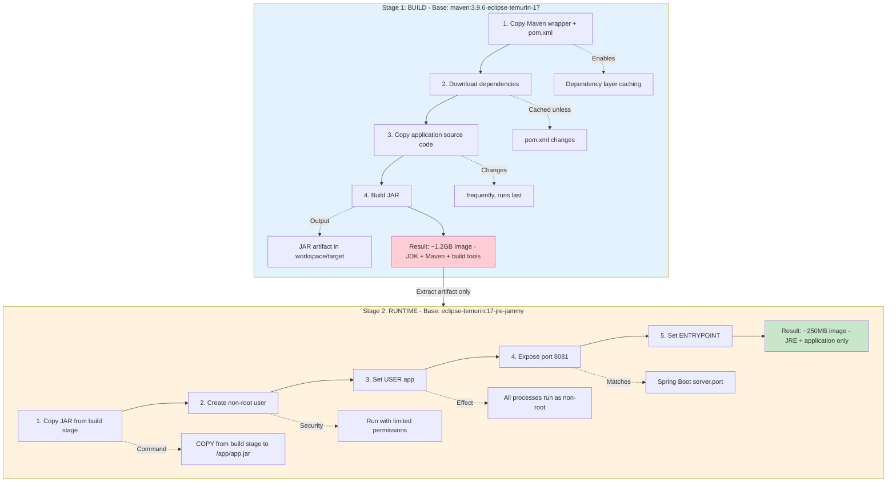

# Docker Containerization Strategy

## Overview

StockEase uses a multi-stage Docker build strategy to create minimal, secure, and reproducible container images for production deployment. The Dockerfile follows enterprise best practices for layer caching, security hardening, and runtime optimization.

## Architecture

### Multi-Stage Build Pipeline



## Build Configuration

### Base Images

**Build Stage**:
- Image: `maven:3.9.6-eclipse-temurin-17`
- Purpose: Full JDK + Maven for compilation
- Size: ~850MB
- Contains: JDK 17, Maven 3.9.6, build tools

**Runtime Stage**:
- Image: `eclipse-temurin:17-jre-jammy`
- Purpose: Minimal JRE for execution
- Size: ~180MB base
- Contains: JRE 17 (headless), Ubuntu Jammy

### Layer Caching Strategy

Docker caches layers based on file changes. The Dockerfile optimizes build speed:

```dockerfile
# Layer 1: Maven wrapper (rarely changes)
COPY mvnw pom.xml ./
COPY .mvn .mvn
RUN chmod +x mvnw

# Layer 2: Dependencies (changes when pom.xml changes)
RUN ./mvnw -B -ntp dependency:go-offline

# Layer 3: Application code (changes frequently)
COPY src ./src
RUN ./mvnw -B -ntp -DskipTests clean package
```

**Caching Efficiency**:
- Source code changes: Only Layer 3 rebuilds (~30s)
- Dependency changes: Layers 2-3 rebuild (~2-3 min)
- Maven config changes: All layers rebuild (~5 min)

### Maven Build Arguments

| Flag | Purpose |
|------|---------|
| `-B` | Batch mode (non-interactive) |
| `-ntp` | No transfer progress (cleaner logs) |
| `-DskipTests` | Skip tests in container build |
| `dependency:go-offline` | Download all dependencies upfront |
| `clean package` | Clean + compile + package JAR |

**Why skip tests?**
- Tests run in CI pipeline before Docker build
- Keeps Docker build fast (~1 min vs ~3 min)
- Separates concerns: testing vs. packaging

## Security Hardening

### Non-Root User Execution

```dockerfile
RUN addgroup --system app && adduser --system --ingroup app app || true
USER app
```

**Benefits**:
- Limits privilege escalation attacks
- Container runs with UID 1000 (non-root)
- Aligns with Kubernetes security policies
- Reduces attack surface if container is compromised

**Why `|| true`?**
- Some base images have `app` user pre-created
- Prevents build failure if user already exists
- Idempotent operation (safe to run multiple times)

### Minimal Runtime Dependencies

Runtime image contains only:
- JRE 17 (no compiler)
- Application JAR
- Ubuntu Jammy base (~80MB)

**NOT included**:
- Maven, Gradle
- Development tools (gcc, make)
- Source code
- Test dependencies

### Fixed Entrypoint

```dockerfile
ENTRYPOINT ["java", "-jar", "/app/app.jar", "--server.port=8081"]
```

**Advantages**:
- Prevents accidental shell execution
- Forces consistent startup command
- Allows runtime argument overrides
- Explicit port configuration

## Application Configuration

### Port Mapping

| Context | Port | Purpose |
|---------|------|---------|
| Dockerfile | `EXPOSE 8081` | Documentation + container metadata |
| Spring Boot | `server.port=8081` | Application listening port |
| Koyeb | `8081` | Container port mapping |
| CI/CD | `8081` | Health check endpoint |

**Port Selection**: 8081 avoids conflicts with common services (8080, 8000, 3000).

### Environment Variables

The container supports runtime configuration via environment variables:

```bash
# Database configuration
DATABASE_URL=jdbc:postgresql://host:5432/db
DATABASE_USERNAME=user
DATABASE_PASSWORD=secret

# Spring profiles
SPRING_PROFILES_ACTIVE=prod

# JVM tuning
JAVA_OPTS=-Xmx512m -Xms256m
```

**Current deployment (Koyeb)**:
- Profile: `prod`
- Database: Neon PostgreSQL (serverless)
- Memory: 512MB container limit

## Build & Deploy Workflow

### Local Build

```bash
# Build image
docker build -t stockease:local .

# Run container
docker run -p 8081:8081 \
  -e DATABASE_URL=jdbc:postgresql://localhost:5432/stockease \
  -e DATABASE_USERNAME=postgres \
  -e DATABASE_PASSWORD=postgres \
  stockease:local
```

### CI/CD Pipeline Integration

**GitHub Actions** (`auto_deploy.yml`):

```yaml
- name: Build Docker Image
  run: docker build -t ghcr.io/keglev/stockease:latest .

- name: Push to GitHub Container Registry
  run: |
    echo ${{ secrets.GITHUB_TOKEN }} | docker login ghcr.io -u ${{ github.actor }} --password-stdin
    docker push ghcr.io/keglev/stockease:latest
```

**Deployment Flow**:
1. Push to `main` branch
2. GitHub Actions builds Docker image
3. Image pushed to GHCR: `ghcr.io/keglev/stockease:latest`
4. Koyeb pulls image and redeploys service
5. Health checks verify deployment

### Image Registry

**GitHub Container Registry (GHCR)**:
- URL: `ghcr.io/keglev/stockease`
- Tag: `latest` (auto-updates on every main push)
- Visibility: Public
- Size: ~250MB

## Performance Characteristics

### Build Times

| Scenario | Duration | Layers Rebuilt |
|----------|----------|----------------|
| First build | ~5 min | All (download deps + compile) |
| Code change only | ~30 sec | Stage 1 Layer 3 only |
| Dependency change | ~3 min | Stage 1 Layers 2-3 |
| Full rebuild | ~5 min | All layers (no cache) |

### Image Sizes

| Stage | Size | Composition |
|-------|------|-------------|
| Build stage | ~1.2GB | Maven (500MB) + JDK (350MB) + deps (350MB) |
| Runtime image | ~250MB | JRE (180MB) + JAR (70MB) |
| Compression | ~85MB | GHCR compressed image |

**Size optimization achieved**: 83% reduction (1.2GB → 250MB)

### Runtime Performance

- **Startup time**: ~8 seconds (Spring Boot initialization)
- **Memory footprint**: ~200MB (idle), ~400MB (under load)
- **CPU usage**: <5% (idle), 20-40% (moderate load)

## Technology Stack

### Build Components

| Component | Version | Purpose |
|-----------|---------|---------|
| Maven | 3.9.6 | Build tool |
| JDK | Eclipse Temurin 17 | Compilation |
| Spring Boot | 3.5.7 | Application framework |
| Docker | 20.10+ | Container runtime |

### Runtime Components

| Component | Version | Purpose |
|-----------|---------|---------|
| JRE | Eclipse Temurin 17 | Java runtime |
| Ubuntu Jammy | 22.04 LTS | Base OS |
| PostgreSQL Driver | (bundled) | Database connectivity |

## Best Practices Applied

✅ **Multi-stage builds**: Separate build and runtime environments  
✅ **Layer caching**: Dependencies downloaded before source code  
✅ **Minimal base images**: JRE instead of JDK in production  
✅ **Non-root user**: Security-hardened container  
✅ **Explicit ports**: Clear port mapping documentation  
✅ **Fixed entrypoint**: Consistent startup behavior  
✅ **Batch mode flags**: Clean, reproducible builds  
✅ **Wildcard JAR copy**: Version-agnostic artifact extraction  

## Common Issues & Solutions

### Issue: Build Cache Not Working

**Symptom**: Every build downloads dependencies  
**Cause**: `pom.xml` or `.mvn` directory changed  
**Solution**: Ensure `pom.xml` is stable; use `dependency:go-offline`

### Issue: Port Already In Use

**Symptom**: `Address already in use: bind`  
**Cause**: Port 8081 occupied by another process  
**Solution**: Use different host port: `docker run -p 8082:8081 ...`

### Issue: Database Connection Failed

**Symptom**: `Connection refused` or `Unknown host`  
**Cause**: Database not accessible from container  
**Solution**: Use `host.docker.internal` for localhost databases

### Issue: Image Size Too Large

**Symptom**: Slow push/pull times  
**Cause**: Build stage included in final image  
**Solution**: Already mitigated by multi-stage build

## Future Enhancements

### Planned Improvements

1. **JVM Optimization**: Add `-XX:+UseContainerSupport` for better memory limits
2. **Health Checks**: Add `HEALTHCHECK` instruction to Dockerfile
3. **Build Arguments**: Support custom JVM flags via `ARG`
4. **Distroless Base**: Migrate to Google distroless Java image (~50MB smaller)
5. **Image Scanning**: Integrate Trivy/Grype for vulnerability scanning

### Advanced Configurations

```dockerfile
# Example: JVM tuning for production
ENTRYPOINT ["java", \
  "-XX:+UseContainerSupport", \
  "-XX:MaxRAMPercentage=75.0", \
  "-XX:+UseG1GC", \
  "-Djava.security.egd=file:/dev/./urandom", \
  "-jar", "/app/app.jar"]
```

## References

- [Dockerfile Location](../../Dockerfile)
- [CI/CD Pipeline Documentation](./ci-pipeline.md)
- [Deployment Overview](../deployment.md)
- [Spring Boot Container Images](https://spring.io/guides/topicals/spring-boot-docker/)
- [Docker Multi-Stage Builds](https://docs.docker.com/build/building/multi-stage/)
- [Eclipse Temurin Images](https://hub.docker.com/_/eclipse-temurin)

## Related Documentation

- **[ci-pipeline.md](./ci-pipeline.md)** — CI/CD workflow that builds this image
- **[staging-config.md](./staging-config.md)** — Environment configuration
- **[deployment.md](../deployment.md)** — Overall deployment architecture
