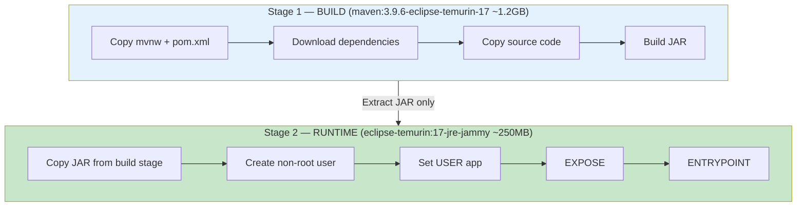

# Docker Containerization Strategy

**Purpose**: Document the multi-stage Dockerfile, layer caching strategy, security hardening, and image registry configuration.

---

## Multi-Stage Build


```mermaid
graph TD
    subgraph Stage1["Stage 1 — BUILD (maven:3.9.6-eclipse-temurin-17 ~1.2GB)"]
        B1[Copy mvnw + pom.xml] --> B2[Download dependencies]
        B2 --> B3[Copy source code]
        B3 --> B4[Build JAR]
    end

    Stage1 -->|Extract JAR only| Stage2

    subgraph Stage2["Stage 2 — RUNTIME (eclipse-temurin:17-jre-jammy ~250MB)"]
        R1[Copy JAR from build stage] --> R2[Create non-root user]
        R2 --> R3[Set USER app]
        R3 --> R4[EXPOSE <port>]
        R4 --> R5[ENTRYPOINT]
    end

    style Stage1 fill:#e3f2fd
    style Stage2 fill:#c8e6c9
```

Size reduction: 1.2GB → ~250MB (83% smaller).

---

## Dockerfile

```dockerfile
# Stage 1 — Build
FROM maven:3.9.6-eclipse-temurin-17 AS builder

WORKDIR /app
COPY mvnw pom.xml ./
COPY .mvn .mvn
RUN chmod +x mvnw

# Dependency layer — cached unless pom.xml changes
RUN ./mvnw -B -ntp dependency:go-offline

# Source layer — changes frequently
COPY src ./src
RUN ./mvnw -B -ntp -DskipTests clean package

# Stage 2 — Runtime
FROM eclipse-temurin:17-jre-jammy

WORKDIR /app

COPY --from=builder /app/target/stockease-backend-*.jar app.jar

RUN addgroup --system app && adduser --system --ingroup app app || true
USER app

EXPOSE <port>

ENTRYPOINT ["java", "-jar", "/app/app.jar", "--server.port=<port>"]
```

---

## Layer Caching Strategy

| Layer | Invalidated When | Rebuild Time |
|-------|-----------------|--------------|
| Maven wrapper + pom.xml | `pom.xml` or `.mvn` changes | ~3 min (re-downloads deps) |
| Dependencies | `pom.xml` changes | ~2 min |
| Source code | Any `src/` change | ~30s |

The Dockerfile copies `pom.xml` before `src/` specifically to maximize cache hits on the dependency layer.

---

## Security Hardening

**Non-root user execution**: the container runs as `app` (UID 1000), not root. This limits privilege escalation and aligns with Kubernetes security policies. The `|| true` guard prevents build failure if the `app` user already exists in the base image.

**Minimal runtime image**: the final stage uses JRE only — no JDK, no Maven, no source code, no build tools. Attack surface is minimized.

**No hardcoded secrets**: all sensitive values are passed via environment variables at runtime.

**Fixed ENTRYPOINT**: prevents accidental shell execution and enforces consistent startup behavior.

---

## Maven Build Flags

| Flag | Purpose |
|------|---------|
| `-B` | Batch mode — non-interactive |
| `-ntp` | No transfer progress — cleaner CI logs |
| `-DskipTests` | Tests run in CI before Docker build, not inside it |
| `dependency:go-offline` | Downloads all dependencies upfront for reliable caching |
| `clean package` | Clean + compile + package JAR |

Tests are intentionally skipped in the Docker build. They run in the CI pipeline before the build stage.

---

## Image Registry (GHCR)

```
Registry: <registry-rost>/keglev/stockease
Visibility: Public

Tags:
  <registry-rost>/keglev/stockease:latest      — updated on every main push
  <registry-rost>/keglev/stockease:v1.0.0      — semantic version tags
  <registry-rost>/keglev/stockease:sha-abc123  — commit hash tags
```

---

## Port Configuration

| Context | Port |
|---------|------|
| Dockerfile `EXPOSE` | <port> |
| Spring Boot `server.port` | <port> |
| Koyeb container port | <port> |
| Health check | <port> |

Port <port> is used to avoid conflicts with common default ports (8080, 3000, 8000).

---

## Local Build & Run

```bash
# Build image
docker build -t stockease:local .

# Run container
docker run -p <port>:<port> \
  -e SPRING_DATASOURCE_URL=jdbc:postgresql://localhost:5432/stockease \
  -e SPRING_DATASOURCE_USERNAME=${DB_USER} \
  -e SPRING_DATASOURCE_PASSWORD=${DB_PASSWORD} \
  -e JWT_SECRET=local-dev-secret-32-chars-min \
  stockease:local
```

---

## Build Performance

| Scenario | Duration | Layers Rebuilt |
|----------|----------|----------------|
| First build (no cache) | ~5 min | All |
| Source code change only | ~30s | Source + package |
| Dependency change | ~3 min | Deps + source + package |

---

[Back to Deployment Index](./index.md)
