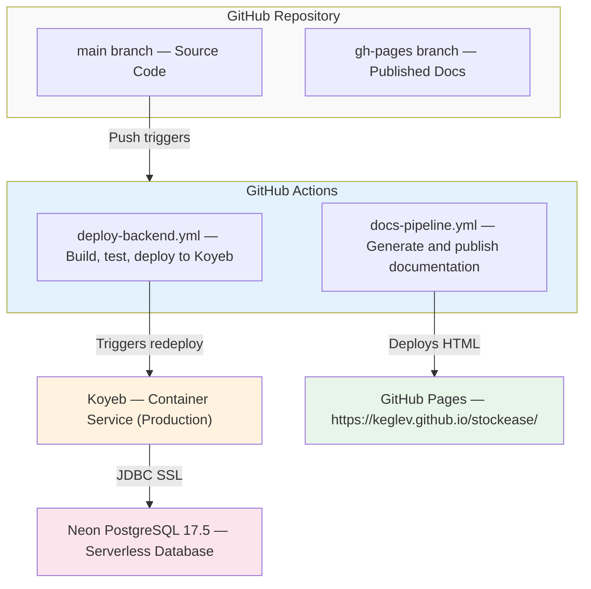
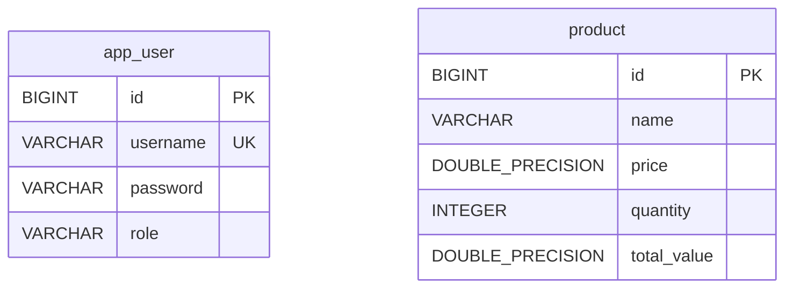

# Infrastructure

**Purpose**: Document the production deployment topology, Koyeb service configuration, database management, monitoring, and disaster recovery.

---

## Deployment Topology



---

## Deployment Environments

| Environment | Branch | Database | URL |
|-------------|--------|----------|-----|
| Development | Any feature branch | H2 in-memory | localhost:8081 |
| Production | main | Neon PostgreSQL | stockease-backend-production.koyeb.app |

Staging (separate Koyeb service + PostgreSQL test instance) is available but not currently active.

---

## Koyeb Service Configuration

```yaml
Service Name: stockease-backend-production
Runtime: Docker (built from Dockerfile in repo)
Region: US (Auto)
Replicas: 1–2 (auto-scaling)

Environment Variables:
  SPRING_PROFILES_ACTIVE: production
  DB_HOST: [Neon endpoint]
  DB_PORT: 5432
  DB_NAME: stockease
  DB_USER: [from secrets]
  DB_PASSWORD: [from secrets]
  JWT_SECRET: [from secrets]
  JAVA_OPTS: -Xmx512m -Xms256m

Port Mapping:
  Container Port: 8081
  Public Port: 443 (HTTPS)
  Protocol: HTTP2

Health Check:
  Endpoint: /health
  Interval: 30s
  Timeout: 5s
  Consecutive Failures before unhealthy: 3
  Consecutive Successes before healthy: 1
```

### Auto-Scaling

```yaml
Min Replicas: 1
Max Replicas: 2
Target CPU: 70%
Target Memory: 80%
Scale Up Delay: 60s
Scale Down Delay: 300s
```

---

## Neon PostgreSQL (Production Database)

```
Host: [neon-project].neon.tech
Port: 5432
SSL Mode: require
Connection Pooling: enabled (limit: 100)
```

### Automated Backups
- Frequency: daily (automatic)
- Retention: 7 days
- Recovery: point-in-time restore available

### Database Migrations (Flyway)



Migration files in `src/main/resources/db/migration/`:

| File | Action |
|------|--------|
| `V1__baseline.sql` | Empty Flyway baseline marker for existing schema |
| `V2__create_schema.sql` | Creates `app_user` and `product` tables with BIGSERIAL PKs |

Seed data (fixture users and products) is inserted at application startup by `DataSeeder.java`, which is active in all non-production profiles (`@Profile("!prod")`). See [Staging & Configuration](./staging-config.md) for details.

Flyway runs automatically on application startup via `FlywayConfiguration.java`, which forces migrations to execute before JPA initializes — resolving a Spring Boot 3.5.x startup ordering issue.

---

## Monitoring

### Health Endpoints

Two health check paths exist:

**`GET /api/health`** — custom endpoint, returns `text/plain`. Used by Koyeb health probes.
```
Database is connected and API is running.
```

**`GET /actuator/health`** and **`GET /actuator/health/**`** — Spring Boot Actuator endpoints, return JSON. Also public per `SecurityConfig`.
```json
{
  "status": "UP",
  "components": {
    "db": { "status": "UP" },
    "diskSpace": { "status": "UP" }
  }
}
```

### Application Logs

Captured by Koyeb via stdout/stderr. Key startup sequence:

```
INFO  Flyway Community Edition — Database: PostgreSQL 17.5
INFO  Successfully validated 3 migrations — Current version: 3
INFO  Will secure any request
INFO  Tomcat started on port(s): 8081
INFO  Started StockEaseApplication in 4.1s
```

### Tracked Metrics

Request count, response time (avg, P95, P99), error rate (4xx, 5xx), database connections (active/idle), memory (heap/non-heap), container CPU.

---

## Disaster Recovery

### If Deployment Fails
Koyeb automatically keeps the previous healthy version running. The pipeline marks the run as failed. Review logs on Koyeb and re-trigger once the issue is resolved.

### If Database Is Corrupted
1. Identify recovery point from Neon backups
2. Restore to a staging instance first
3. Verify application functionality against restored DB
4. Switch production connection to restored instance

### If Koyeb Service Goes Down
Manually trigger `deploy-backend.yml` via `workflow_dispatch`. Verify health checks pass before considering the issue resolved.

---

## Deployment Checklist

Before every production deployment:

- [ ] All tests passing (65+ tests)
- [ ] Code reviewed and approved
- [ ] Secrets configured in GitHub and Koyeb
- [ ] Database migrations validated against staging
- [ ] Health check endpoint responding
- [ ] CORS configured for production domain only
- [ ] SSL certificate active
- [ ] Backups verified
- [ ] Rollback plan confirmed (previous version available on Koyeb)

---

[Back to Deployment Index](./index.md)
