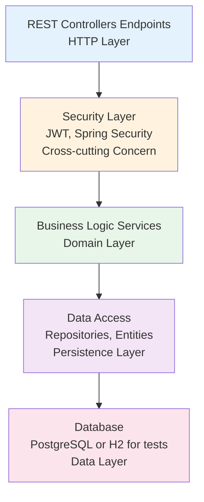
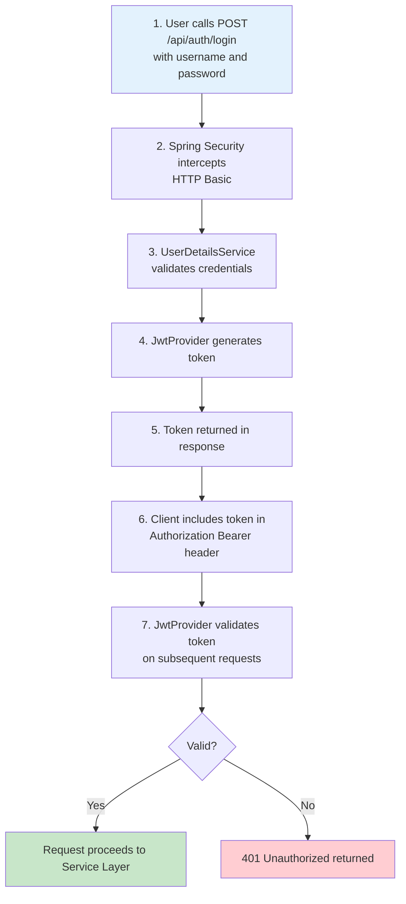

# Service Layers & Component Architecture

## Layered Architecture

StockEase follows a **classic N-tier layered architecture** with clear separation of concerns:



## Layer Descriptions

### 1. HTTP/Presentation Layer (Controllers)

**Purpose**: Handle HTTP requests/responses, input validation, and routing

**Components**:
- `AuthController` - Authentication endpoints
- `ProductController` - Product CRUD endpoints
- `HealthController` - System health check
- `ExceptionHandler` - Global error handling

**DTOs used by controllers**:
- `LoginRequest` — { username: String, password: String } (validated with @NotBlank)
- `ApiResponse<T>` — Generic response envelope: { success: boolean, message: String, data: T }
- `PaginatedResponse<T>` — Wrapper for Spring Page with pagination metadata (pageNumber, pageSize, totalElements, totalPages)

**Responsibilities**:
```
Request → Validate Input → Call Service → Format Response → HTTP Status
```

**Example Flow**:
```java
// POST /api/products
@PostMapping
public ResponseEntity<ProductDTO> createProduct(
    @RequestBody CreateProductRequest req,
    @RequestHeader("Authorization") String token) {
    
    // 1. Controller validates request format
    // 2. Controller calls ProductService
    // 3. Service validates business logic
    // 4. Controller formats response
    // 5. Returns HTTP 201 Created
}
```

### 2. Security Layer (Cross-cutting)

**Purpose**: Enforce authentication and authorization across all endpoints

**Components**:
- `JwtProvider` - Generate and validate JWT tokens
- `SecurityConfig` - Spring Security configuration
- `AuthenticationFilter` - Intercept and validate requests
- `PasswordEncoder` - BCrypt hashing

**Authentication Flow**:



**Protected Endpoints**:
- All `/api/products/*` endpoints require JWT token
- `/health` is public (no auth required)

**Controller / Endpoint summary**

| Controller | Key Endpoints | Auth Requirement |
|------------|---------------|------------------|
| `AuthController` | POST `/api/auth/login` | Public (permitAll)
| `HealthController` | GET `/api/health` | Public
| `ProductController` | GET `/api/products` | JWT (`ADMIN`,`USER`)
| `ProductController` | GET `/api/products/paged` | JWT (`ADMIN`,`USER`)
| `ProductController` | GET `/api/products/{id}` | JWT (`ADMIN`,`USER`)
| `ProductController` | POST `/api/products` | JWT (`ADMIN`)
| `ProductController` | PUT `/api/products/{id}/quantity` | JWT (`ADMIN`,`USER`)
| `ProductController` | PUT `/api/products/{id}/price` | JWT (`ADMIN`,`USER`)
| `ProductController` | PUT `/api/products/{id}/name` | JWT (`ADMIN`,`USER`)
| `ProductController` | GET `/api/products/low-stock` | JWT (`ADMIN`,`USER`)
| `ProductController` | GET `/api/products/search` | JWT (`ADMIN`,`USER`)
| `ProductController` | DELETE `/api/products/{id}` | JWT (`ADMIN`)
| `ProductController` | GET `/api/products/total-stock-value` | JWT (`ADMIN`,`USER`)

### 3. Business Logic Layer (Services)

**Purpose**: Implement business rules, validation, and orchestration

**Components**:
- `AuthService` - User authentication and authorization
- `ProductService` - Product business logic
- `HealthService` - System status
- Custom validators and processors

**AuthService Responsibilities**:

```mermaid
graph TD
    subgraph registerUser["registerUser(username, password)"]
        R1[Validate username<br/>not empty, unique] --> R2[Validate password<br/>strength requirements]
        R2 --> R3[Hash password with BCrypt]
        R3 --> R4[Create User entity]
        R4 --> R5[Save to database]
        R5 --> R6[Return UserDTO]
    end
    
    subgraph authenticateUser["authenticateUser(username, password)"]
        A1[Find user by username] --> A2[Compare provided password<br/>with hashed password]
        A2 --> A3[Generate JWT token<br/>with role]
        A3 --> A4[Return token + user info]
        A2 -.->|Fail| A5[Throw exception if auth fails]
    end
    
    subgraph validateToken["validateToken(token)"]
        V1[Parse JWT signature] --> V2[Check expiration]
        V2 --> V3[Extract user claims]
        V3 --> V4[Return user info or<br/>throw exception]
    end
    
    style registerUser fill:#e3f2fd
    style authenticateUser fill:#fff3e0
    style validateToken fill:#e8f5e9
```



**ProductService Responsibilities**:

```mermaid
graph TD
    subgraph createProduct["createProduct(request, userId, role)"]
        C1[Validate request<br/>name, price, quantity] --> C2[Check authorization<br/>ADMIN only]
        C2 --> C3[Check SKU uniqueness]
        C3 --> C4[Create Product entity]
        C4 --> C5[Set metadata<br/>createdAt, createdBy]
        C5 --> C6[Save to database]
        C6 --> C7[Return ProductDTO]
    end
    
    subgraph getProducts["getProducts(page, size, sort, filter)"]
        G1[Build dynamic query<br/>from filters] --> G2[Apply pagination<br/>page, size]
        G2 --> G3[Apply sorting<br/>name, price, date]
        G3 --> G4[Execute query]
        G4 --> G5[Map to DTOs]
        G5 --> G6[Return PageResponse]
    end
    
    subgraph updateProduct["updateProduct(id, request, userId, role)"]
        U1[Find product by ID] --> U2[Check authorization<br/>ADMIN only]
        U2 --> U3[Validate request fields]
        U3 --> U4[Update product fields]
        U4 --> U5[Set updatedAt timestamp]
        U5 --> U6[Save to database]
        U6 --> U7[Return updated ProductDTO]
    end
    
    subgraph deleteProduct["deleteProduct(id, userId, role)"]
        D1[Find product by ID] --> D2[Check authorization<br/>ADMIN only]
        D2 --> D3[Delete from database]
        D3 --> D4[Return success]
    end
    
    style createProduct fill:#e3f2fd
    style getProducts fill:#fff3e0
    style updateProduct fill:#e8f5e9
    style deleteProduct fill:#ffcdd2
```



**Key Design Patterns**:
- **Dependency Injection**: Spring injects repositories into services
- **Validation**: Validate before database calls
- **Error Handling**: Throw domain-specific exceptions
- **Transaction Management**: `@Transactional` for data consistency

### 4. Data Access Layer (Repositories & Entities)

**Purpose**: Abstract database operations and provide query interface

**Components**:
- `User` entity - JPA entity mapping to users table
- `Product` entity - JPA entity mapping to products table
- `AuthRepository` - Spring Data JPA repository for User
- `ProductRepository` - Spring Data JPA repository for Product

**Entity Example**:
```java
@Entity
@Table(name = "users")
public class User {
    @Id
    @GeneratedValue(strategy = GenerationType.UUID)
    private UUID id;
    
    @Column(unique = true, nullable = false)
    private String username;
    
    @Column(nullable = false)
    private String password; // BCrypt hashed
    
    @Enumerated(EnumType.STRING)
    private Role role; // ADMIN, USER
    
    @CreationTimestamp
    private LocalDateTime createdAt;
}
```

**Repository Interface**:
```java
public interface ProductRepository extends JpaRepository<Product, UUID> {
    // Spring Data generates SQL automatically
    Optional<Product> findBySku(String sku);
    List<Product> findByCategory(String category);
    Page<Product> findAll(Pageable pageable);
    
    // Custom query if needed
    @Query("SELECT p FROM Product p WHERE p.price > ?1 AND p.quantity > 0")
    List<Product> findAffordableInStock(BigDecimal maxPrice);
}
```

**Database Operations**:
```
Java Service → Spring Data JPA → JDBC Driver → PostgreSQL/H2
```

### 5. Database Layer (Persistence)

**Purpose**: Store and retrieve data reliably

**Production Database**:
- **PostgreSQL 17.5** (Neon serverless)
- ACID compliance
- Full-text search capabilities
- Connection pooling (HikariCP)

**Test Database**:
- **H2** (in-memory)
- Fast test execution
- Data isolation per test
- No external dependencies

**Schema Management**:
```
Flyway Migrations → Database Versioning
V1__init_schema.sql     ← Create tables
V2__add_indexes.sql     ← Add performance optimizations
V3__seed_data.sql       ← Populate test data
```

## Data Flow Diagram

### Create Product Flow
```
1. Frontend (Vue.js)
   ├── User fills form (name, price, quantity)
   ├── Sends POST /api/products with JWT token
   └── Content-Type: application/json

2. HTTP Layer (ProductController)
   ├── Receives request
   ├── Validates JSON structure
   ├── Calls productService.createProduct(request, token)
   └── Catches exceptions

3. Security Layer
   ├── Validates JWT token
   ├── Extracts user ID and role
   ├── Checks if user has ADMIN role
   └── Returns 403 Forbidden if unauthorized

4. Business Logic Layer (ProductService)
   ├── Validates business rules:
   │   ├── Name is not empty
   │   ├── Price > 0
   │   ├── SKU is unique
   │   └── Quantity >= 0
   ├── Creates Product entity
   ├── Sets metadata (createdAt, createdBy)
   ├── Calls productRepository.save(product)
   └── Throws ValidationException if validation fails

5. Data Access Layer (Spring Data JPA)
   ├── Converts Product entity to SQL INSERT
   ├── Executes: INSERT INTO products (name, price, sku, ...) VALUES (...)
   └── Returns saved Product with generated ID

6. Database Layer (PostgreSQL)
   ├── Validates constraints (unique SKU, NOT NULL fields)
   ├── Executes INSERT
   ├── Triggers any cascade operations
   └── Returns INSERTING succeeds or error

7. Back through layers with response:
   ├── JPA returns Product entity
   ├── Service returns ProductDTO
   ├── Controller formats HTTP response
   ├── Returns HTTP 201 Created with Location header
   └── Frontend receives response and updates UI

Response JSON:
{
  "id": "550e8400-e29b-41d4-a716-446655440000",
  "name": "Widget",
  "price": 29.99,
  "sku": "WIDGET-001",
  "quantity": 100,
  "createdAt": "2025-10-31T10:30:00Z"
}
```

### Get Products with Filtering Flow
```
1. Frontend
   ├── Sends: GET /api/products?page=0&size=20&sort=name,asc&category=electronics

2. ProductController
   ├── Extracts query parameters
   ├── Calls productService.getProducts(page, size, sort, category)

3. ProductService
   ├── Builds dynamic WHERE clause: category = 'electronics'
   ├── Creates PageRequest(0, 20, Sort.by("name").ascending())
   ├── Calls productRepository.findAll(spec, pageRequest)

4. Spring Data JPA
   ├── Translates to SQL:
   │   SELECT * FROM products
   │   WHERE category = 'electronics'
   │   ORDER BY name ASC
   │   LIMIT 20 OFFSET 0
   │   
   ├── Executes query

5. Database
   ├── Scans products table (uses index on category)
   ├── Filters results
   ├── Orders by name
   ├── Returns limited result set

6. Back through layers:
   ├── JPA returns Page<Product>
   ├── Service converts to Page<ProductDTO>
   ├── Controller formats JSON response
   └── Returns HTTP 200 OK with pagination metadata

Response JSON:
{
  "content": [
    { "id": "...", "name": "...", "category": "electronics" },
    ...
  ],
  "page": 0,
  "size": 20,
  "totalElements": 150,
  "totalPages": 8,
  "last": false
}
```

## Component Dependencies

```
AuthController
  ├── depends on: AuthService
  ├── depends on: JwtProvider
  └── depends on: PasswordEncoder

ProductController
  ├── depends on: ProductService
  ├── depends on: SecurityContext (JWT validation)
  └── depends on: ExceptionHandler

AuthService
  ├── depends on: AuthRepository
  ├── depends on: PasswordEncoder
  ├── depends on: JwtProvider
  └── depends on: UserRepository

ProductService
  ├── depends on: ProductRepository
  ├── depends on: Custom validators
  └── depends on: Mappers (Entity → DTO)

AuthRepository
  └── accesses: User entity (users table)

ProductRepository
  └── accesses: Product entity (products table)

Security Configuration
  ├── depends on: JwtProvider
  ├── depends on: UserDetailsService
  └── depends on: PasswordEncoder
```

## Transaction Boundaries

**Read Operations** (No transaction needed):
- GET /api/products (read-only)
- GET /api/products/{id} (read-only)
- GET /health (read-only)

**Write Operations** (@Transactional required):
```java
@Transactional
public void createProduct(CreateProductRequest req) {
    // BEGIN TRANSACTION
    
    // Multiple operations treated as atomic
    Product product = new Product(req);
    productRepository.save(product); // Can fail
    auditLog.log("Product created", product.getId()); // Can fail
    
    // COMMIT TRANSACTION (if all succeed)
    // ROLLBACK TRANSACTION (if any operation fails)
}
```

## Error Handling Strategy

```
Layer → Exception → Handler → Response

Application Exception
  ├── ValidationException (400 Bad Request)
  ├── AuthenticationException (401 Unauthorized)
  ├── AuthorizationException (403 Forbidden)
  ├── EntityNotFoundException (404 Not Found)
  └── InternalServerException (500 Internal Server Error)

@RestControllerAdvice
public class GlobalExceptionHandler {
    @ExceptionHandler(ValidationException.class)
    public ResponseEntity<ErrorResponse> handleValidation(ValidationException e) {
        return ResponseEntity
            .status(HttpStatus.BAD_REQUEST)
            .body(new ErrorResponse(e.getMessage(), "VALIDATION_ERROR"));
    }
}
```

## Performance Considerations

### Database Indexing
```sql
-- Indexed for fast lookups
CREATE INDEX idx_products_sku ON products(sku);
CREATE INDEX idx_products_category ON products(category);
CREATE INDEX idx_users_username ON users(username);
```

### Query Optimization
- Use pagination for list endpoints (avoid loading 10k+ records)
- Use lazy loading for relationships
- Cache frequently accessed data
- Use database-level filtering before returning to application

### Connection Pooling
- HikariCP manages database connections
- Maximum pool size: 10 connections
- Reduces connection overhead

---

## Related Documentation

### Main Architecture Topics
- **[Architecture Overview](./overview.md)** - Business context, technology stack, design decisions
- **[Backend Architecture](./backend.md)** - Spring Boot components and code organization
- **[Security Architecture](./security.md)** - Authentication and authorization in each layer
- **[Deployment Architecture](./deployment.md)** - How layers are deployed to production

### Architecture Decisions (ADRs)
- **[Database Choice](./decisions/001-database-choice.md)** - Repository layer database selection
- **[Validation Strategy](./decisions/002-validation-strategy.md)** - Validation in Service layer

### Design Patterns & Practices
- **[Repository Pattern](./patterns/repository-pattern.md)** - Repository layer implementation details
- **[Security Patterns](./patterns/security-patterns.md)** - Security filters in Controller layer

---

**Document Version**: 1.0  
**Last Updated**: October 31, 2025  
**Status**: Production
