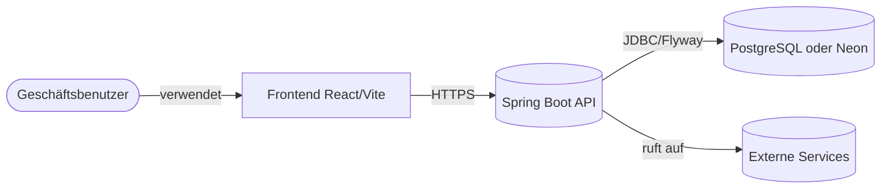
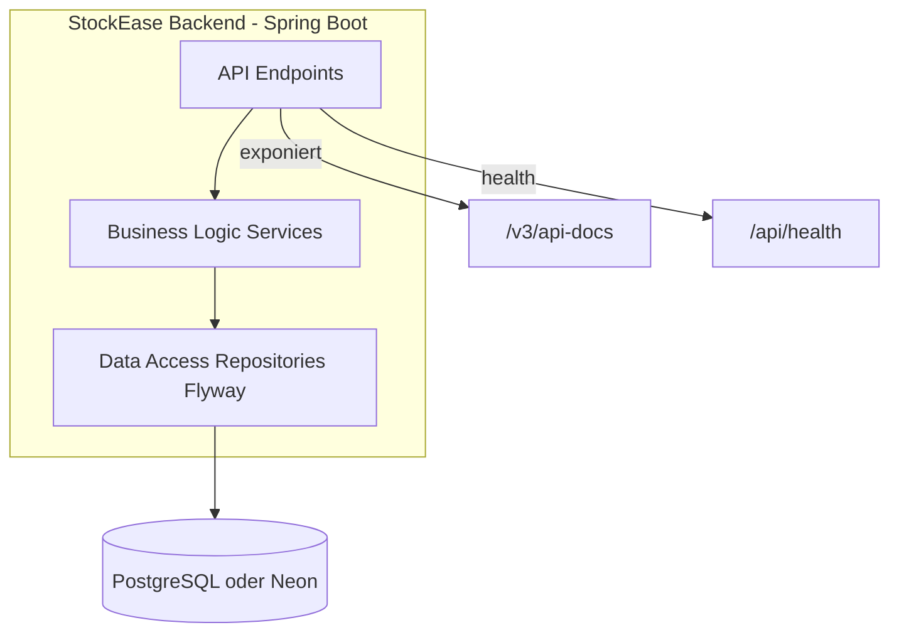

# StockEase Backend-Architektur – Übersicht

**[English Version](./overview.md)**

## Zusammenfassung

StockEase ist ein unternehmensgerechtes Bestandsverwaltungssystem, das mit **Spring Boot 3.5.7** und **PostgreSQL** entwickelt wurde. Das Backend bietet RESTful APIs für Produktverwaltung, Authentifizierung und Bestandsverfolgung mit umfangreicher Testabdeckung (65+ Tests) und containerisierter Bereitstellung auf Koyeb.

**Live API**: https://keglev.github.io/stockease/api-docs.html

## Geschäftskontext

### Problemstellung
Unternehmen benötigen eine zentrale, sichere und skalierbare Plattform, um:
- Bestände in Echtzeit zu verwalten
- Benutzerzugriffe mit rollengestützter Authentifizierung zu kontrollieren
- Lagerniveaus, Preise und Produktmetadaten zu verfolgen
- Zuverlässige APIs für Frontend und Drittanbieter bereitzustellen

### Lösungsarchitektur
StockEase bietet:
- **Multi-User-Unterstützung** mit rollengestützter Zugriffskontrolle (Admin, Benutzer)
- **RESTful API** für CRUD-Operationen auf Produkten und Beständen
- **Sichere Authentifizierung** mit JWT-Tokens und BCrypt-Passwort-Hashing
- **Cloud-native Bereitstellung** mit Containerisierung und automatischer Skalierung
- **Produktionsbereite** Datenbank (PostgreSQL) mit automatischen Migrationen

## C4-Architekturmodell

### Kontextdiagramm (Ebene 1)


### Container-Diagramm (Ebene 2)


### Komponenten-Diagramm (Ebene 3)

#### 1. Controllers-Ebene
- **AuthController**: Authentifizierungs-Endpoints (Login, Registrierung, Token-Validierung)
- **ProductController**: Produktverwaltungs-Endpoints (Erstellen, Lesen, Aktualisieren, Löschen, Suchen, Paginierung)
- **HealthController**: System-Gesundheitsprüfung
- **OpenAPI-Anmerkungen**: Generiert automatisch API-Dokumentation

#### 2. Service-Ebene
- **AuthService**: 
  - Benutzerkreditvalidierung
  - JWT-Token-Generierung und -Validierung
  - Passwort-Hashing (BCrypt)
  - Rollengestützte Zugriffskontrolle

- **ProductService**:
  - Geschäftslogik für CRUD-Produktoperationen
  - Filter- und Suchfunktionen
  - Paginierung und Sortierung
  - Datenvalidierung

- **HealthService**:
  - Datenbankverbindungsprüfungen
  - Anwendungsstatus-Berichterstattung

#### 3. Repository-Ebene (Spring Data JPA)
- **AuthRepository**: Benutzerpersistenz
- **ProductRepository**: Produktpersistenz
- **Benutzerdefinierte Abfragen** für komplexe Filter

#### 4. Sicherheits-Ebene
- **JWT-Provider**: Token-Generierung und -Validierung
- **BCrypt**: Passwort-Hashing
- **Spring Security**: HTTP Basic und Bearer Token Authentifizierung
- **CORS-Konfiguration**: Frontend-Integration

#### 5. Datenzugriff-Ebene
- **Flyway**: Datenbank-Versionierung und Migrationen
- **PostgreSQL 17.5**: Produktionsdatenbank (Neon)
- **H2**: In-Memory-Test-Datenbank

## Bereitstellungsarchitektur

### Produktionsumgebung
```
┌──────────────────────────────────┐
│   GitHub Repository              │
│   (main + docs branches)         │
└────────────┬─────────────────────┘
             │
             ↓ Push to main
┌──────────────────────────────────┐
│   GitHub Actions CI/CD           │
│   ├── Build & Test               │
│   ├── Push to GHCR               │
│   ├── Deploy to Koyeb            │
│   └── Generate Docs → docs branch│
└────────────┬─────────────────────┘
             │
             ↓ Container Image
┌──────────────────────────────────┐
│   Koyeb Container Service        │
│   (Auto-scaling)                 │
└────────────┬─────────────────────┘
             │
             ↓ JDBC Connection
┌──────────────────────────────────┐
│   Neon PostgreSQL 17.5           │
│   (Serverless Database)          │
└──────────────────────────────────┘

Docs Branch → GitHub Pages
https://Keglev.github.io/stockease/
```

## Technologie-Stack

| Ebene | Technologie | Version | Zweck |
|-------|-----------|---------|---------|
| **Runtime** | Java | 17 LTS | JVM-Laufzeit |
| **Framework** | Spring Boot | 3.5.7 | REST API Framework |
| **Sicherheit** | Spring Security | 6.3.1 | Authentifizierung & Autorisierung |
| **Datenzugriff** | Spring Data JPA | 3.3.7 | ORM und Datenbankabstraktion |
| **Migrationen** | Flyway | 11.7.2 | Datenbank-Versionierung |
| **Datenbank** | PostgreSQL | 17.5 | Produktionsdatenspeicher |
| **Testing** | JUnit 5 | 5.10.2 | Unit-Test-Framework |
| **Test DB** | H2 | 2.3.232 | In-Memory-Test-Datenbank |
| **Build** | Maven | 3.9.x | Build-Automatisierung |
| **Dokumentation** | SpringDoc OpenAPI | 2.4.0 | OpenAPI/Swagger-Generierung |
| **Container** | Docker | Latest | Containerisierung |
| **Bereitstellung** | Koyeb | - | Cloud-Plattform |

## Wichtige Designentscheidungen

### 1. JWT-basierte Authentifizierung
**Entscheidung**: JWT-Tokens statt sitzungsbasierter Authentifizierung verwenden
- ✅ Zustandsloses Design ermöglicht horizontale Skalierung
- ✅ Funktioniert gut mit containerisierten Microservices
- ✅ Unterstützt Frontend-SPA-Anwendungen
- ✅ Bessere Mobile-App-Integration

### 2. PostgreSQL über H2 (Produktion)
**Entscheidung**: PostgreSQL für Produktion, H2 für Tests
- ✅ ACID-Compliance und Zuverlässigkeit
- ✅ Bewährte Enterprise-Datenbank
- ✅ Bessere Leistung für Produktionslasten
- ✅ H2 für schnelle lokale Testausführung

### 3. Flyway für Datenbankmigration
**Entscheidung**: Flyway statt Hibernate auto-ddl verwenden
- ✅ Versionskontrolle für Datenbankschema
- ✅ Reproduzierbare Bereitstellungen
- ✅ Sichere Migrationen mit Validierung
- ✅ Funktioniert mit H2 (Tests) und PostgreSQL (Produktion)

### 4. Spring Data JPA für Persistenz
**Entscheidung**: Spring Data JPA statt reines SQL verwenden
- ✅ Reduziert Boilerplate-Code
- ✅ Datenbankagnostisch (H2/PostgreSQL)
- ✅ Automatische Abfragegenerierung
- ✅ Integrierte Paginierung und Sortierung

### 5. Containerisierte Bereitstellung (Koyeb)
**Entscheidung**: Containerbasierte Bereitstellung
- ✅ Konsistente Umgebung von Entwicklung bis Produktion
- ✅ Einfache automatische Skalierung
- ✅ Nahtlose CI/CD-Integration
- ✅ Infrastructure-as-Code-Ansatz

## Datenmodelle

### Benutzer/Authentifizierungs-Entity
```
User
├── id: UUID (Primary Key)
├── username: String (Unique)
├── email: String (Unique)
├── password: String (BCrypt hashed)
├── role: Enum (ADMIN, USER)
├── createdAt: Timestamp
└── updatedAt: Timestamp
```

### Produkt-Entity
```
Product
├── id: UUID (Primary Key)
├── name: String
├── description: Text
├── price: BigDecimal
├── quantity: Integer
├── sku: String (Unique)
├── category: String
├── createdAt: Timestamp
├── updatedAt: Timestamp
└── createdBy: UUID (Foreign Key to User)
```

## API-Endpoints – Übersicht

| Methode | Endpoint | Authentifizierung | Zweck |
|--------|----------|-----------------|---------|
| POST | `/api/auth/login` | Keine (öffentlich) | Anmeldedaten authentifizieren und JWT-Token zurückgeben |
| GET | `/api/health` | Keine | Gesundheitsprüfung (Datenbankverbindungs-Probe) |
| GET | `/api/products` | JWT (ADMIN, USER) | Alle Produkte auflisten (sortiert) |
| GET | `/api/products/paged` | JWT (ADMIN, USER) | Paginierte Produktliste (Query: page, size) |
| GET | `/api/products/{id}` | JWT (ADMIN, USER) | Einzelnes Produkt nach ID abrufen |
| POST | `/api/products` | JWT (ADMIN) | Produkt erstellen |
| PUT | `/api/products/{id}/quantity` | JWT (ADMIN, USER) | Produktmenge aktualisieren |
| PUT | `/api/products/{id}/price` | JWT (ADMIN, USER) | Produktpreis aktualisieren |
| PUT | `/api/products/{id}/name` | JWT (ADMIN, USER) | Produktname aktualisieren |
| GET | `/api/products/low-stock` | JWT (ADMIN, USER) | Produkte mit Menge < 5 auflisten |
| GET | `/api/products/search?name=...` | JWT (ADMIN, USER) | Produkte nach Name suchen |
| DELETE | `/api/products/{id}` | JWT (ADMIN) | Produkt nach ID löschen |
| GET | `/api/products/total-stock-value` | JWT (ADMIN, USER) | Aggregierten Gesamtbestandswert abrufen |
| GET | `/v3/api-docs` | Keine | OpenAPI-Spezifikation (für ReDoc-Generierung) |

## Qualitätsattribute

| Attribut | Ziel | Status |
|----------|------|--------|
| **Testabdeckung** | >80% | ✅ 65+ Tests erfolgreich |
| **Verfügbarkeit** | 99,9% | ✅ Automatische Skalierung auf Koyeb |
| **Antwortzeit** | <200ms | ✅ In-Memory-Caching wo erforderlich |
| **Skalierbarkeit** | Horizontal | ✅ Zustandsloses Design, containerisiert |
| **Sicherheit** | Enterprise | ✅ JWT + BCrypt + CORS |
| **Dokumentation** | Auto-generiert | ✅ OpenAPI (springdoc) + ReDoc (CI) + JaCoCo |

## Monitoring & Beobachtbarkeit

### Aktuelle Metriken
- Build-Zeit: ~2–3 Minuten
- Testausführung: <1 Minute
- Container-Startup: <10 Sekunden
- Durchschnittliche Antwortzeit: 50–150 ms

### Logs & Debugging
- Anwendungslogs via stdout/stderr (Koyeb erfasst)
- Request/Response-Logging in kritischen Pfaden
- Fehler-Tracking via HTTP-Statuscodes
- Performance-Metriken via OpenAPI-Dokumentation

## Zukünftige Verbesserungen

1. **Verteiltes Tracing**: OpenTelemetry implementieren
2. **Caching-Schicht**: Redis für häufig abgerufene Daten hinzufügen
3. **Message Queue**: Kafka für asynchrone Operationen implementieren
4. **Erweiterte Suche**: Elasticsearch für Produktsuche hinzufügen
5. **Multi-Tenancy**: Unterstützung für mehrere Organisationen
6. **API Rate Limiting**: Rate Limiting pro Benutzer/API-Schlüssel implementieren

---

## Verwandte Dokumentation

### Hauptarchitektur-Themen
- **[Backend-Architektur](./backend.md)** - Spring Boot Schichtenarchitektur, Controller, Services, Repositories
- **[Frontend-Architektur](./frontend.md)** - React 18 Stack, Komponenten, State Management
- **[Service-Schichten](./layers.md)** - Controller, Service, Repository Muster und Datenfluss
- **[Sicherheitsarchitektur](./security.md)** - JWT, Authentifizierung, Autorisierung, RBAC
- **[Bereitstellungsarchitektur](./deployment.md)** - Infrastruktur, CI/CD, Monitoring, Disaster Recovery

### Architektur-Entscheidungen (ADRs)
- **[Datenbankwahl](./decisions/001-database-choice.md)** - Warum PostgreSQL über H2 für Produktion
- **[Validierungsstrategie](./decisions/002-validation-strategy.md)** - Eingabevalidierung und Business-Rule-Durchsetzung

### Design-Muster & Best Practices
- **[Repository-Muster](./patterns/repository-pattern.md)** - Spring Data JPA Repository-Implementierung
- **[Sicherheitsmuster](./patterns/security-patterns.md)** - JWT, BCrypt, CORS Best Practices

### Infrastruktur & Bereitstellung
- **[CI/CD-Pipeline](./deployment/ci-pipeline.md)** - GitHub Actions, automatisiertes Testing, Bereitstellung
- **[Staging-Konfiguration](./deployment/staging-config.md)** - Staging-Umgebungssetup und Testing

### Navigation
- **[Index](./index.md)** - Dokumentations-Hub mit Lesepfaden nach Rolle
- **[Hauptdokumentation Index](../index.md)** - Alle Backend-Dokumentation

---

**Dokumentversion**: 1.0  
**Zuletzt aktualisiert**: 31. Oktober 2025  
**Status**: Produktion  
**Branch**: main
