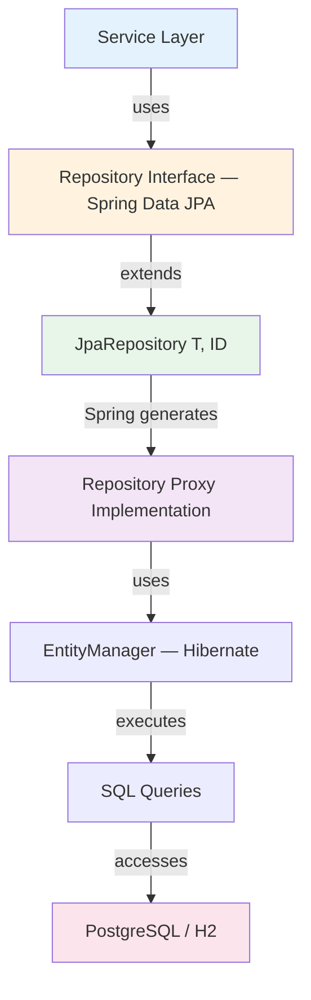

# Repository Pattern

**Purpose**: Document how the Repository pattern is implemented in StockEase using Spring Data JPA to abstract data access from business logic.

---

## Pattern Structure



---

## Repository Interfaces

### UserRepository

```java
public interface UserRepository extends JpaRepository<AppUser, Long> {

    Optional<AppUser> findByUsername(String username);
    boolean existsByUsername(String username);
}
```

### ProductRepository

```java
public interface ProductRepository extends JpaRepository<Product, Long> {

    List<Product> findByNameContainingIgnoreCase(String name);
    List<Product> findByQuantityLessThan(int threshold);
    Page<Product> findAll(Pageable pageable);
}
```

---

## Query Method Naming Convention

Spring Data JPA generates SQL from method names automatically:

| Method Name | Generated Query |
|-------------|----------------|
| `findByNameContainingIgnoreCase(String name)` | `WHERE LOWER(name) LIKE LOWER(?)` |
| `findByQuantityLessThan(int threshold)` | `WHERE quantity < ?` |
| `findByUsername(String username)` | `WHERE username = ?` |
| `existsByUsername(String username)` | `SELECT COUNT(*) > 0 WHERE username = ?` |
| `findByPriceGreaterThan(BigDecimal)` | `WHERE price > ?` |
| `findByPriceLessThanEqual(BigDecimal)` | `WHERE price <= ?` |

---

## Usage in Service Layer

```java
@Service
public class ProductService {

    @Transactional(readOnly = true)
    public Page<ProductDTO> getProducts(int page, int size) {
        Pageable pageable = PageRequest.of(page, size);
        return productRepository.findAll(pageable)
            .map(ProductDTO::fromEntity);
    }

    @Transactional
    public ProductDTO createProduct(CreateProductRequest request) {
        Product product = new Product(
            request.getName(), request.getQuantity(), request.getPrice());
        product.setTotalValue(request.getPrice() * request.getQuantity());
        return ProductDTO.fromEntity(productRepository.save(product));
    }

    @Transactional
    public void deleteProduct(Long id) {
        Product product = productRepository.findById(id)
            .orElseThrow(() -> new EntityNotFoundException("Product not found"));
        productRepository.delete(product);
    }
}
```

---

## Pagination

```java
// Basic pagination
Pageable pageable = PageRequest.of(0, 20);
Page<Product> page = productRepository.findAll(pageable);

// With sorting
Pageable pageable = PageRequest.of(0, 20, Sort.by(Sort.Order.asc("name")));
Page<Product> page = productRepository.findAll(pageable);
```

Spring returns a `Page<T>` with `content`, `totalElements`, `totalPages`, `pageNumber`, and `pageSize` — mapped directly to the `PaginatedResponse<T>` DTO.

---

## Custom Queries

### JPQL

```java
// Named parameter
@Query("SELECT p FROM Product p WHERE p.price > :minPrice")
List<Product> findExpensiveProducts(@Param("minPrice") BigDecimal minPrice);
```

### Native SQL

```java
@Query(
    value = """
        SELECT p.* FROM products p
        WHERE p.created_at > NOW() - INTERVAL '7 days'
        ORDER BY p.price DESC
        """,
    nativeQuery = true
)
List<Product> findRecentProducts();
```

---

## Transaction Management

**Read operations** use `@Transactional(readOnly = true)` — the database can apply read optimizations and no write locks are held.

**Write operations** use `@Transactional` to ensure atomicity:

```java
@Transactional
public void createAndAudit(CreateProductRequest request) {
    Product product = productRepository.save(new Product(request));
    auditRepository.save(new AuditEvent(product.getId(), "CREATE"));
    // If either save throws, both roll back automatically
}
```

---

## N+1 Query Prevention

The current `Product` entity has no associations (no `@ManyToOne` or `@OneToMany` relationships), so N+1 is not a current concern. If associations are added in the future (e.g., `createdBy → AppUser`), use fetch joins to prevent N+1 queries:

```java
// Problem: N+1 queries with a hypothetical association
@Query("""
    SELECT DISTINCT p FROM Product p
    LEFT JOIN FETCH p.createdBy
    """)
List<Product> findAllWithCreator();
```

Use `FetchType.LAZY` by default on any future associations. Switch to `EAGER` or use fetch joins only when the association is always needed.

---

[Back to Patterns Index](./index.md)
