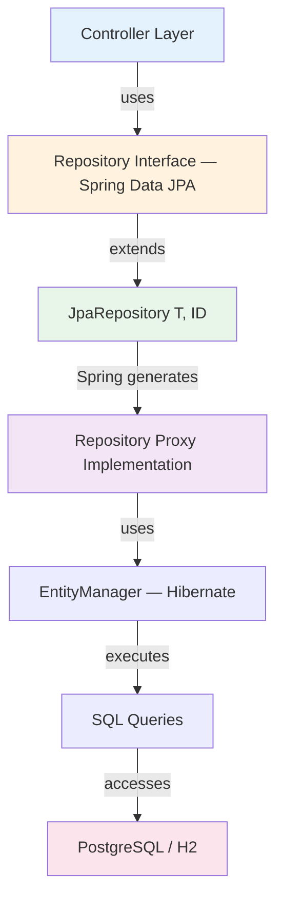

# Repository Pattern

**Purpose**: Document how the Repository pattern is implemented in StockEase using Spring Data JPA to abstract data access from business logic.

---

## Pattern Structure



---

## Repository Interfaces

### UserRepository

```java
public interface UserRepository extends JpaRepository<User, Long> {

    Optional<User> findByUsername(String username);
}
```

### ProductRepository

```java
public interface ProductRepository extends JpaRepository<Product, Long> {

    @Query("SELECT p FROM Product p WHERE p.quantity < :threshold")
    List<Product> findByQuantityLessThan(@Param("threshold") int threshold);

    @Query("SELECT p FROM Product p ORDER BY p.id ASC")
    List<Product> findAllOrderById();

    @Query("SELECT COALESCE(SUM(p.totalValue), 0) FROM Product p")
    double calculateTotalStockValue();

    List<Product> findByNameContainingIgnoreCase(String name);
}
```

---

## Query Method Naming Convention

Spring Data JPA generates SQL from method names automatically:

| Method Name | Generated Query |
|-------------|----------------|
| `findByUsername(String username)` | `WHERE username = ?` |
| `findByNameContainingIgnoreCase(String name)` | `WHERE LOWER(name) LIKE LOWER(?)` |

---

## Usage in Controllers

Controllers inject repositories directly — there is no intermediate service layer.

```java
@RestController
@RequestMapping("/api/products")
public class ProductController {

    private final ProductRepository productRepository;

    public List<Product> getAllProducts() {
        return productRepository.findAllOrderById();
    }

    public ResponseEntity<?> createProduct(@Valid @RequestBody CreateProductRequest req) {
        return ResponseEntity.ok(productRepository.save(
            new Product(req.getName(), req.getQuantity(), req.getPrice())));
    }

    public ResponseEntity<?> deleteProduct(@PathVariable long id) {
        if (!productRepository.existsById(id)) {
            return ResponseEntity.status(HttpStatus.NOT_FOUND)
                .body(new ApiResponse<>(false, "Cannot delete. Product with ID " + id + " does not exist.", null));
        }
        productRepository.deleteById(id);
        return ResponseEntity.ok(new ApiResponse<>(true, "Product with ID " + id + " has been successfully deleted.", null));
    }
}
```

---

## Pagination

```java
// Basic pagination
Pageable pageable = PageRequest.of(0, 20);
Page<Product> page = productRepository.findAll(pageable);

// With sorting
Pageable pageable = PageRequest.of(0, 20, Sort.by(Sort.Order.asc("name")));
Page<Product> page = productRepository.findAll(pageable);
```

Spring returns a `Page<T>` with `content`, `totalElements`, `totalPages`, `pageNumber`, and `pageSize` — mapped directly to the `PaginatedResponse<T>` DTO.

---

## Custom Queries

StockEase uses `@Query` for three methods that can't be expressed with derived method names:

```java
// Named parameter — explicit JPQL chosen over derived method for low-stock threshold queries
@Query("SELECT p FROM Product p WHERE p.quantity < :threshold")
List<Product> findByQuantityLessThan(@Param("threshold") int threshold);

// Explicit ORDER BY id (Spring Data's findAll(Sort) would also work, but this is self-documenting)
@Query("SELECT p FROM Product p ORDER BY p.id ASC")
List<Product> findAllOrderById();

// Aggregate with COALESCE to return 0 instead of null when table is empty
@Query("SELECT COALESCE(SUM(p.totalValue), 0) FROM Product p")
double calculateTotalStockValue();
```

---

## Transaction Management

Spring Data JPA wraps each repository method call in its own transaction automatically. There is no application-level `@Transactional` in StockEase because all write operations are single `save()` or `delete()` calls — each is inherently atomic. If multi-step write sequences are added in the future, explicit `@Transactional` on the calling controller method would enforce atomicity across both steps.

---

## N+1 Query Prevention

Neither `Product` nor `User` has JPA associations (`@ManyToOne`/`@OneToMany`), so N+1 is not a concern in the current schema. If associations are added in the future, use `FetchType.LAZY` by default and prefer fetch joins (`LEFT JOIN FETCH`) in `@Query` methods over `EAGER` loading.

---

[Back to Patterns Index](./index.md)
