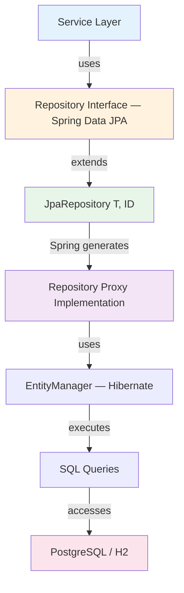

# Repository Pattern

**Purpose**: Document how the Repository pattern is implemented in StockEase using Spring Data JPA to abstract data access from business logic.

---

## Pattern Structure



---

## Repository Interfaces

### UserRepository

```java
public interface UserRepository extends JpaRepository<User, UUID> {

    Optional<User> findByUsername(String username);
    Optional<User> findByEmail(String email);
    boolean existsByUsername(String username);

    @Query("""
        SELECT u FROM User u
        WHERE u.role = :role
        ORDER BY u.createdAt DESC
        """)
    List<User> findByRoleOrderByDate(@Param("role") Role role);
}
```

### ProductRepository

```java
public interface ProductRepository extends JpaRepository<Product, UUID> {

    Optional<Product> findBySku(String sku);
    Page<Product> findByCategory(String category, Pageable pageable);
    List<Product> findByCreatedBy(UUID userId);
    boolean existsBySku(String sku);

    @Query("""
        SELECT p FROM Product p
        WHERE p.price BETWEEN :minPrice AND :maxPrice
        AND p.quantity > 0
        ORDER BY p.price ASC
        """)
    List<Product> findAffordableInStock(
        @Param("minPrice") BigDecimal minPrice,
        @Param("maxPrice") BigDecimal maxPrice);

    @Query("""
        SELECT p FROM Product p
        WHERE LOWER(p.name) LIKE LOWER(CONCAT('%', :search, '%'))
        """)
    Page<Product> searchByName(@Param("search") String search, Pageable pageable);
}
```

---

## Query Method Naming Convention

Spring Data JPA generates SQL from method names automatically:

| Method Name | Generated Query |
|-------------|----------------|
| `findBySku(String sku)` | `WHERE sku = ?` |
| `findByCategoryAndPrice(String, BigDecimal)` | `WHERE category = ? AND price = ?` |
| `findByPriceGreaterThan(BigDecimal)` | `WHERE price > ?` |
| `findByPriceLessThanEqual(BigDecimal)` | `WHERE price <= ?` |
| `findBySkuContaining(String)` | `WHERE sku LIKE ?` |
| `findBySkuIn(List<String>)` | `WHERE sku IN (?, ...)` |
| `existsBySku(String)` | `SELECT COUNT(*) > 0 WHERE sku = ?` |

---

## Usage in Service Layer

```java
@Service
public class ProductService {

    @Transactional(readOnly = true)
    public Page<ProductDTO> getProducts(int page, int size, String category) {
        Pageable pageable = PageRequest.of(page, size);
        return productRepository.findByCategory(category, pageable)
            .map(ProductDTO::fromEntity);
    }

    @Transactional
    public ProductDTO createProduct(CreateProductRequest request, UUID userId) {
        if (productRepository.existsBySku(request.getSku()))
            throw new ValidationException("SKU already exists");

        Product product = new Product(request);
        product.setCreatedBy(userId);
        return ProductDTO.fromEntity(productRepository.save(product));
    }

    @Transactional
    public void deleteProduct(UUID id) {
        Product product = productRepository.findById(id)
            .orElseThrow(() -> new EntityNotFoundException("Product not found"));
        productRepository.delete(product);
    }
}
```

---

## Pagination

```java
// Basic pagination
Pageable pageable = PageRequest.of(0, 20);
Page<Product> page = productRepository.findAll(pageable);

// With sorting
Pageable pageable = PageRequest.of(0, 20, Sort.by(Sort.Order.asc("name")));
Page<Product> page = productRepository.findAll(pageable);
```

Spring returns a `Page<T>` with `content`, `totalElements`, `totalPages`, `pageNumber`, and `pageSize` — mapped directly to the `PaginatedResponse<T>` DTO.

---

## Custom Queries

### JPQL

```java
// Named parameter
@Query("SELECT p FROM Product p WHERE p.price > :minPrice")
List<Product> findExpensiveProducts(@Param("minPrice") BigDecimal minPrice);
```

### Native SQL

```java
@Query(
    value = """
        SELECT p.* FROM products p
        WHERE p.created_at > NOW() - INTERVAL '7 days'
        ORDER BY p.price DESC
        """,
    nativeQuery = true
)
List<Product> findRecentProducts();
```

---

## Transaction Management

**Read operations** use `@Transactional(readOnly = true)` — the database can apply read optimizations and no write locks are held.

**Write operations** use `@Transactional` to ensure atomicity:

```java
@Transactional
public void createAndAudit(CreateProductRequest request) {
    Product product = productRepository.save(new Product(request));
    auditRepository.save(new AuditEvent(product.getId(), "CREATE"));
    // If either save throws, both roll back automatically
}
```

---

## N+1 Query Prevention

```java
// Problem: N+1 queries — one extra query per product to load creator
List<Product> products = productRepository.findAll();
for (Product p : products) {
    User creator = p.getCreatedBy(); // Additional query per product
}

// Solution: fetch join loads everything in one query
@Query("""
    SELECT DISTINCT p FROM Product p
    LEFT JOIN FETCH p.createdBy
    """)
List<Product> findAllWithCreator();
```

### Lazy vs Eager Loading

```java
@Entity
public class Product {
    @ManyToOne(fetch = FetchType.LAZY)
    private User createdBy;  // Loaded only when accessed

    @OneToMany(fetch = FetchType.EAGER)
    private Set<Tag> tags;   // Always loaded with the entity
}
```

Use `LAZY` by default. Switch to `EAGER` or use fetch joins only when the association is always needed.

---

[Back to Patterns Index](./index.md)
