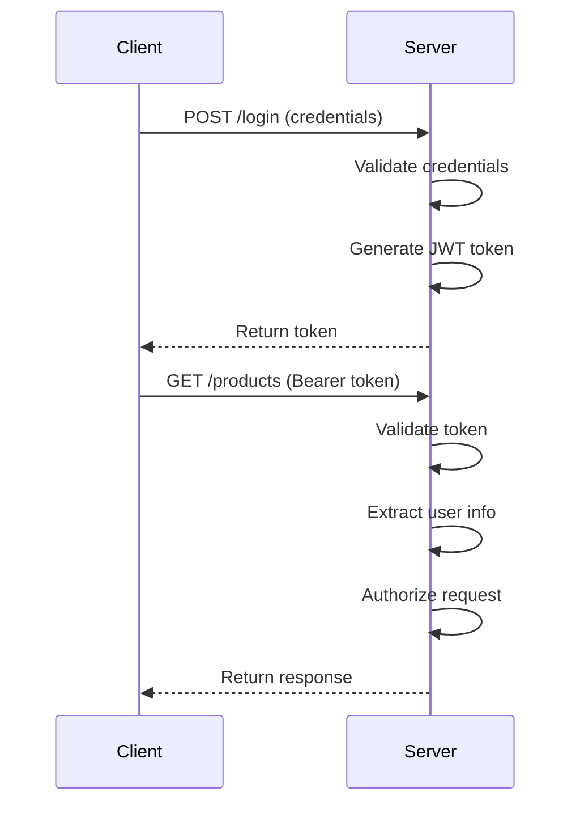
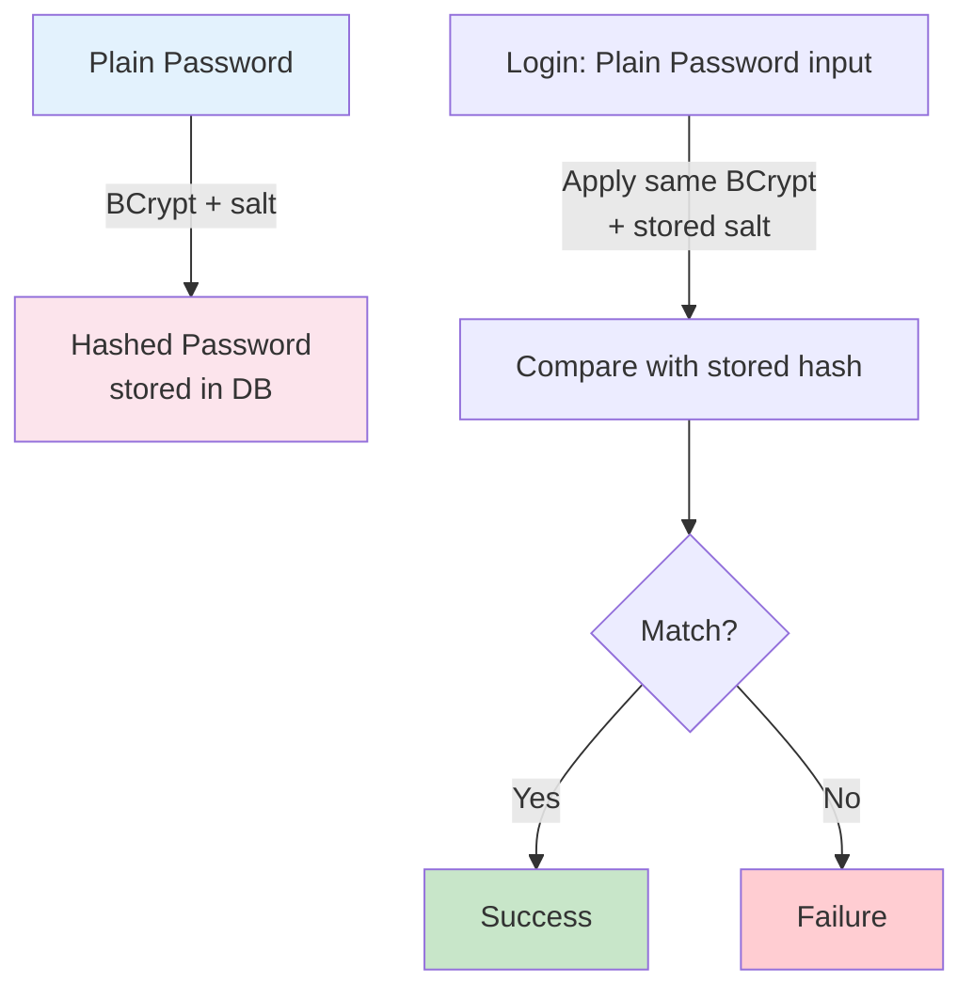
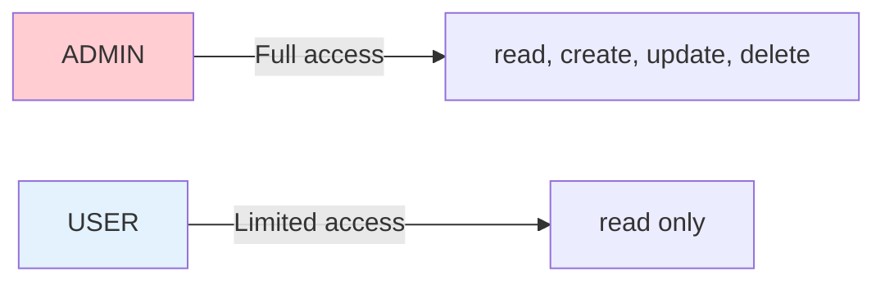

# Security Patterns & Best Practices

## Overview

StockEase implements multiple security patterns to protect data, ensure user authentication, authorize actions, and audit operations.

## Authentication Patterns

### 1. JWT Bearer Token Pattern

**Flow**:



**Implementation**:
```java
// Login endpoint
@PostMapping("/login")
public ResponseEntity<LoginResponse> login(
    @RequestParam String username,
    @RequestParam String password) {
    
    // 1. Validate credentials
    User user = userRepository.findByUsername(username)
        .orElseThrow(() -> new AuthenticationException("Invalid credentials"));
    
    if (!passwordEncoder.matches(password, user.getPassword())) {
        throw new AuthenticationException("Invalid credentials");
    }
    
    // 2. Generate JWT token
    String token = jwtProvider.generateToken(user);
    
    // 3. Return token
    return ResponseEntity.ok(new LoginResponse(token, user.getUsername()));
}

// Protected endpoint
@GetMapping("/products")
public ResponseEntity<Page<ProductDTO>> getProducts(
    @RequestHeader("Authorization") String authHeader) {
    
    // 1. Extract token from header
    String token = authHeader.replace("Bearer ", "");
    
    // 2. Validate token
    UUID userId = jwtProvider.validateToken(token);
    
    // 3. Authorize request
    User user = userRepository.findById(userId)
        .orElseThrow(() -> new AuthenticationException("User not found"));
    
    // 4. Execute business logic
    return ResponseEntity.ok(productService.getProducts(Pageable.unpaged()));
}
```

### 2. Password Hashing with BCrypt

**Pattern**:



**Implementation**:
```java
@Configuration
public class SecurityConfig {
    @Bean
    public PasswordEncoder passwordEncoder() {
        // Cost factor of 10 = ~100ms per hash
        return new BCryptPasswordEncoder(10);
    }
}

// Registration
@Service
public class AuthService {
    @Transactional
    public void register(RegisterRequest request) {
        // 1. Validate input
        if (userRepository.existsByUsername(request.getUsername())) {
            throw new ValidationException("Username already exists");
        }
        
        // 2. Hash password
        String hashedPassword = passwordEncoder.encode(request.getPassword());
        
        // 3. Create user with hashed password
        User user = new User();
        user.setUsername(request.getUsername());
        user.setPassword(hashedPassword);
        user.setRole(Role.USER);
        
        // 4. Save (never save plain password)
        userRepository.save(user);
    }
}
```

## Authorization Patterns

### 1. Role-Based Access Control (RBAC)

**Roles**:



**Implementation**:
```java
// Method-level security
@Service
public class ProductService {
    @Secured("ROLE_ADMIN")
    public void deleteProduct(UUID id) {
        productRepository.deleteById(id);
    }
    
    // Available to both ADMIN and USER
    public Page<ProductDTO> getProducts(Pageable page) {
        return productRepository.findAll(page)
            .map(ProductDTO::fromEntity);
    }
}

// Endpoint-level security
@RestController
@RequestMapping("/api/products")
public class ProductController {
    @PreAuthorize("hasRole('ADMIN')")
    @PostMapping
    public ResponseEntity<ProductDTO> createProduct(
        @RequestBody CreateProductRequest request) {
        return ResponseEntity.ok(productService.create(request));
    }
}
```

### 2. Resource-Level Authorization

```java
// User can only see products they created
@GetMapping("/{id}")
public ResponseEntity<ProductDTO> getProduct(
    @PathVariable UUID id,
    @AuthenticationPrincipal User user) {
    
    Product product = productRepository.findById(id)
        .orElseThrow(() -> new EntityNotFoundException("Product not found"));
    
    // Check ownership (except for ADMIN)
    if (!product.getCreatedBy().equals(user.getId()) && 
        !user.getRole().equals(Role.ADMIN)) {
        throw new AuthorizationException("Unauthorized");
    }
    
    return ResponseEntity.ok(ProductDTO.fromEntity(product));
}
```

## Validation Patterns

### 1. Input Validation

```java
@RequestMapping("/api/products")
public class ProductController {
    @PostMapping
    public ResponseEntity<ProductDTO> createProduct(
        @Valid @RequestBody CreateProductRequest request) {
        // @Valid triggers validation
        // Invalid data → 400 Bad Request
        // Valid data → proceeds
        return ResponseEntity.ok(productService.create(request));
    }
}

public class CreateProductRequest {
    @NotBlank(message = "Name is required")
    @Size(min = 3, max = 255)
    private String name;
    
    @NotNull(message = "Price is required")
    @DecimalMin(value = "0.01")
    @DecimalMax(value = "999999.99")
    private BigDecimal price;
    
    @Pattern(regexp = "^[A-Z0-9-]{3,50}$")
    private String sku;
}
```

### 2. SQL Injection Prevention

```java
// ✅ SAFE: Parameterized queries (Spring Data JPA)
productRepository.findBySku(userInput);
// Internally: SELECT * FROM products WHERE sku = ?
// Parameter binding prevents injection

// ✅ SAFE: @Query with parameters
@Query("SELECT p FROM Product p WHERE p.sku = :sku")
Optional<Product> findBySku(@Param("sku") String sku);

// ❌ UNSAFE: String concatenation (NEVER DO THIS)
entityManager.createNativeQuery(
    "SELECT * FROM products WHERE sku = '" + userInput + "'"
);
```

## Data Protection Patterns

### 1. At-Rest Encryption

```yaml
# Database connection with SSL
spring:
  datasource:
    url: jdbc:postgresql://host:5432/db?sslmode=require
    username: ${DB_USER}
    password: ${DB_PASSWORD}
```

### 2. Secrets Management

```java
// ✅ USE: Environment variables
@Value("${jwt.secret}")
private String jwtSecret;

@Value("${db.password}")
private String dbPassword;

// ❌ DON'T: Hardcode secrets
private String jwtSecret = "my-secret-key"; // NEVER!
```

### 3. Audit Logging

```java
@Service
public class AuditService {
    public void logEvent(String eventType, UUID userId, String action) {
        AuditEvent event = new AuditEvent();
        event.setEventType(eventType);
        event.setUserId(userId);
        event.setAction(action);
        event.setTimestamp(LocalDateTime.now());
        
        auditRepository.save(event);
        logger.info("Audit: {} - {} - {}", eventType, userId, action);
    }
}

// Usage
auditService.logEvent("PRODUCT_CREATED", userId, "Created product: " + productId);
```

## CORS Security Pattern

```java
@Configuration
public class CorsConfig implements WebMvcConfigurer {
    @Override
    public void addCorsMappings(CorsRegistry registry) {
        registry.addMapping("/api/**")
            .allowedOrigins("https://stockease-frontend.example.com") // ✅ Specific origin
            .allowedMethods("GET", "POST", "PUT", "DELETE", "OPTIONS")
            .allowedHeaders("Content-Type", "Authorization")
            .exposedHeaders("X-Total-Count")
            .allowCredentials(true) // ✅ Allow credentials
            .maxAge(3600); // ✅ Cache preflight 1 hour
    }
}

// ❌ NEVER DO THIS
.allowedOrigins("*") // Unsafe!
.allowCredentials(true) // Can't use with "*"
```

## Exception Handling Security Pattern

```java
@RestControllerAdvice
public class GlobalExceptionHandler {
    
    // ✅ Safe: Generic error message
    @ExceptionHandler(EntityNotFoundException.class)
    public ResponseEntity<ErrorResponse> handleNotFound(
        EntityNotFoundException e) {
        
        return ResponseEntity.status(HttpStatus.NOT_FOUND)
            .body(new ErrorResponse("Resource not found"));
        // Don't expose internal details
    }
    
    // ✅ Safe: Generic error message
    @ExceptionHandler(Exception.class)
    public ResponseEntity<ErrorResponse> handleGeneric(Exception e) {
        logger.error("Unexpected error", e); // Log internally
        
        return ResponseEntity.status(HttpStatus.INTERNAL_SERVER_ERROR)
            .body(new ErrorResponse("Internal server error"));
        // Never expose stack trace to client
    }
    
    // ❌ UNSAFE: Exposes internals
    .body(new ErrorResponse(e.getMessage())); // BAD!
}
```

## HTTP Security Headers Pattern

```java
@Configuration
@EnableWebSecurity
public class SecurityConfig {
    @Bean
    public SecurityFilterChain securityFilterChain(HttpSecurity http) throws Exception {
        http
            // HSTS: Force HTTPS
            .headers()
                .httpStrictTransportSecurity()
                    .maxAgeInSeconds(31536000)
                    .includeSubDomains(true)
            // X-Frame-Options: Prevent clickjacking
            .and()
                .frameOptions()
                    .deny()
            // X-Content-Type-Options: Prevent MIME sniffing
            .and()
                .contentTypeOptions()
            // X-XSS-Protection: Enable browser XSS protection
            .and()
                .xssProtection();
        
        return http.build();
    }
}
```

## API Key Pattern (Future)

```java
// For third-party integrations
@Documented
@Target(ElementType.METHOD)
@Retention(RetentionPolicy.RUNTIME)
public @interface ApiKeyRequired {
}

@Component
public class ApiKeyFilter extends OncePerRequestFilter {
    @Override
    protected void doFilterInternal(
        HttpServletRequest request, 
        HttpServletResponse response, 
        FilterChain chain) throws ServletException, IOException {
        
        String apiKey = request.getHeader("X-API-Key");
        
        if (isValidApiKey(apiKey)) {
            chain.doFilter(request, response);
        } else {
            response.sendError(HttpServletResponse.SC_UNAUTHORIZED, "Invalid API key");
        }
    }
    
    private boolean isValidApiKey(String apiKey) {
        return apiKeyRepository.existsByKeyAndActive(apiKey, true);
    }
}
```

## Testing Security

```java
@WebMvcTest(ProductController.class)
public class ProductControllerSecurityTest {
    @Autowired
    private MockMvc mockMvc;
    
    // ✅ Test authentication required
    @Test
    public void testCreateProductWithoutAuth() throws Exception {
        mockMvc.perform(post("/api/products")
            .contentType(MediaType.APPLICATION_JSON)
            .content("{}"))
            .andExpect(status().isUnauthorized());
    }
    
    // ✅ Test authorization (role-based)
    @Test
    @WithMockUser(roles = "USER")
    public void testCreateProductAsUserFails() throws Exception {
        mockMvc.perform(post("/api/products")
            .header("Authorization", "Bearer " + userToken)
            .contentType(MediaType.APPLICATION_JSON)
            .content("{}"))
            .andExpect(status().isForbidden());
    }
    
    // ✅ Test ADMIN can create
    @Test
    @WithMockUser(roles = "ADMIN")
    public void testCreateProductAsAdminSucceeds() throws Exception {
        mockMvc.perform(post("/api/products")
            .header("Authorization", "Bearer " + adminToken)
            .contentType(MediaType.APPLICATION_JSON)
            .content(validProductJson))
            .andExpect(status().isCreated());
    }
}
```

## Security Checklist

Before production deployment:
- [ ] All secrets in environment variables (not code)
- [ ] HTTPS/TLS enforced
- [ ] CORS configured for specific origins
- [ ] Authentication implemented (JWT)
- [ ] Authorization implemented (RBAC)
- [ ] Input validation on all endpoints
- [ ] SQL injection prevented (parameterized queries)
- [ ] Passwords hashed with BCrypt
- [ ] Security headers configured
- [ ] Audit logging implemented
- [ ] Error handling doesn't expose internals
- [ ] Default credentials changed/removed
- [ ] Security tests written
- [ ] Vulnerability scan completed
- [ ] Code review for security issues

---

**Document Version**: 1.0  
**Last Updated**: October 31, 2025  
**Status**: Production Ready
