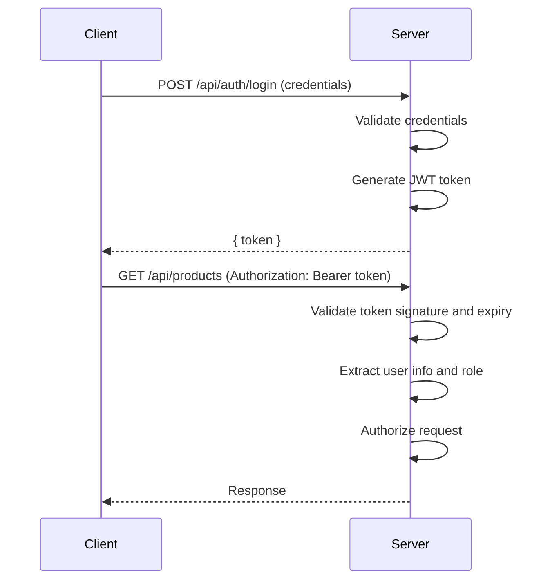
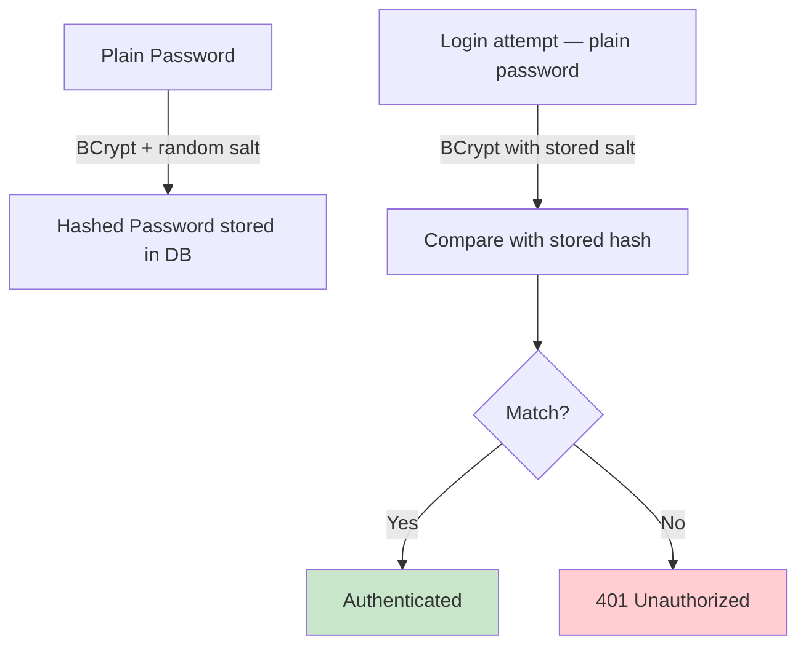
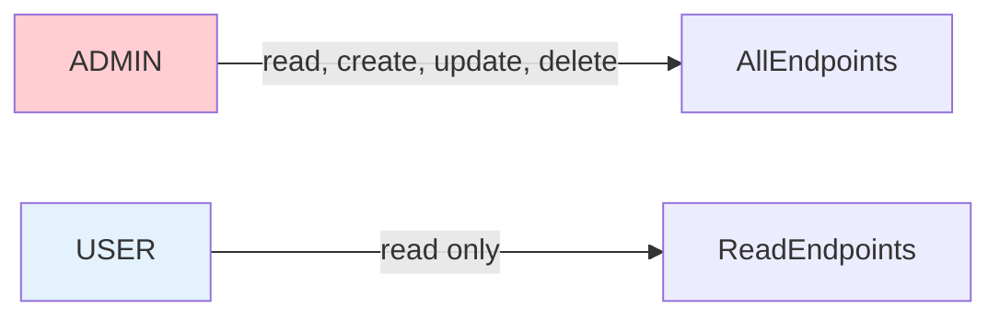

# Security Patterns

**Purpose**: Document how authentication, authorization, input validation, and data protection patterns are implemented in StockEase.

---

## JWT Bearer Token Pattern


```mermaid
sequenceDiagram
    participant Client
    participant Server

    Client->>Server: POST /api/auth/login (credentials)
    Server->>Server: Validate credentials
    Server->>Server: Generate JWT token
    Server-->>Client: { token }

    Client->>Server: GET /api/products (Authorization: Bearer token)
    Server->>Server: Validate token signature and expiry
    Server->>Server: Extract user info and role
    Server->>Server: Authorize request
    Server-->>Client: Response
```

```java
@PostMapping("/login")
public ResponseEntity<ApiResponse<String>> login(@Valid @RequestBody LoginRequest request) {
    UsernamePasswordAuthenticationToken authToken =
        new UsernamePasswordAuthenticationToken(request.getUsername(), request.getPassword());
    authenticationManager.authenticate(authToken);
    User user = userRepository.findByUsername(request.getUsername()).orElseThrow();
    String token = jwtUtil.generateToken(user.getUsername(), user.getRole());
    return ResponseEntity.ok(new ApiResponse<>(true, "Login successful", token));
}
```

---

## BCrypt Password Hashing Pattern


```mermaid
graph TD
    A[Plain Password] -->|BCrypt + random salt| B[Hashed Password stored in DB]
    C[Login attempt — plain password] -->|BCrypt with stored salt| D[Compare with stored hash]
    D --> E{Match?}
    E -->|Yes| F[Authenticated]
    E -->|No| G[401 Unauthorized]

    style F fill:#c8e6c9
    style G fill:#ffcdd2
```

Cost factor 10 produces ~100ms per hash — fast enough for users, slow enough to resist brute force.

```java
@Bean
public PasswordEncoder passwordEncoder() {
    return new BCryptPasswordEncoder(); // default cost factor 10
}

// Registration
String hashedPassword = passwordEncoder.encode(request.getPassword());
user.setPassword(hashedPassword);
userRepository.save(user); // Plain password never stored or logged
```

---

## Role-Based Access Control (RBAC) Pattern


```mermaid
graph LR
    ADMIN -->|read, create, update, delete| AllEndpoints
    USER -->|read only| ReadEndpoints

    style ADMIN fill:#ffcdd2
    style USER fill:#e3f2fd
```

**Method-level** (`@Secured`):

```java
@Service
public class ProductService {

    @Secured("ROLE_ADMIN")
    public void deleteProduct(UUID id) {
        productRepository.deleteById(id);
    }

    // No annotation — available to any authenticated user
    public Page<ProductDTO> getProducts(Pageable page) {
        return productRepository.findAll(page).map(ProductDTO::fromEntity);
    }
}
```

**Endpoint-level** (`@PreAuthorize`):

```java
@PostMapping
@PreAuthorize("hasRole('ADMIN')")
public ResponseEntity<ProductDTO> createProduct(
    @Valid @RequestBody CreateProductRequest request) {
    return ResponseEntity.ok(productService.create(request));
}
```

**Resource-level** (ownership check):

```java
@GetMapping("/{id}")
public ResponseEntity<ProductDTO> getProduct(
    @PathVariable UUID id,
    @AuthenticationPrincipal User user) {

    Product product = productRepository.findById(id)
        .orElseThrow(() -> new EntityNotFoundException("Product not found"));

    if (!product.getCreatedBy().equals(user.getId()) &&
        !user.getRole().equals(Role.ADMIN))
        throw new AuthorizationException("Unauthorized");

    return ResponseEntity.ok(ProductDTO.fromEntity(product));
}
```

---

## Input Validation Pattern

Bean Validation (`@Valid` + JSR-303) triggers automatically on controller method parameters:

```java
public class CreateProductRequest {

    @NotBlank(message = "Name is required")
    @Size(min = 3, max = 255)
    private String name;

    @NotNull @DecimalMin("0.01") @DecimalMax("999999.99")
    private BigDecimal price;

    @NotBlank @Pattern(regexp = "^[A-Z0-9-]{3,50}$")
    private String sku;
}
```

Validation failure returns 400 with field-level error details, caught by `GlobalExceptionHandler`.

---

## SQL Injection Prevention Pattern

Spring Data JPA uses parameterized queries exclusively — user input is never concatenated into SQL strings.

```java
// Safe — Spring Data parameterizes automatically
productRepository.findBySku(userInput);
// Executes: SELECT * FROM products WHERE sku = ?

// Safe — named parameter in @Query
@Query("SELECT p FROM Product p WHERE p.sku = :sku")
Optional<Product> findBySku(@Param("sku") String sku);

// Never do this
entityManager.createNativeQuery(
    "SELECT * FROM products WHERE sku = '" + userInput + "'" // SQL injection risk
);
```

---

## Exception Handling Security Pattern

Error responses must not expose internal state, stack traces, or database structure to the client.

```java
@RestControllerAdvice
public class GlobalExceptionHandler {

    // Generic message to client — detail logged internally only
    @ExceptionHandler(EntityNotFoundException.class)
    public ResponseEntity<ErrorResponse> handleNotFound(EntityNotFoundException e) {
        return ResponseEntity.status(HttpStatus.NOT_FOUND)
            .body(new ErrorResponse("Resource not found"));
    }

    @ExceptionHandler(Exception.class)
    public ResponseEntity<ErrorResponse> handleGeneric(Exception e) {
        logger.error("Unexpected error", e); // Full detail in server logs only
        return ResponseEntity.status(HttpStatus.INTERNAL_SERVER_ERROR)
            .body(new ErrorResponse("Internal server error"));
    }

    // Never expose e.getMessage() directly — it may contain schema or query details
}
```

---

## Secrets Management Pattern

All sensitive values are injected via environment variables — never hardcoded.

```java
// Correct
@Value("${jwt.secret}")
private String jwtSecret;

@Value("${db.password}")
private String dbPassword;

// Never do this
private String jwtSecret = "my-secret-key";
```

See [Staging & Configuration](../deployment/staging-config.md) for the full list of required environment variables.

---

## Audit Logging Pattern

Critical operations are logged with user context for traceability.

```java
@Service
public class AuditService {

    public void logEvent(String eventType, UUID userId, String action) {
        AuditEvent event = new AuditEvent();
        event.setEventType(eventType);
        event.setUserId(userId);
        event.setAction(action);
        event.setTimestamp(LocalDateTime.now());
        auditRepository.save(event);
        logger.info("Audit: {} - {} - {}", eventType, userId, action);
    }
}

// Usage
auditService.logEvent("PRODUCT_CREATED", userId, "Created product: " + productId);
```

Logged events: login attempts (success/failure), product creation/modification/deletion, authorization failures (403), unexpected server errors (500).

---

[Back to Patterns Index](./index.md)
