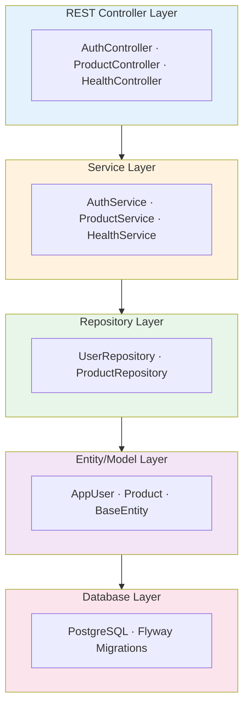
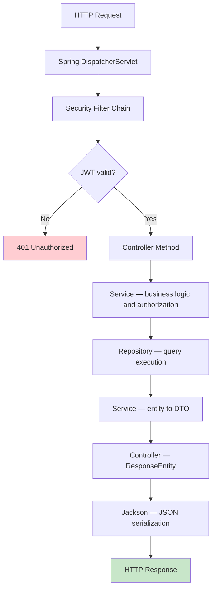

# Backend Architecture

**Tech Stack**: Spring Boot 3.5.7 · Java 17 LTS · PostgreSQL 17.5 · Spring Security · JWT
**Deployment**: https://stockeasebackend.koyeb.app
**API Spec**: OpenAPI 3.0 via SpringDoc (`/v3/api-docs`)

---

## Layered Architecture



---

## Request Lifecycle



---

## Project Structure

```
backend/src/main/java/com/stocks/stockease/
├── controller/
│   ├── AuthController.java
│   ├── ProductController.java
│   └── HealthController.java
├── service/
│   ├── AuthService.java
│   ├── ProductService.java
│   └── HealthService.java
├── repository/
│   ├── UserRepository.java
│   └── ProductRepository.java
├── model/
│   ├── AppUser.java
│   ├── Product.java
│   └── BaseEntity.java
├── dto/
│   ├── AuthDTO.java
│   ├── ProductDTO.java
│   └── ErrorResponseDTO.java
├── security/
│   ├── JwtTokenProvider.java
│   ├── SecurityConfig.java
│   ├── JwtAuthenticationFilter.java
│   └── CustomAuthenticationEntryPoint.java
├── exception/
│   ├── ResourceNotFoundException.java
│   ├── UnauthorizedException.java
│   ├── ValidationException.java
│   └── GlobalExceptionHandler.java
├── config/
│   ├── CorsConfig.java
│   ├── DataSeeder.java
│   └── FlywayConfiguration.java
└── StockEaseApplication.java

src/main/resources/
├── application.properties
├── application-dev.properties
├── application-prod.properties
└── db/migration/
    ├── V1__baseline.sql
    └── V2__create_schema.sql
```

---

## Controller Layer

### AuthController — `POST /api/auth/login`

```java
@RestController
@RequestMapping("/api/auth")
public class AuthController {

    @PostMapping("/login")
    public ResponseEntity<?> login(@Valid @RequestBody LoginRequest req) {
        // Authenticate user → generate JWT → return token + user info
    }

    @GetMapping("/validate")
    @PreAuthorize("isAuthenticated()")
    public ResponseEntity<?> validateToken() {
        // Return current user info if token valid
    }
}
```

### ProductController — `/api/products`

```java
@RestController
@RequestMapping("/api/products")
public class ProductController {

    @GetMapping
    @PreAuthorize("hasAnyRole('ADMIN', 'USER')")
    public ResponseEntity<List<ProductDTO>> getAllProducts() { }

    @GetMapping("/paged")
    public ResponseEntity<Page<ProductDTO>> getProductsPaged(
        @RequestParam(defaultValue = "0") int page,
        @RequestParam(defaultValue = "10") int size) { }

    @PostMapping
    @PreAuthorize("hasRole('ADMIN')")
    public ResponseEntity<ProductDTO> createProduct(
        @Valid @RequestBody CreateProductRequest req) { }

    @PutMapping("/{id}/quantity")
    @PreAuthorize("hasAnyRole('ADMIN', 'USER')")
    public ResponseEntity<?> updateQuantity(
        @PathVariable Long id,
        @Valid @RequestBody UpdateQuantityRequest req) { }

    @PutMapping("/{id}/price")
    @PreAuthorize("hasAnyRole('ADMIN', 'USER')")
    public ResponseEntity<?> updatePrice(
        @PathVariable Long id,
        @Valid @RequestBody UpdatePriceRequest req) { }

    @PutMapping("/{id}/name")
    @PreAuthorize("hasAnyRole('ADMIN', 'USER')")
    public ResponseEntity<?> updateName(
        @PathVariable Long id,
        @Valid @RequestBody UpdateNameRequest req) { }

    @DeleteMapping("/{id}")
    @PreAuthorize("hasRole('ADMIN')")
    public ResponseEntity<?> deleteProduct(@PathVariable Long id) { }
}
```

---

## Service Layer

### ProductService — key transactional methods

```java
@Service
public class ProductService {

    @Transactional(readOnly = true)
    public Page<ProductDTO> getProductsPaged(int page, int size) {
        return productRepository.findAll(PageRequest.of(page, size, Sort.by("name")))
            .map(this::mapToDTO);
    }

    @Transactional
    public ProductDTO createProduct(CreateProductRequest request) {
        validateProductInput(request);
        Product product = new Product();
        product.setName(request.getName());
        product.setQuantity(request.getQuantity());
        product.setPrice(request.getPrice());
        product.setTotalValue(request.getPrice() * request.getQuantity());
        return mapToDTO(productRepository.save(product));
    }

    @Transactional
    public void deleteProduct(Long id) {
        if (!productRepository.existsById(id))
            throw new ResourceNotFoundException("Product not found");
        productRepository.deleteById(id);
    }
}
```

---

## Repository Layer

```java
public interface UserRepository extends JpaRepository<AppUser, Long> {
    Optional<AppUser> findByUsername(String username);
    boolean existsByUsername(String username);
}

public interface ProductRepository extends JpaRepository<Product, Long> {
    List<Product> findByNameContainingIgnoreCase(String name);
    Page<Product> findAll(Pageable pageable);
    List<Product> findByQuantityLessThan(int threshold);
}
```

---

## Entity Layer

```java
@Entity
@Table(name = "app_user")
public class AppUser {
    @Id @GeneratedValue(strategy = GenerationType.IDENTITY)
    private Long id;
    @Column(unique = true, nullable = false) private String username;
    @Column(nullable = false) private String password; // BCrypt hashed
    @Column(nullable = false) private String role;
    @CreationTimestamp private LocalDateTime createdAt;
    @UpdateTimestamp private LocalDateTime updatedAt;
}

@Entity
@Table(name = "product")
public class Product {
    @Id @GeneratedValue(strategy = GenerationType.IDENTITY)
    private Long id;
    @Column(nullable = false) private String name;
    @Column(nullable = false) private Integer quantity;
    @Column(nullable = false) private BigDecimal price;
    @Column(nullable = false) private BigDecimal totalValue;
    @CreationTimestamp private LocalDateTime createdAt;
    @UpdateTimestamp private LocalDateTime updatedAt;

    @PrePersist @PreUpdate
    private void calculateTotalValue() {
        this.totalValue = price.multiply(new BigDecimal(quantity));
    }
}
```

---

## Exception Handling

```java
@RestControllerAdvice
public class GlobalExceptionHandler {

    @ExceptionHandler(ResourceNotFoundException.class)
    public ResponseEntity<ErrorResponse> handleNotFound(ResourceNotFoundException e) {
        return ResponseEntity.status(HttpStatus.NOT_FOUND)
            .body(new ErrorResponse("NOT_FOUND", e.getMessage()));
    }

    @ExceptionHandler(ValidationException.class)
    public ResponseEntity<ErrorResponse> handleValidation(ValidationException e) {
        return ResponseEntity.status(HttpStatus.BAD_REQUEST)
            .body(new ErrorResponse("VALIDATION_ERROR", e.getMessage()));
    }

    @ExceptionHandler(Exception.class)
    public ResponseEntity<ErrorResponse> handleGeneric(Exception e) {
        return ResponseEntity.status(HttpStatus.INTERNAL_SERVER_ERROR)
            .body(new ErrorResponse("SERVER_ERROR", "An unexpected error occurred"));
    }
}
```

---

## Database Migrations (Flyway)

```sql
-- V2__create_schema.sql
CREATE TABLE IF NOT EXISTS app_user (
    id BIGSERIAL PRIMARY KEY,
    username VARCHAR(255) NOT NULL UNIQUE,
    password VARCHAR(255) NOT NULL,
    role VARCHAR(255) NOT NULL DEFAULT 'ROLE_USER',
    created_at TIMESTAMP DEFAULT CURRENT_TIMESTAMP,
    updated_at TIMESTAMP DEFAULT CURRENT_TIMESTAMP
);

CREATE TABLE IF NOT EXISTS product (
    id BIGSERIAL PRIMARY KEY,
    name VARCHAR(255) NOT NULL,
    quantity INTEGER NOT NULL,
    price NUMERIC(10, 2) NOT NULL,
    total_value NUMERIC(10, 2) NOT NULL,
    created_at TIMESTAMP DEFAULT CURRENT_TIMESTAMP,
    updated_at TIMESTAMP DEFAULT CURRENT_TIMESTAMP
);

CREATE INDEX idx_username ON app_user(username);
CREATE INDEX idx_product_name ON product(name);
```

---

## Configuration

```properties
# application.properties
server.port=8081
spring.datasource.url=${SPRING_DATASOURCE_URL}
spring.datasource.username=${SPRING_DATASOURCE_USERNAME}
spring.datasource.password=${SPRING_DATASOURCE_PASSWORD}
spring.datasource.driver-class-name=org.postgresql.Driver
spring.jpa.hibernate.ddl-auto=validate
spring.jpa.properties.hibernate.dialect=org.hibernate.dialect.PostgreSQLDialect
spring.datasource.hikari.maximumPoolSize=10
spring.datasource.hikari.minimumIdle=2
spring.datasource.hikari.connectionTimeout=60000
app.cors.allowed-origins=https://stockeasefrontend.vercel.app,http://localhost:5173
app.jwt.secret=${JWT_SECRET}
app.jwt.expiration=86400000
logging.level.com.stocks.stockease=INFO
logging.level.org.springframework=WARN
```

---

[Back to System Index](./index.md)
