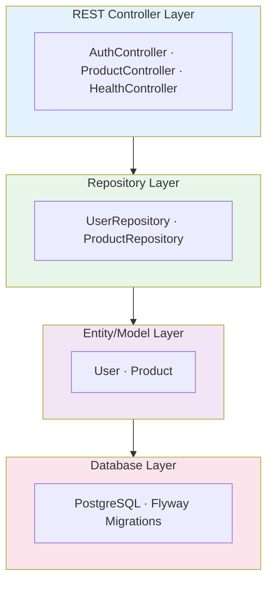
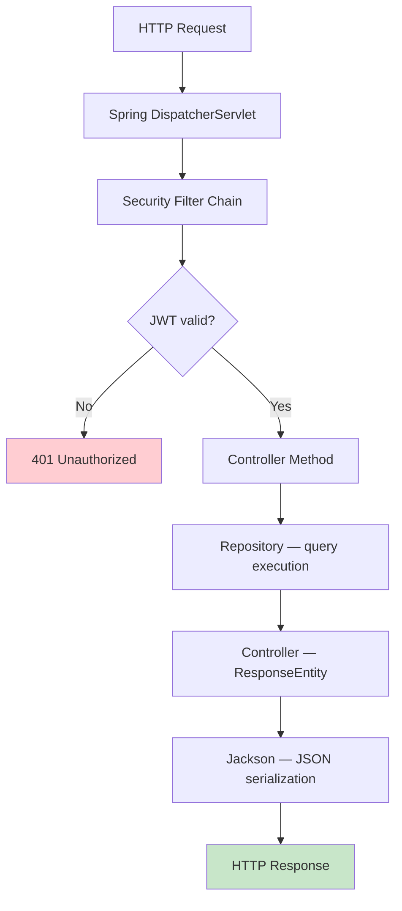

# Backend Architecture

**Tech Stack**: Spring Boot 3.5.7 · Java 17 LTS · PostgreSQL 17.5 · Spring Security · JWT
**Deployment**: https://stockeasebackend.koyeb.app
**API Spec**: OpenAPI 3.0 via SpringDoc (`/v3/api-docs`)

---

## Layered Architecture



StockEase has no intermediate service layer — controllers call repositories directly.

---

## Request Lifecycle



---

## Project Structure

```
backend/src/main/java/com/stocks/stockease/
├── controller/
│   ├── AuthController.java
│   ├── ProductController.java
│   └── HealthController.java
├── repository/
│   ├── UserRepository.java
│   └── ProductRepository.java
├── model/
│   ├── User.java
│   └── Product.java
├── dto/
│   ├── ApiResponse.java
│   ├── LoginRequest.java
│   ├── PaginatedResponse.java
│   ├── CreateProductRequest.java
│   ├── UpdateQuantityRequest.java
│   ├── UpdatePriceRequest.java
│   └── UpdateNameRequest.java
├── security/
│   ├── JwtUtil.java
│   ├── JwtFilter.java
│   ├── SecurityConfig.java
│   ├── CustomUserDetailsService.java
│   └── CustomAuthenticationEntryPoint.java
├── exception/
│   └── GlobalExceptionHandler.java
├── config/
│   ├── CorsConfig.java
│   ├── DataSeeder.java
│   └── FlywayConfiguration.java
└── StockEaseApplication.java

src/main/resources/
├── application.properties
├── application-prod.yml
└── db/migration/
    ├── V1__baseline.sql
    └── V2__create_schema.sql

src/main/java/db/migration/
└── V3__seed_data.java
```

---

## Controller Layer

### AuthController — `POST /api/auth/login`

```java
@RestController
@RequestMapping("/api/auth")
public class AuthController {

    @PostMapping("/login")
    public ResponseEntity<ApiResponse<String>> login(@Valid @RequestBody LoginRequest req) {
        // Authenticate → generate JWT → return ApiResponse wrapping token string
    }
}
```

### ProductController — `/api/products`

```java
@RestController
@RequestMapping("/api/products")
public class ProductController {

    @GetMapping
    @PreAuthorize("hasAnyRole('ADMIN', 'USER')")
    public List<Product> getAllProducts() { }  // returns raw list ordered by ID

    @GetMapping("/paged")
    @PreAuthorize("hasAnyRole('ADMIN', 'USER')")
    public ResponseEntity<ApiResponse<PaginatedResponse<Product>>> getPagedProducts(
        @RequestParam(defaultValue = "0") @Min(0) int page,
        @RequestParam(defaultValue = "10") @Positive int size) { }

    @PostMapping
    @PreAuthorize("hasRole('ADMIN')")
    public ResponseEntity<?> createProduct(
        @Valid @RequestBody CreateProductRequest req) { }  // returns raw Product

    @PutMapping("/{id}/quantity")
    @PreAuthorize("hasAnyRole('ADMIN', 'USER')")
    public ResponseEntity<?> updateQuantity(
        @PathVariable Long id,
        @Valid @RequestBody UpdateQuantityRequest req) { }

    @PutMapping("/{id}/price")
    @PreAuthorize("hasAnyRole('ADMIN', 'USER')")
    public ResponseEntity<?> updatePrice(
        @PathVariable Long id,
        @Valid @RequestBody UpdatePriceRequest req) { }

    @PutMapping("/{id}/name")
    @PreAuthorize("hasAnyRole('ADMIN', 'USER')")
    public ResponseEntity<?> updateName(
        @PathVariable Long id,
        @Valid @RequestBody UpdateNameRequest req) { }

    @DeleteMapping("/{id}")
    @PreAuthorize("hasRole('ADMIN')")
    public ResponseEntity<?> deleteProduct(@PathVariable Long id) { }
}
```

---

## Repository Layer

Controllers call repositories directly — there is no intermediate service layer. Spring Data JPA repositories handle transactions for single operations automatically.

```java
public interface UserRepository extends JpaRepository<User, Long> {
    Optional<User> findByUsername(String username);
}

public interface ProductRepository extends JpaRepository<Product, Long> {

    @Query("SELECT p FROM Product p WHERE p.quantity < :threshold")
    List<Product> findByQuantityLessThan(@Param("threshold") int threshold);

    @Query("SELECT p FROM Product p ORDER BY p.id ASC")
    List<Product> findAllOrderById();

    @Query("SELECT COALESCE(SUM(p.totalValue), 0) FROM Product p")
    double calculateTotalStockValue();

    List<Product> findByNameContainingIgnoreCase(String name);
}
```

---

## Entity Layer

```java
@Data
@Entity
@Table(name = "app_user")
@NoArgsConstructor
@AllArgsConstructor
public class User {
    @Id @GeneratedValue(strategy = GenerationType.IDENTITY)
    private Long id;
    @Column(unique = true, nullable = false) private String username;
    @Column(nullable = false) private String password; // BCrypt hashed
    @Column(nullable = false) private String role;     // "ROLE_ADMIN" or "ROLE_USER"
}

@Data
@Entity
@Table(name = "product")
@NoArgsConstructor
@AllArgsConstructor
public class Product {
    @Id @GeneratedValue(strategy = GenerationType.IDENTITY)
    private Long id;
    @Column(nullable = false) private String name;
    @Column(nullable = false) private Integer quantity;
    @Column(nullable = false) private Double price;
    @Column(nullable = false) private Double totalValue;

    // Custom setters recalculate totalValue = quantity * price on every change
    public void setQuantity(Integer quantity) { this.quantity = quantity; updateTotalValue(); }
    public void setPrice(Double price)        { this.price = price;       updateTotalValue(); }

    // Convenience constructor — totalValue is computed, not supplied by the caller
    public Product(String name, int quantity, double price) { ... }
}
```

---

## Exception Handling

`GlobalExceptionHandler` (`@RestControllerAdvice`) catches exceptions and returns a consistent `ApiResponse<T>` shape. All error responses have `success: false`.

| Exception | HTTP Status | Triggered By |
|-----------|-------------|-------------|
| `EntityNotFoundException` | 404 | Product not found by ID |
| `NoSuchElementException` | 404 | Stream `.get()` on empty Optional |
| `IllegalArgumentException` | 400 | Business rule violation |
| `MethodArgumentNotValidException` | 400 | `@Valid` bean validation failure |
| `HttpMessageNotReadableException` | 400 | Malformed request body or type mismatch |
| `HandlerMethodValidationException` | 400 | `@Min`/`@Positive` on path/query params |
| `AccessDeniedException` | 403 | Insufficient role (Spring Security) |
| `BadCredentialsException` | 401 | Wrong password during login |
| `JwtException` | 401 | Invalid/expired JWT token |
| `Exception` (catch-all) | 500 | Unexpected runtime error |

Validation 400 responses include a `data` map with field-level error messages:

```json
{
  "success": false,
  "message": "Validation failed for request parameters.",
  "data": { "name": "must not be blank", "quantity": "must be greater than or equal to 0" }
}
```

---

## Database Migrations (Flyway)

Three migrations exist:

- **`V1__baseline.sql`** — empty baseline marker; establishes Flyway history on an existing schema
- **`V2__create_schema.sql`** — creates the full schema
- **`V3__seed_data.java`** — seeds fixture users (`admin`, `user`) and 8 sample products with BCrypt-hashed passwords; Java migration so `BCryptPasswordEncoder` can be used at migration time

```sql
-- V2__create_schema.sql
CREATE TABLE IF NOT EXISTS app_user (
    id        BIGSERIAL PRIMARY KEY,
    username  VARCHAR(255) NOT NULL UNIQUE,
    password  VARCHAR(255) NOT NULL,
    role      VARCHAR(255) NOT NULL
);

CREATE TABLE IF NOT EXISTS product (
    id          BIGSERIAL PRIMARY KEY,
    name        VARCHAR(255) NOT NULL,
    quantity    INTEGER NOT NULL,
    price       DOUBLE PRECISION NOT NULL,
    total_value DOUBLE PRECISION NOT NULL
);
```

No explicit indexes are defined in migrations — `app_user.username` uniqueness is enforced by the `UNIQUE` constraint, which PostgreSQL indexes automatically. Seed data is inserted by the V3 Flyway migration, which runs in all environments including production. `DataSeeder.java` (`@Profile("!prod")`) also exists but its `count() == 0` guards make it a no-op after V3 has populated the database — it only takes effect in test environments where Flyway is disabled.

---

## Configuration

```properties
# application.properties
server.port=8081
spring.datasource.url=${NEON_JDBC_URL:${DATABASE_URL:}}
spring.datasource.username=${SPRING_DATASOURCE_USERNAME}
spring.datasource.password=${SPRING_DATASOURCE_PASSWORD}
spring.datasource.driver-class-name=org.postgresql.Driver
spring.jpa.hibernate.ddl-auto=update
spring.jpa.properties.hibernate.dialect=org.hibernate.dialect.PostgreSQLDialect
spring.jpa.show-sql=true
spring.jpa.open-in-view=false
logging.level.com.stocks.stockease=INFO
logging.level.org.springframework=INFO
logging.level.org.hibernate.SQL=WARN
logging.level.org.apache.catalina=WARN
```

Warning: ddl-auto is set to update in the default profile and must be overridden to validate in production via application-prod.yml — never let update reach production.

---

[Back to System Index](./index.md)
