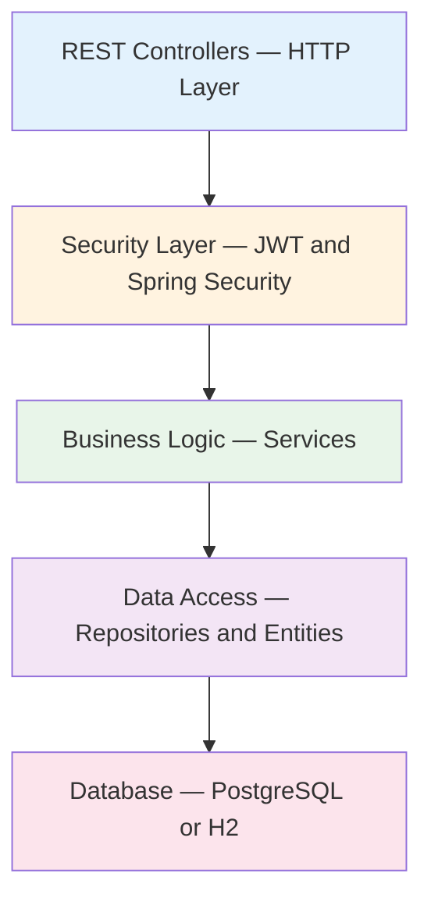

# Service Layers & Component Architecture

**Purpose**: Document the responsibilities of each layer, data flow, transaction boundaries, and component dependencies.

---

## Layered Architecture



---

## Layer Responsibilities

### HTTP / Controller Layer
Handles request/response mapping, input format validation, and routing. Calls service methods and formats `ResponseEntity` responses.

DTOs used:
- `LoginRequest` — `{ username: String, password: String }` (validated with `@NotBlank`)
- `ApiResponse<T>` — `{ success: boolean, message: String, data: T }`
- `PaginatedResponse<T>` — Spring Page wrapper with `pageNumber`, `pageSize`, `totalElements`, `totalPages`

### Security Layer (Cross-cutting)
Intercepts all requests. Validates JWT tokens, extracts user role, and enforces authorization before the request reaches the service layer.

```mermaid
sequenceDiagram
    participant U as User
    participant FE as Frontend
    participant BE as Backend
    U->>FE: Submit credentials
    FE->>BE: POST /api/auth/login
    BE->>BE: Authenticate via AuthenticationManager
    BE->>BE: Generate JWT (JwtUtil)
    BE-->>FE: 200 OK + { token }
    FE-->>U: Store token; include in Authorization header
```

### Business Logic Layer (Services)
Implements business rules, validates domain constraints, manages transactions, and maps entities to DTOs.

**AuthService** responsibilities: credential validation, JWT generation, BCrypt password comparison.

**ProductService** responsibilities: CRUD orchestration, business rule validation (price > 0, quantity ≥ 0), `@Transactional` boundaries, entity-to-DTO mapping.

### Data Access Layer (Repositories)
Spring Data JPA interfaces. Provides derived queries, custom `@Query` methods, and pagination support.

```java
public interface ProductRepository extends JpaRepository<Product, UUID> {
    Optional<Product> findBySku(String sku);
    Page<Product> findAll(Pageable pageable);

    @Query("SELECT p FROM Product p WHERE p.price > ?1 AND p.quantity > 0")
    List<Product> findAffordableInStock(BigDecimal maxPrice);
}
```

### Database Layer
PostgreSQL 17.5 in production (Neon serverless). H2 in-memory for tests. Schema managed by Flyway.

---

## Endpoint Authorization Summary

| Controller | Endpoint | Auth Requirement |
|------------|----------|-----------------|
| `AuthController` | POST `/api/auth/login` | Public |
| `HealthController` | GET `/api/health` | Public |
| `ProductController` | GET `/api/products` | JWT (ADMIN, USER) |
| `ProductController` | GET `/api/products/paged` | JWT (ADMIN, USER) |
| `ProductController` | GET `/api/products/{id}` | JWT (ADMIN, USER) |
| `ProductController` | POST `/api/products` | JWT (ADMIN) |
| `ProductController` | PUT `/api/products/{id}/quantity` | JWT (ADMIN, USER) |
| `ProductController` | PUT `/api/products/{id}/price` | JWT (ADMIN, USER) |
| `ProductController` | PUT `/api/products/{id}/name` | JWT (ADMIN, USER) |
| `ProductController` | GET `/api/products/low-stock` | JWT (ADMIN, USER) |
| `ProductController` | GET `/api/products/search` | JWT (ADMIN, USER) |
| `ProductController` | DELETE `/api/products/{id}` | JWT (ADMIN) |
| `ProductController` | GET `/api/products/total-stock-value` | JWT (ADMIN, USER) |

---

## Transaction Boundaries

Read operations use `@Transactional(readOnly = true)`. Write operations use `@Transactional` to ensure atomicity.

```java
@Transactional
public void createProduct(CreateProductRequest req) {
    Product product = new Product(req);
    productRepository.save(product);        // atomic with next line
    auditLog.log("Product created", product.getId());
    // Both succeed or both roll back
}
```

---

## Component Dependencies

```
AuthController       → AuthService → UserRepository, JwtProvider, PasswordEncoder
ProductController    → ProductService → ProductRepository
GlobalExceptionHandler (cross-cutting)

SecurityConfig       → JwtProvider, UserDetailsService, PasswordEncoder
JwtAuthenticationFilter → JwtProvider
```

---

## Error Handling Strategy

| Exception | HTTP Status | When |
|-----------|-------------|------|
| `ResourceNotFoundException` | 404 | Entity not found by ID |
| `ValidationException` | 400 | Business rule violation |
| `UnauthorizedException` | 401 | Invalid or missing token |
| `AuthorizationException` | 403 | Insufficient role |
| `Exception` (catch-all) | 500 | Unexpected server error |

All exceptions are caught by `GlobalExceptionHandler` (`@RestControllerAdvice`) and returned as a consistent `ErrorResponse` JSON body.

---

## Database Indexing

```sql
CREATE INDEX idx_products_sku      ON products(sku);
CREATE INDEX idx_products_category ON products(category);
CREATE INDEX idx_users_username    ON users(username);
```

Queries on `sku`, `category`, and `username` use these indexes. Pagination uses `ORDER BY` with `LIMIT/OFFSET` handled by Spring Data's `Pageable`.

---

[Back to System Index](./index.md)
