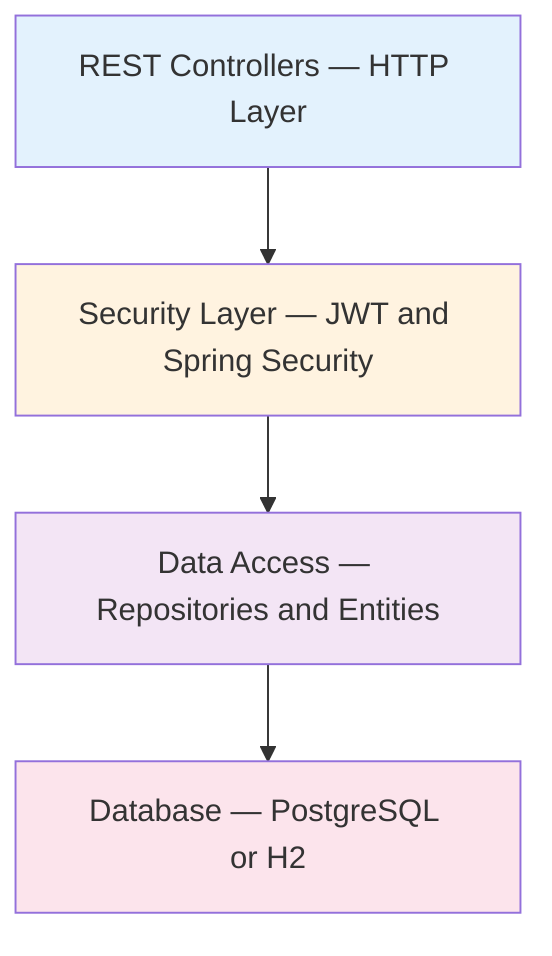

# Component Architecture & Layers

**Purpose**: Document the responsibilities of each layer, data flow, transaction boundaries, and component dependencies.

---

## Layered Architecture



---

## Layer Responsibilities

### HTTP / Controller Layer
Handles request/response mapping, input validation, and routing. Controllers call repositories directly — there is no intermediate service layer. Results are formatted into `ResponseEntity` responses.

DTOs used:
- `LoginRequest` — `{ username: String, password: String }` (validated with `@NotBlank`)
- `ApiResponse<T>` — `{ success: boolean, message: String, data: T }`
- `PaginatedResponse<T>` — Spring Page wrapper with `pageNumber`, `pageSize`, `totalElements`, `totalPages`

### Security Layer (Cross-cutting)
Intercepts all requests. Validates JWT tokens, extracts user role, and enforces authorization before the request reaches the controller.

```mermaid
sequenceDiagram
    participant U as User
    participant FE as Frontend
    participant BE as Backend
    U->>FE: Submit credentials
    FE->>BE: POST /api/auth/login
    BE->>BE: Authenticate via AuthenticationManager
    BE->>BE: Generate JWT (JwtUtil)
    BE-->>FE: 200 OK + { token }
    FE-->>U: Store token; include in Authorization header
```

### Data Access Layer (Repositories)
Spring Data JPA interfaces. Provides derived queries, custom `@Query` methods, and pagination support.

```java
public interface UserRepository extends JpaRepository<User, Long> {
    Optional<User> findByUsername(String username);
}

public interface ProductRepository extends JpaRepository<Product, Long> {

    @Query("SELECT p FROM Product p WHERE p.quantity < :threshold")
    List<Product> findByQuantityLessThan(@Param("threshold") int threshold);

    @Query("SELECT p FROM Product p ORDER BY p.id ASC")
    List<Product> findAllOrderById();

    @Query("SELECT COALESCE(SUM(p.totalValue), 0) FROM Product p")
    double calculateTotalStockValue();

    List<Product> findByNameContainingIgnoreCase(String name);
}
```

### Database Layer
PostgreSQL 17.5 in production (Neon serverless). H2 in-memory for tests. Schema managed by Flyway.

---

## Endpoint Authorization Summary

| Controller | Endpoint | Auth Requirement |
|------------|----------|-----------------|
| `AuthController` | POST `/api/auth/login` | Public |
| `HealthController` | GET `/api/health` | Public |
| `ProductController` | GET `/api/products` | JWT (ADMIN, USER) |
| `ProductController` | GET `/api/products/paged` | JWT (ADMIN, USER) |
| `ProductController` | GET `/api/products/{id}` | JWT (ADMIN, USER) |
| `ProductController` | POST `/api/products` | JWT (ADMIN) |
| `ProductController` | PUT `/api/products/{id}/quantity` | JWT (ADMIN, USER) |
| `ProductController` | PUT `/api/products/{id}/price` | JWT (ADMIN, USER) |
| `ProductController` | PUT `/api/products/{id}/name` | JWT (ADMIN, USER) |
| `ProductController` | GET `/api/products/low-stock` | JWT (ADMIN, USER) |
| `ProductController` | GET `/api/products/search` | JWT (ADMIN, USER) |
| `ProductController` | DELETE `/api/products/{id}` | JWT (ADMIN) |
| `ProductController` | GET `/api/products/total-stock-value` | JWT (ADMIN, USER) |

---

## Transaction Boundaries

There is no explicit service layer. Controllers call `JpaRepository` methods directly, which Spring Data JPA wraps in transactions automatically for each operation. There are no multi-step write sequences that require explicit `@Transactional` boundaries in application code — each `save()` or `delete()` is its own atomic unit.

---

## Component Dependencies

```
AuthController       → AuthenticationManager, JwtUtil, UserRepository
ProductController    → ProductRepository
HealthController     → DataSource (direct JDBC connection check)
GlobalExceptionHandler (cross-cutting)

SecurityConfig             → JwtFilter, CustomUserDetailsService, PasswordEncoder
JwtFilter                  → JwtUtil, CustomUserDetailsService
CustomUserDetailsService   → UserRepository
```

---

## Error Handling Strategy

All exceptions are caught by `GlobalExceptionHandler` (`@RestControllerAdvice`) and returned as a consistent `ApiResponse<T>` JSON body with `success: false`.

| Exception | HTTP Status | When |
|-----------|-------------|------|
| `EntityNotFoundException` | 404 | Product not found by ID |
| `NoSuchElementException` | 404 | `.get()` on empty Optional |
| `IllegalArgumentException` | 400 | Business rule violation |
| `MethodArgumentNotValidException` | 400 | `@Valid` bean validation failure |
| `HttpMessageNotReadableException` | 400 | Malformed request body |
| `HandlerMethodValidationException` | 400 | `@Min`/`@Positive` on path/query params |
| `AccessDeniedException` | 403 | Insufficient role (Spring Security) |
| `BadCredentialsException` | 401 | Wrong password during login |
| `JwtException` | 401 | Invalid/expired JWT token |
| `Exception` (catch-all) | 500 | Unexpected server error |

---

## Database Indexing

The current schema (`V2__create_schema.sql`) defines no explicit indexes beyond the primary key constraints. The `username` column in `app_user` has a `UNIQUE` constraint which PostgreSQL backs with an implicit index. Pagination uses `ORDER BY` with `LIMIT/OFFSET` handled by Spring Data's `Pageable`.

Explicit indexes (e.g., on `product.name` for search queries) are a planned addition when query performance profiling indicates a need.

---

[Back to System Index](./index.md)
