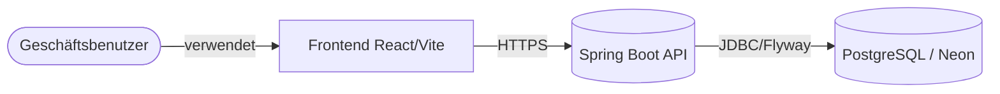
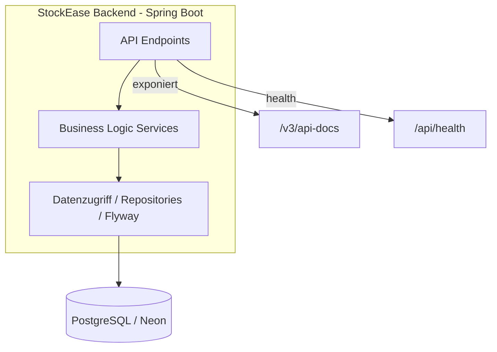

# StockEase Backend-Architektur — Übersicht

**[English Version](./overview.md)**

**Live API**: https://keglev.github.io/stockease/api-docs.html

---

## Geschäftskontext

Unternehmen benötigen eine zentrale, sichere und skalierbare Plattform, um Bestände in Echtzeit zu verwalten, Benutzerzugriffe mit rollengestützter Authentifizierung zu kontrollieren, Lagerniveaus und Preise zu verfolgen und zuverlässige APIs für Frontend und Drittanbieter bereitzustellen.

StockEase bietet Multi-User-Unterstützung mit rollengestützter Zugriffskontrolle (Admin, Benutzer), RESTful CRUD-Operationen auf Produkten und Beständen, sichere JWT-Authentifizierung mit BCrypt-Passwort-Hashing, cloud-native containerisierte Bereitstellung und PostgreSQL mit automatischen Flyway-Migrationen.

---

## C4-Architekturmodell

### Kontextdiagramm (Ebene 1)

### Container-Diagramm (Ebene 2)

### Komponentenzusammenfassung (Ebene 3)

| Ebene | Komponenten |
|-------|------------|
| Controllers | `AuthController`, `ProductController`, `HealthController` |
| Services | `AuthService`, `ProductService`, `HealthService` |
| Repositories | `UserRepository`, `ProductRepository` |
| Sicherheit | `JwtProvider`, `SecurityConfig`, `JwtAuthenticationFilter`, `BCrypt` |
| Datenzugriff | Flyway-Migrationen, PostgreSQL (Prod), H2 (Test) |

---

## Technologie-Stack

| Ebene | Technologie | Version |
|-------|-----------|---------|
| Runtime | Java | 17 LTS |
| Framework | Spring Boot | 3.5.7 |
| Sicherheit | Spring Security | 6.3.1 |
| Datenzugriff | Spring Data JPA | 3.3.7 |
| Migrationen | Flyway | 11.7.2 |
| Datenbank | PostgreSQL | 17.5 |
| Testing | JUnit 5 | 5.10.2 |
| Test-DB | H2 | 2.3.232 |
| Build | Maven | 3.9.x |
| Dokumentation | SpringDoc OpenAPI | 2.4.0 |
| Container | Docker | Latest |
| Bereitstellung | Koyeb | — |

---

## Wichtige Designentscheidungen

**JWT-basierte Authentifizierung** — zustandsloses Design ermöglicht horizontale Skalierung, funktioniert mit SPA-Frontends und containerisierten Services.

**PostgreSQL für Produktion, H2 für Tests** — ACID-Compliance und Zuverlässigkeit in der Produktion; schnelle, isolierte Testausführung lokal.

**Flyway für Migrationen** — versionskontrolliertes Schema, reproduzierbare Bereitstellungen, funktioniert mit H2 und PostgreSQL.

**Spring Data JPA** — eliminiert Boilerplate-Code, datenbankagnostisch, integrierte Paginierung und Sortierung.

**Containerisierte Bereitstellung auf Koyeb** — konsistente Umgebung von der Entwicklung bis zur Produktion, einfache automatische Skalierung.

---

## Datenmodelle

**AppUser**: `id` (UUID, PK), `username` (eindeutig), `password` (BCrypt), `role` (ADMIN/USER), `createdAt`, `updatedAt`

**Product**: `id` (UUID, PK), `name`, `price` (BigDecimal), `quantity`, `sku` (eindeutig), `totalValue`, `createdAt`, `updatedAt`, `createdBy` (FK → AppUser)

---

## API-Endpoints

| Methode | Endpoint | Auth | Zweck |
|---------|----------|------|-------|
| POST | `/api/auth/login` | Öffentlich | Authentifizierung und JWT zurückgeben |
| GET | `/api/health` | Öffentlich | Datenbankverbindungsprüfung |
| GET | `/api/products` | JWT (ADMIN, USER) | Alle Produkte auflisten |
| GET | `/api/products/paged` | JWT (ADMIN, USER) | Paginierte Produktliste |
| GET | `/api/products/{id}` | JWT (ADMIN, USER) | Einzelnes Produkt abrufen |
| POST | `/api/products` | JWT (ADMIN) | Produkt erstellen |
| PUT | `/api/products/{id}/quantity` | JWT (ADMIN, USER) | Menge aktualisieren |
| PUT | `/api/products/{id}/price` | JWT (ADMIN, USER) | Preis aktualisieren |
| PUT | `/api/products/{id}/name` | JWT (ADMIN, USER) | Name aktualisieren |
| GET | `/api/products/low-stock` | JWT (ADMIN, USER) | Produkte mit Menge < 5 |
| GET | `/api/products/search?name=` | JWT (ADMIN, USER) | Nach Name suchen |
| DELETE | `/api/products/{id}` | JWT (ADMIN) | Produkt löschen |
| GET | `/api/products/total-stock-value` | JWT (ADMIN, USER) | Gesamtbestandswert |
| GET | `/v3/api-docs` | Öffentlich | OpenAPI-Spezifikation |

---

## Qualitätsattribute

| Attribut | Ziel | Status |
|----------|------|--------|
| Testabdeckung | > 80% | 65+ Tests erfolgreich |
| Verfügbarkeit | 99,9% | Automatische Skalierung auf Koyeb |
| Antwortzeit | < 200ms | In-Memory-Caching wo erforderlich |
| Skalierbarkeit | Horizontal | Zustandsloses Design, containerisiert |
| Sicherheit | Enterprise | JWT + BCrypt + CORS |
| Dokumentation | Auto-generiert | OpenAPI + ReDoc + JaCoCo |

---

[Zurück zum System-Index](./index.de.md)
