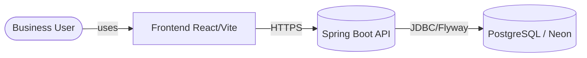
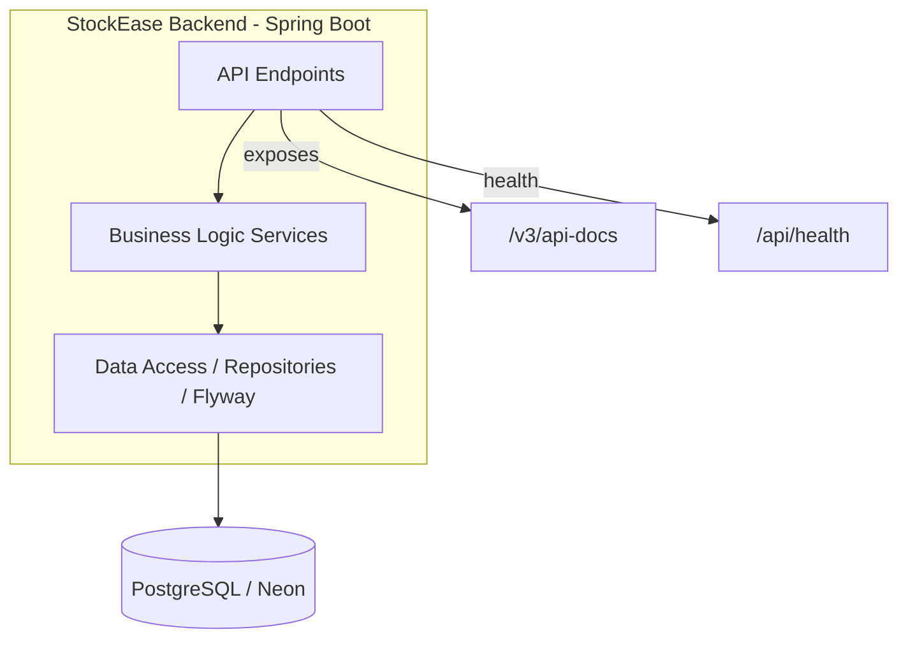

# StockEase Backend Architecture Overview

**[Deutsche Version](./overview.de.md)**

**Live API**: https://keglev.github.io/stockease/api-docs.html

---

## Business Context

Businesses need a centralized, secure, and scalable platform to manage product inventory in real-time, control user access with role-based authentication, track stock levels and pricing, and provide reliable APIs for frontend and third-party integrations.

StockEase delivers multi-user support with role-based access control (Admin, User), RESTful CRUD operations on products and inventory, secure JWT authentication with BCrypt password hashing, cloud-native containerized deployment, and PostgreSQL with automated Flyway migrations.

---

## C4 Architecture Model

### Context Diagram (Level 1)

### Container Diagram (Level 2)

### Component Layer Summary (Level 3)

| Layer | Components |
|-------|------------|
| Controllers | `AuthController`, `ProductController`, `HealthController` |
| Services | `AuthService`, `ProductService`, `HealthService` |
| Repositories | `UserRepository`, `ProductRepository` |
| Security | `JwtProvider`, `SecurityConfig`, `JwtAuthenticationFilter`, `BCrypt` |
| Data Access | Flyway migrations, PostgreSQL (prod), H2 (test) |

---

## Technology Stack

| Layer | Technology | Version |
|-------|-----------|---------|
| Runtime | Java | 17 LTS |
| Framework | Spring Boot | 3.5.7 |
| Security | Spring Security | 6.3.1 |
| Data Access | Spring Data JPA | 3.3.7 |
| Migrations | Flyway | 11.7.2 |
| Database | PostgreSQL | 17.5 |
| Testing | JUnit 5 | 5.10.2 |
| Test DB | H2 | 2.3.232 |
| Build | Maven | 3.9.x |
| Documentation | SpringDoc OpenAPI | 2.4.0 |
| Container | Docker | Latest |
| Deployment | Koyeb | — |

---

## Key Design Decisions

**JWT-based authentication** — stateless design enables horizontal scaling, works with SPA frontends and containerized services.

**PostgreSQL for production, H2 for tests** — ACID compliance and reliability in production; fast isolated test execution locally.

**Flyway for migrations** — version-controlled schema, reproducible deployments, works across both H2 and PostgreSQL.

**Spring Data JPA** — eliminates boilerplate, database-agnostic, built-in pagination and sorting.

**Containerized deployment on Koyeb** — consistent environment from development to production, easy auto-scaling, seamless CI/CD.

---

## Data Models

**AppUser**: `id` (Long, PK auto-increment), `username` (unique), `password` (BCrypt), `role` (ROLE_ADMIN/ROLE_USER)

**Product**: `id` (Long, PK auto-increment), `name`, `price` (DOUBLE PRECISION), `quantity` (INTEGER), `totalValue` (DOUBLE PRECISION)

---

## API Endpoints

| Method | Endpoint | Auth | Purpose |
|--------|----------|------|---------|
| POST | `/api/auth/login` | Public | Authenticate and return JWT |
| GET | `/api/health` | Public | DB connectivity check |
| GET | `/api/products` | JWT (ADMIN, USER) | List all products |
| GET | `/api/products/paged` | JWT (ADMIN, USER) | Paginated product list |
| GET | `/api/products/{id}` | JWT (ADMIN, USER) | Get single product |
| POST | `/api/products` | JWT (ADMIN) | Create product |
| PUT | `/api/products/{id}/quantity` | JWT (ADMIN, USER) | Update quantity |
| PUT | `/api/products/{id}/price` | JWT (ADMIN, USER) | Update price |
| PUT | `/api/products/{id}/name` | JWT (ADMIN, USER) | Update name |
| GET | `/api/products/low-stock` | JWT (ADMIN, USER) | Products with quantity < 5 |
| GET | `/api/products/search?name=` | JWT (ADMIN, USER) | Search by name |
| DELETE | `/api/products/{id}` | JWT (ADMIN) | Delete product |
| GET | `/api/products/total-stock-value` | JWT (ADMIN, USER) | Aggregate stock value |
| GET | `/v3/api-docs` | Public | OpenAPI spec |

---

## Quality Attributes

| Attribute | Target | Status |
|-----------|--------|--------|
| Test Coverage | > 80% | 65+ tests passing |
| Availability | 99.9% | Auto-scaling on Koyeb |
| Response Time | < 200ms | In-memory caching where needed |
| Scalability | Horizontal | Stateless design, containerized |
| Security | Enterprise | JWT + BCrypt + CORS |
| Documentation | Auto-generated | OpenAPI + ReDoc + JaCoCo |

---

[Back to System Index](./index.md)
