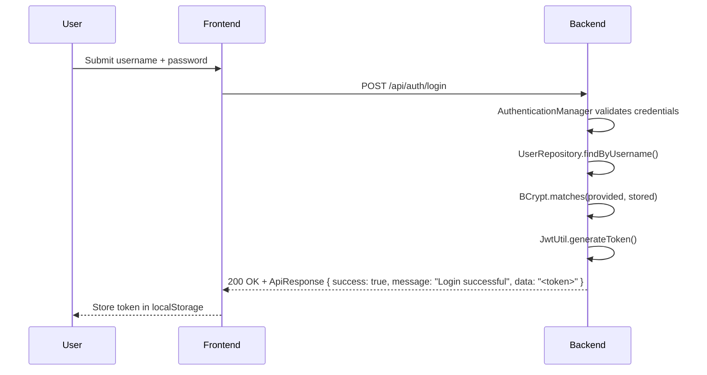

# Security Architecture

**Purpose**: Document the defense-in-depth security model, JWT implementation, RBAC, password security, CORS, input validation, and secrets management.

---

## Security Layers

```
HTTPS/TLS (Transport Security)
CORS (Cross-Origin Resource Sharing)
HTTP Security Headers
Authentication (JWT Tokens)
Authorization (Role-Based Access Control)
Input Validation & Sanitization
Password Hashing (BCrypt)
Database Security (Parameterized SQL)
```

---

## JWT Authentication

### Token Structure

```
Header.Payload.Signature

Payload:
{
  "sub": "john.doe",
  "role": "ROLE_ADMIN",
  "iat": 1701418200,
  "exp": 1701454200
}
```

Algorithm: HS256. Expiration: 10 hours (hardcoded `EXPIRATION_TIME = 36000000` ms).

### Login Flow



### Token Validation Flow

Every secured request passes through `JwtFilter`:

1. Extract token from `Authorization: Bearer <token>` header
2. Verify signature using secret key
3. Check expiration (`exp` claim vs current time)
4. Extract claims (`username`, `role`)
5. Set `Authentication` in `SecurityContext`
6. If invalid or expired → 401 Unauthorized

### JwtUtil

`JwtUtil` generates and validates tokens. Key behaviours:

- Token is signed with HS256 using a static secret key
- Token expires after 10 hours (hardcoded `EXPIRATION_TIME = 36000000` ms)
- `sub` claim holds the username string
- `role` claim holds the Spring role string (e.g. `ROLE_ADMIN`)
- `validateToken()` catches `JwtException` internally and returns `false`; missing or invalid tokens cause Spring Security to invoke `CustomAuthenticationEntryPoint` → 401

```java
@Component
public class JwtUtil {

    public String generateToken(String username, String role) {
        // builds JWT with sub=username, role claim, iat, exp
        // signs with HS256 and the static secret key
    }

    public boolean validateToken(String token) { ... }

    public String extractUsername(String token) { ... }

    public String extractRole(String token) { ... }
}
```

---

## Role-Based Access Control (RBAC)

Two roles: `ROLE_ADMIN` (full access) and `ROLE_USER` (read + limited update).

```java
@PostMapping
@PreAuthorize("hasRole('ADMIN')")
public ResponseEntity<?> createProduct(@Valid @RequestBody CreateProductRequest req) { }
```

Full authorization matrix is in [Service Layers](./layers.md).

---

## Password Security (BCrypt)

Cost factor: 10. BCrypt is one-way — passwords are never stored or logged in plaintext.

```java
@Bean
public PasswordEncoder passwordEncoder() {
    return new BCryptPasswordEncoder();
}
```

Verification at login: `passwordEncoder.matches(providedRaw, storedHash)` (default cost factor 10).

---

## CORS Configuration

```java
@Configuration
public class CorsConfig implements WebMvcConfigurer {
    @Override
    public void addCorsMappings(CorsRegistry registry) {
        registry.addMapping("/**")
            .allowedOrigins(
                "https://stockeasefrontend.vercel.app/",
                "http://localhost:5173")
            .allowedMethods("GET", "POST", "PUT", "DELETE", "OPTIONS")
            .allowedHeaders("*")
            .allowCredentials(true);
    }
}
```

CORS is enforced at two levels: `CorsConfig` (MVC layer) and `SecurityConfig` (Spring Security filter). Both must allow the same origins. Production origins are restricted to the Vercel frontend and local dev — no wildcard `*` for `allowedOrigins`.

---

## Security Configuration

```java
@Configuration
@EnableMethodSecurity
public class SecurityConfig {

    @Bean
    public SecurityFilterChain securityFilterChain(HttpSecurity http) throws Exception {
        http
            .csrf(csrf -> csrf.disable())
            .cors(cors -> cors.configurationSource(corsConfigurationSource()))
            .authorizeHttpRequests(auth -> auth
                .requestMatchers("/api/health").permitAll()
                .requestMatchers(HttpMethod.GET, "/actuator/health/**").permitAll()
                .requestMatchers(HttpMethod.POST, "/api/auth/login").permitAll()
                .requestMatchers(HttpMethod.POST, "/api/products").hasRole("ADMIN")
                .requestMatchers(HttpMethod.PUT, "/api/products/**").hasAnyRole("ADMIN", "USER")
                .requestMatchers(HttpMethod.DELETE, "/api/products/**").hasRole("ADMIN")
                .requestMatchers(HttpMethod.GET, "/api/products/**").hasAnyRole("ADMIN", "USER")
                .anyRequest().authenticated()
            )
            .exceptionHandling(ex -> ex
                .authenticationEntryPoint(customAuthenticationEntryPoint)
            )
            .sessionManagement(session ->
                session.sessionCreationPolicy(SessionCreationPolicy.STATELESS));

        http.addFilterBefore(jwtFilter, UsernamePasswordAuthenticationFilter.class);
        return http.build();
    }
}
```

---

## Input Validation

Bean Validation (`@Valid` + JSR-303) on all request DTOs:

```java
public class CreateProductRequest {
    @NotNull @NotBlank
    private String name;           // must not be blank

    @NotNull @Min(0)
    private Integer quantity;      // must be >= 0

    @NotNull @Positive
    private Double price;          // must be > 0
}

public class UpdateQuantityRequest {
    @NotNull @Min(0)
    private Integer quantity;
}

public class UpdatePriceRequest {
    @NotNull @Positive
    private Double price;
}

public class UpdateNameRequest {
    @NotNull @NotBlank
    private String name;
}

public class LoginRequest {
    @NotBlank private String username;
    @NotBlank private String password;
}
```

Validation failures are caught by `GlobalExceptionHandler` and returned as `ApiResponse<Map<String,String>>` with HTTP 400 and a `data` map of field → error message.

---

## SQL Injection Prevention

Spring Data JPA uses parameterized queries exclusively. String concatenation in queries is prohibited.

```java
// Safe — Spring Data derived query, parameterized automatically
productRepository.findByNameContainingIgnoreCase(userProvidedName);

// Safe — named parameter in custom JPQL query
@Query("SELECT p FROM Product p WHERE p.quantity < :threshold")
List<Product> findByQuantityLessThan(@Param("threshold") int threshold);
```

---

## HTTP Security Headers

Set automatically by Spring Security:

| Header | Value | Protects Against |
|--------|-------|-----------------|
| `Strict-Transport-Security` | `max-age=31536000; includeSubDomains` | Forces HTTPS |
| `X-Content-Type-Options` | `nosniff` | MIME-type sniffing |
| `X-Frame-Options` | `DENY` | Clickjacking |
| `X-XSS-Protection` | `1; mode=block` | Reflected XSS |
| `Cache-Control` | `no-cache, no-store` | Sensitive data caching |

---

## Secrets Management

All sensitive values are environment variables — never committed to the repository.

| Variable | Purpose |
|----------|---------|
| `SPRING_DATASOURCE_URL` | Database connection string |
| `SPRING_DATASOURCE_USERNAME` | Database user |
| `SPRING_DATASOURCE_PASSWORD` | Database password |
| `JWT_SECRET` | JWT signing key (32+ characters) |

Managed via GitHub Secrets in CI/CD and Koyeb environment variables in production.

---

## Audit Logging

Key events are logged at the controller level using SLF4J. Logging is configured via `application.properties`:

```
logging.level.com.stocks.stockease=INFO
logging.level.org.springframework=INFO
```

Example log output:
```
[2025-10-31 10:30:45] INFO  [AuthController] Login attempt for user 'john.doe'
[2025-10-31 10:31:12] INFO  [ProductController] Creating product: {name=Widget, quantity=10, price=9.99}
[2025-10-31 10:32:00] DEBUG [JwtFilter] JWT validation failed for token
```

---

## Production Deployment Checklist

- [ ] Change all default credentials
- [ ] Remove seed data (V3 migration)
- [ ] Set strong JWT secret (32+ characters)
- [ ] Configure CORS for production domain only
- [ ] Verify HTTPS/TLS is active
- [ ] Confirm all secrets are in environment variables, not in code
- [ ] Enable database backups
- [ ] Review security headers in response

---

[Back to System Index](./index.md)
