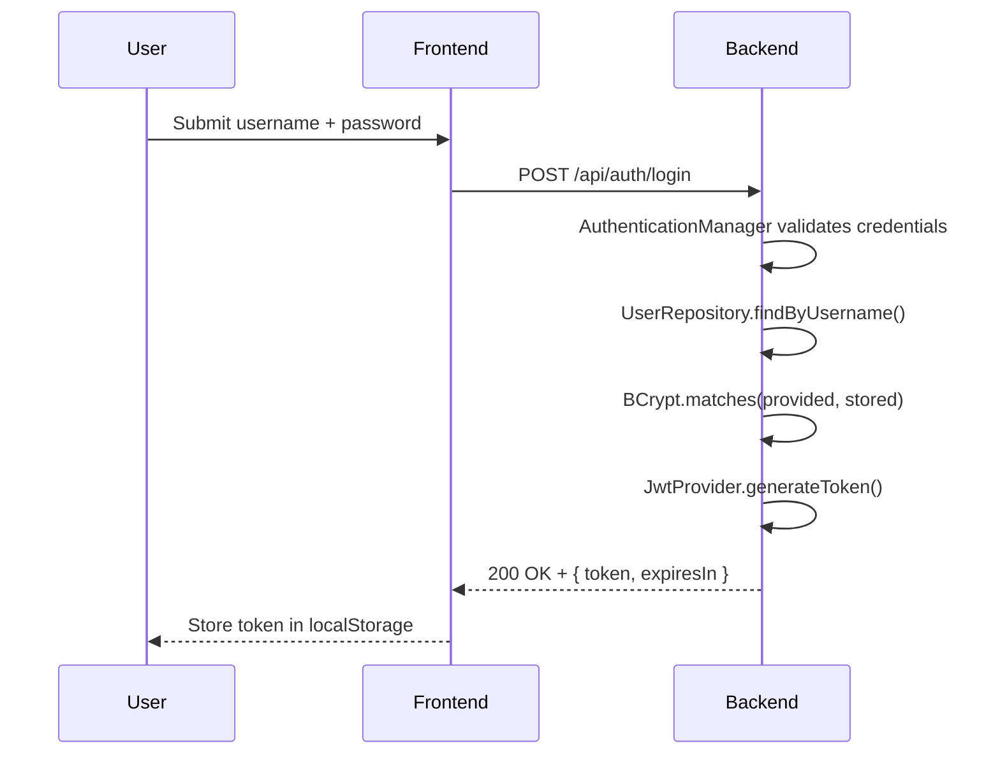

# Security Architecture

**Purpose**: Document the defense-in-depth security model, JWT implementation, RBAC, password security, CORS, input validation, and secrets management.

---

## Security Layers

```
HTTPS/TLS (Transport Security)
CORS (Cross-Origin Resource Sharing)
HTTP Security Headers
Authentication (JWT Tokens)
Authorization (Role-Based Access Control)
Input Validation & Sanitization
Password Hashing (BCrypt)
Database Security (Parameterized SQL)
```

---

## JWT Authentication

### Token Structure

```
Header.Payload.Signature

Payload:
{
  "sub": "1",
  "username": "john.doe",
  "role": "ADMIN",
  "iat": 1701418200,
  "exp": 1701504600,
  "iss": "stockease-backend",
  "aud": "stockease-frontend"
}
```

Algorithm: HS256. Expiration: 24 hours (`app.jwt.expiration=86400000`).

### Login Flow



### Token Validation Flow

Every secured request passes through `JwtAuthenticationFilter`:

1. Extract token from `Authorization: Bearer <token>` header
2. Verify signature using secret key
3. Check expiration (`exp` claim vs current time)
4. Extract claims (`userId`, `role`)
5. Set `Authentication` in `SecurityContext`
6. If invalid or expired → 401 Unauthorized

### JwtTokenProvider

```java
@Component
public class JwtTokenProvider {

    @Value("${app.jwt.secret}") private String jwtSecret;
    @Value("${app.jwt.expiration:86400000}") private int jwtExpiration;

    public String generateToken(Authentication authentication) {
        AppUser user = (AppUser) authentication.getPrincipal();
        Date now = new Date();
        return Jwts.builder()
            .setSubject(user.getId().toString())
            .claim("username", user.getUsername())
            .claim("role", user.getRole())
            .setIssuedAt(now)
            .setExpiration(new Date(now.getTime() + jwtExpiration))
            .signWith(SignatureAlgorithm.HS512, jwtSecret)
            .compact();
    }

    public boolean validateToken(String token) {
        try {
            Jwts.parser().setSigningKey(jwtSecret).parseClaimsJws(token);
            return true;
        } catch (JwtException | IllegalArgumentException e) {
            return false;
        }
    }
}
```

---

## Role-Based Access Control (RBAC)

Two roles: `ROLE_ADMIN` (full access) and `ROLE_USER` (read + limited update).

```java
@PostMapping
@PreAuthorize("hasRole('ADMIN')")
public ResponseEntity<ProductDTO> createProduct(@Valid @RequestBody CreateProductRequest req) { }
```

Full authorization matrix is in [Service Layers](./layers.md).

---

## Password Security (BCrypt)

Cost factor: 10. BCrypt is one-way — passwords are never stored or logged in plaintext.

```java
@Bean
public PasswordEncoder passwordEncoder() {
    return new BCryptPasswordEncoder(10);
}
```

Verification at login: `passwordEncoder.matches(providedRaw, storedHash)`.

---

## CORS Configuration

```java
@Configuration
public class CorsConfig implements WebMvcConfigurer {
    @Override
    public void addCorsMappings(CorsRegistry registry) {
        registry.addMapping("/**")
            .allowedOrigins(
                "https://stockeasefrontend.vercel.app/",
                "http://localhost:5173")
            .allowedMethods("GET", "POST", "PUT", "DELETE", "OPTIONS")
            .allowedHeaders("*")
            .allowCredentials(true);
    }
}
```

CORS is enforced at two levels: `CorsConfig` (MVC layer) and `SecurityConfig` (Spring Security filter). Both must allow the same origins. Production origins are restricted to the Vercel frontend and local dev — no wildcard `*` for `allowedOrigins`.

---

## Security Configuration

```java
@Configuration
@EnableMethodSecurity
public class SecurityConfig {

    @Bean
    public SecurityFilterChain securityFilterChain(HttpSecurity http) throws Exception {
        http
            .csrf(csrf -> csrf.disable())
            .cors(cors -> cors.configurationSource(corsConfigurationSource()))
            .authorizeHttpRequests(auth -> auth
                .requestMatchers("/api/health").permitAll()
                .requestMatchers(HttpMethod.GET, "/actuator/health/**").permitAll()
                .requestMatchers(HttpMethod.POST, "/api/auth/login").permitAll()
                .requestMatchers(HttpMethod.POST, "/api/products").hasRole("ADMIN")
                .requestMatchers(HttpMethod.PUT, "/api/products/**").hasAnyRole("ADMIN", "USER")
                .requestMatchers(HttpMethod.DELETE, "/api/products/**").hasRole("ADMIN")
                .requestMatchers(HttpMethod.GET, "/api/products/**").hasAnyRole("ADMIN", "USER")
                .anyRequest().authenticated()
            )
            .exceptionHandling(ex -> ex
                .authenticationEntryPoint(customAuthenticationEntryPoint)
            )
            .sessionManagement(session ->
                session.sessionCreationPolicy(SessionCreationPolicy.STATELESS));

        http.addFilterBefore(jwtFilter, UsernamePasswordAuthenticationFilter.class);
        return http.build();
    }
}
```

---

## Input Validation

Bean Validation (`@Valid` + JSR-303) on all request DTOs:

```java
public class CreateProductRequest {

    @NotBlank @Size(min = 3, max = 255)
    private String name;

    @NotNull @DecimalMin("0.01") @DecimalMax("999999.99")
    private BigDecimal price;

    @NotNull @Min(0) @Max(1000000)
    private Integer quantity;

    @NotBlank @Pattern(regexp = "^[A-Z0-9-]{3,50}$")
    private String sku;
}
```

Validation failures are caught by `GlobalExceptionHandler` and returned as 400 with field-level error details.

---

## SQL Injection Prevention

Spring Data JPA uses parameterized queries exclusively. String concatenation in queries is prohibited.

```java
// Safe — Spring Data parameterizes automatically
productRepository.findBySku(userProvidedSku);

// Safe — named parameter in custom query
@Query("SELECT p FROM Product p WHERE p.sku = ?1")
Optional<Product> findBySku(String sku);
```

---

## HTTP Security Headers

Set automatically by Spring Security:

| Header | Value | Protects Against |
|--------|-------|-----------------|
| `Strict-Transport-Security` | `max-age=31536000; includeSubDomains` | Forces HTTPS |
| `X-Content-Type-Options` | `nosniff` | MIME-type sniffing |
| `X-Frame-Options` | `DENY` | Clickjacking |
| `X-XSS-Protection` | `1; mode=block` | Reflected XSS |
| `Cache-Control` | `no-cache, no-store` | Sensitive data caching |

---

## Secrets Management

All sensitive values are environment variables — never committed to the repository.

| Variable | Purpose |
|----------|---------|
| `SPRING_DATASOURCE_URL` | Database connection string |
| `SPRING_DATASOURCE_USERNAME` | Database user |
| `SPRING_DATASOURCE_PASSWORD` | Database password |
| `JWT_SECRET` | JWT signing key (32+ characters) |

Managed via GitHub Secrets in CI/CD and Koyeb environment variables in production.

---

## Audit Logging

Logged events: login attempts (success/failure), product creation/modification/deletion, authorization failures (403), server errors (500).

```
[2025-10-31 10:30:45] INFO  [AuthService] User 'john.doe' logged in successfully
[2025-10-31 10:31:12] INFO  [ProductService] Product 'Widget' created by admin
[2025-10-31 10:32:00] WARN  [SecurityFilter] Unauthorized access attempt: invalid token
```

---

## Production Deployment Checklist

- [ ] Change all default credentials
- [ ] Remove seed data (V3 migration)
- [ ] Set strong JWT secret (32+ characters)
- [ ] Configure CORS for production domain only
- [ ] Verify HTTPS/TLS is active
- [ ] Confirm all secrets are in environment variables, not in code
- [ ] Enable database backups
- [ ] Review security headers in response

---

[Back to System Index](./index.md)
