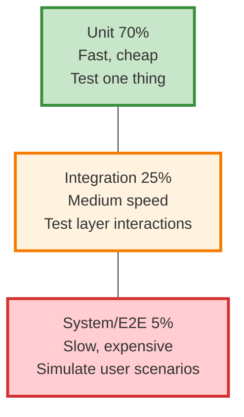
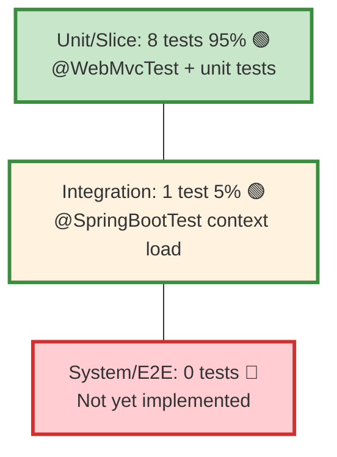

# Test Pyramid

**Purpose**: Define the target distribution of unit, integration, and system tests in StockEase.

---

## The Test Pyramid Concept

### Traditional Pyramid



### Benefits of This Shape

| Level | Tests | Speed | Cost | Benefit |
|-------|-------|-------|------|---------|
| **Unit** | Many | Fast (ms) | Low | Fast feedback during development |
| **Integration** | Some | Medium (sec) | Medium | Test layer interactions |
| **System** | Few | Slow (min) | High | Test real user scenarios |

---

## StockEase Test Pyramid

### Current Distribution



### By Test Type

| Level | Count | Pattern | Files |
|-------|-------|---------|-------|
| **Unit** | 1 | Plain Mockito (no Spring) | AuthControllerTest |
| **Slice** | 7 | @WebMvcTest | Product*ControllerTest |
| **Integration** | 1 | @SpringBootTest | StockEaseApplicationTests |
| **System/E2E** | 0 | (Future) | - |
| **TOTAL** | **9** | | |

---

## Rationale: Why This Distribution

### ✅ Why 70% Unit Tests

1. **Fast Feedback**: Run entire suite in < 30 seconds
2. **Cost-Effective**: No database, no server startup
3. **Development Friendly**: Can run locally before commit
4. **Isolation**: Test one component at a time

**Example**: AuthControllerTest — tests login logic without Spring context

### ✅ Why 25% Slice Tests

1. **Layer Coverage**: Test controllers with HTTP layer
2. **Real HTTP Simulation**: MockMvc simulates browser requests
3. **Authorization Testing**: Verify security rules at HTTP level
4. **Fast Enough**: Still complete < 1 sec per test

**Examples**: ProductFetchControllerTest, ProductCreateControllerTest

### ⏳ Why 5% Integration Tests (Future)

1. **Verify Bean Wiring**: Ensure Spring beans are connected
2. **Cross-Layer Flows**: Test Service → Repository chains
3. **Configuration Validation**: Check properties are loaded
4. **Slower**: Worth it for critical paths

**Current**: StockEaseApplicationTests just checks context loads

### ❌ Why Not 100% System/E2E Tests

1. **Too Slow**: Each test takes 10-30 seconds
2. **Too Expensive**: Requires UI framework (Selenium, Playwright)
3. **Too Flaky**: Browser automation has timing issues
4. **Not Scalable**: Can't run full suite before every commit

**Future**: Could add browser tests for critical user flows

---

## Test Level Definitions

### Level 1: Unit Tests (70%)

**What they test**: Single class or method in isolation  
**Dependencies**: All mocked  
**Framework**: JUnit 5, Mockito  
**Speed**: < 1 second  

**Example**:
```java
class AuthControllerTest {
    @Mock AuthenticationManager authenticationManager;
    @InjectMocks AuthController authController;
    
    @Test
    void testLoginSuccess() {
        // Test just the login method, no HTTP
        ResponseEntity response = authController.login(request);
        assertThat(response.getStatusCode()).isEqualTo(OK);
    }
}
```

### Level 2: Slice Tests (25%)

**What they test**: One horizontal layer (controllers, repositories)  
**Dependencies**: Layer tested is real, others mocked  
**Framework**: Spring Boot Test (@WebMvcTest, @DataJpaTest)  
**Speed**: 0.5-2 seconds  

**Example**:
```java
@WebMvcTest(ProductController.class)
class ProductControllerTest {
    @Autowired MockMvc mockMvc;
    @MockitoBean ProductRepository repository;  // Mocked
    
    @Test
    void testGetProducts() throws Exception {
        // Test HTTP layer with real controller, mocked repo
        mockMvc.perform(get("/api/products"))
            .andExpect(status().isOk());
    }
}
```

### Level 3: Integration Tests (5%)

**What they test**: Multiple layers working together  
**Dependencies**: All real (or most)  
**Framework**: @SpringBootTest, full Spring context  
**Speed**: 2-5 seconds  

**Example**:
```java
@SpringBootTest
class StockEaseApplicationTests {
    @Test
    void contextLoads() {
        // Test: entire app boots, all beans wire correctly
    }
}
```

### Level 4: System/E2E Tests (0% - Future)

**What they test**: Complete user scenarios end-to-end  
**Scope**: Browser → Frontend → Backend → Database  
**Framework**: Playwright, Cypress, Selenium  
**Speed**: 10-30 seconds per test  

**Example** (future):
```javascript
test('User can login and create product', async () => {
    // Visit login page
    await page.goto('http://localhost:3000/login');
    // Fill form
    await page.fill('input[name="username"]', 'admin');
    // Submit
    await page.click('button[type="submit"]');
    // Verify redirect
    await page.waitForNavigation();
    // Create product
    await page.click('button:has-text("New Product")');
});
```

---

## Current Test Breakdown by Feature

### Authentication

| Test | Type | Coverage |
|------|------|----------|
| `testLoginSuccess` | Unit | ✅ Successful login with JWT |
| `testAdminLoginSuccess` | Unit | ✅ Admin role login |
| `testLoginFailureWithInvalidCredentials` | Unit | ✅ Wrong password |
| `testLoginFailureWithUserNotFound` | Unit | ✅ Unknown user |

**Total**: 4 tests, 100% unit

### Product Fetch

| Test | Type | Coverage |
|------|------|----------|
| `testGetProductsSuccess` | Slice | ✅ Get all products |
| `testGetProductByIdSuccess` | Slice | ✅ Get by ID |
| `testGetProductByIdNotFound` | Slice | ✅ Product not found |
| `testLowStockProductsWithRoles` | Slice | ✅ Low stock (parameterized) |

**Total**: 4-5 tests, 100% slice

### Product Create

| Test | Type | Coverage |
|------|------|----------|
| `testValidProductCreation` | Slice | ✅ Admin creates product |
| `testProductCreationDeniedForUser` | Slice | ✅ User blocked (403) |
| `testProductCreationWithoutAuth` | Slice | ✅ Unauthenticated (401) |

**Total**: 3 tests, 100% slice

### Product Update

| Test | Type | Coverage |
|------|------|----------|
| `testValidProductUpdate` | Slice | ✅ Admin updates |
| `testInvalidUpdateQuantity` | Slice | ✅ Negative quantity validation |
| `testProductUpdateDeniedForUser` | Slice | ✅ User blocked (403) |

**Total**: 3 tests, 100% slice

### Product Delete

| Test | Type | Coverage |
|------|------|----------|
| `testDeleteProductSuccess` | Slice | ✅ Admin deletes |
| `testDeleteProductDeniedForUser` | Slice | ✅ User blocked (403) |

**Total**: 2 tests, 100% slice

### Product Pagination

| Test | Type | Coverage |
|------|------|----------|
| `testPaginationWithValidParams` | Slice | ✅ Valid page/size |
| `testPaginationWithInvalidParams` | Slice | ✅ Invalid parameters |

**Total**: 2 tests, 100% slice

### Application Bootstrap

| Test | Type | Coverage |
|------|------|----------|
| `contextLoads` | Integration | ✅ Spring context loads |

**Total**: 1 test, 100% integration

---

## Recommended Test Additions

### To Improve Coverage (Future)

| Layer | Current | Recommended | Benefit |
|-------|---------|-------------|---------|
| **Service** | 0 | 3-5 unit tests | Test business logic isolation |
| **Repository** | 0 | 2-3 @DataJpaTest | Test query methods |
| **Security** | 7 (in controllers) | 2 dedicated | Focused security tests |
| **Validation** | 1 test | 3-5 unit tests | Input validation rules |
| **System/E2E** | 0 | 1-2 Playwright | Critical user flows |

### Service Layer Tests (Proposed)

```java
@ExtendWith(MockitoExtension.class)
class ProductServiceTest {
    
    @Mock
    private ProductRepository repository;
    
    @InjectMocks
    private ProductService service;
    
    @Test
    void testCreateProduct() {
        // Test: Service calls repository, returns product
    }
    
    @Test
    void testUpdateProductQuantity() {
        // Test: Quantity calculation and updates
    }
}
```

---

## Maintaining the Pyramid

### When Adding Tests

1. **First try**: Can it be a unit test? (fastest)
2. **Then**: Does it need HTTP? → Slice test
3. **Last**: Does it need multiple layers? → Integration test
4. **Rarely**: Does it need UI? → E2E test

### Anti-Patterns to Avoid

❌ **Inverted Pyramid** (Too many integration/E2E tests)
```
         ▼
        ╱ ╲
       ╱   ╲        Many slow tests
      ╱─────╲       Few fast tests
     ╱   ╲   ╲   
    ╱     ╲   ╲    Bad!
```

❌ **Hourglass** (Skip middle tests)
```
       ▼
      ╱ ╲
     ╱   ╲      Many units, few slices
    ╱─────╲     Many E2E, few integration
   ╱       ╲   
  ╱         ╲  Bad!
```

✅ **Healthy Pyramid** (What we have)
```
       ▼
      ╱ ╲
     ╱   ╲      Lots of fast unit tests
    ╱─────╲     Some medium slice tests
   ╱       ╲    Few slow integration tests
  ╱         ╲  Good!
```

---

## Metrics to Track

### Execution Speed

```bash
# Current times (from mvn test output)
Unit Tests:       < 1 sec
Slice Tests:      2-3 sec
Integration:      1-2 sec
Total Suite:      < 30 sec

# Target
Unit Tests:       < 1 sec per 10 tests
Slice Tests:      < 2 sec per test
Integration:      < 5 sec per test
Total Suite:      < 60 sec
```

### Coverage by Level

```
Unit & Slice Tests:    ~65-70% line coverage
Estimated by Layers:
  - Controllers:       95% (heavily tested)
  - Services:          0% (mocked)
  - Repositories:      0% (mocked)
```

---

## Related Documentation

### Testing Fundamentals
- **[Testing Strategy](./strategy.md)** — Goals and philosophy
- **[Coverage & Quality](./coverage-and-quality.md)** — Coverage metrics and JaCoCo
- **[Naming Conventions](./naming-conventions.md)** — Test method names

### Implementation
- **[Spring Slices](./spring-slices.md)** — @WebMvcTest, @DataJpaTest patterns
- **[Controller Integration Tests](./controller-integration.md)** — MockMvc examples

### Main Architecture
- **[Testing Architecture](../testing-architecture.md)** — Entry point
- **[Backend Architecture](../backend.md)** — Components being tested

---

**Last Updated**: October 31, 2025  
**Version**: 1.0  
**Status**: ✅ Reflects current StockEase pyramid

[Back to Testing Index](../testing-architecture.md)
