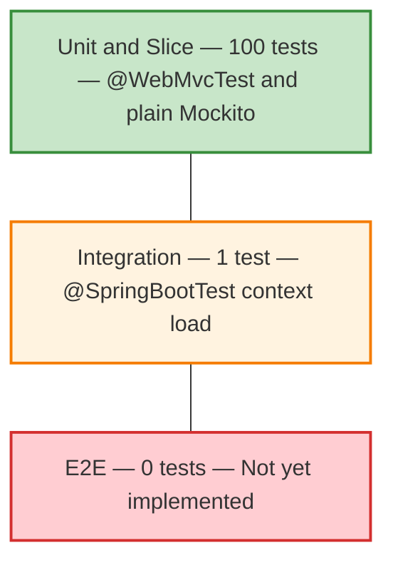

# Test Pyramid

**Purpose**: Define the target distribution of test levels in StockEase and explain the rationale.

---

## Current Distribution

```mermaid
graph TD
    A["E2E — 0 tests — Not yet implemented"]
    B["Integration — 1 test — @SpringBootTest context load"]
    C["Unit and Slice — 100 tests — @WebMvcTest and plain Mockito"]

    C --- B
    B --- A

    style A fill:#ffcdd2,stroke:#d32f2f,stroke-width:2px
    style B fill:#fff3e0,stroke:#f57c00,stroke-width:2px
    style C fill:#c8e6c9,stroke:#388e3c,stroke-width:2px
```

| Level | Count | Annotation | Target % |
|-------|-------|------------|----------|
| Unit | 44 | Plain Mockito | 20% |
| Slice | 56 | `@WebMvcTest` | 75% |
| Integration | 1 | `@SpringBootTest` | 5% |
| E2E | 0 | — | 0% (future) |

---

## Rationale

### Unit Tests (Plain Mockito)
Fast, no Spring context. Used for `AuthControllerTest` where the method is tested directly without HTTP.
Target: any class with testable logic that does not require HTTP simulation.

### Slice Tests (@WebMvcTest)
Loads only the controller and security layer. MockMvc simulates HTTP without starting a server.
Used for all `Product*ControllerTest` classes. Runs in under 2 seconds per class.

### Integration Tests (@SpringBootTest)
Loads the full application context. Used only to verify that all beans wire correctly on startup.
Kept to one test: `StockEaseApplicationTests.contextLoads()`.

### E2E Tests (Future)
Would require browser automation (Playwright or Cypress) against the full stack.
Out of scope for this backend repository.

---

## Anti-Patterns to Avoid

**Inverted pyramid** — too many integration tests, too few unit tests. Slow suite, hard to isolate failures.

**Hourglass** — many unit tests and many E2E tests but no slice tests. Missing HTTP layer coverage.

**Flat** — everything is `@SpringBootTest`. Common beginner mistake; kills speed and feedback loop.

---

## Adding New Tests — Decision Order

1. Can it be a plain Mockito unit test? → Start here.
2. Does it require HTTP simulation? → Use `@WebMvcTest`.
3. Does it require multiple real layers? → Use `@SpringBootTest` sparingly.
4. Does it require a browser? → Out of scope for this repo.

---

## Related Documentation

- **[Testing Strategy](./strategy.md)** — Goals and philosophy
- **[Coverage Matrix](./matrix.md)** — Full test inventory by layer and feature
- **[Spring Slices](./spring-slices.md)** — `@WebMvcTest` and `@DataJpaTest` details

---

**Last Updated**: June 2026
**Status**: Current

[Back to Testing Architecture Index](testing-architecture.md)
