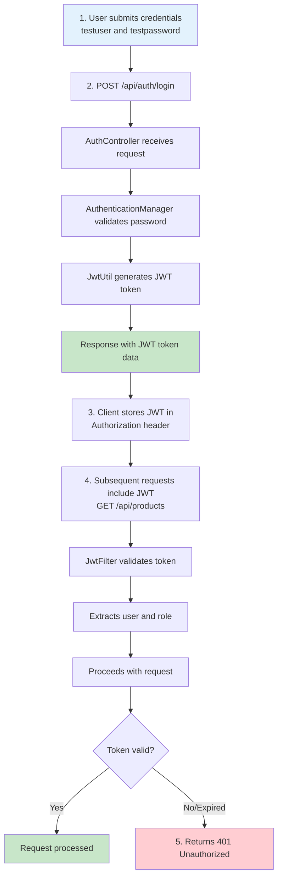

# Security Tests

**Purpose**: Document how StockEase tests authentication, authorization, JWT validation, and role-based access control.

---

## Table of Contents

1. [JWT Authentication Flow](#jwt-authentication-flow)
2. [Role-Based Authorization Tests](#role-based-authorization-tests)
3. [TestConfig Security Setup](#testconfig-security-setup)
4. [AuthControllerTest Patterns](#authcontrollertest-patterns)
5. [Authorization in Controller Tests](#authorization-in-controller-tests)
6. [CSRF Protection Tests](#csrf-protection-tests)
7. [Security Assertions](#security-assertions)
8. [Related Documentation](#related-documentation)

---

## JWT Authentication Flow

### How JWT Works in StockEase



### JWT Token Structure in Tests

```
Header (Algorithm & Type)
{
  "alg": "HS256",
  "typ": "JWT"
}

Payload (Claims)
{
  "sub": "testuser",           // Subject (username)
  "role": "ROLE_USER",          // Role/Authority
  "iat": 1631234567,            // Issued at
  "exp": 1631238167             // Expiration
}

Signature
HMACSHA256(
  base64UrlEncode(header) + "." +
  base64UrlEncode(payload),
  "your-secret-key"
)
```

---

## Role-Based Authorization Tests

### Roles in StockEase

| Role | Permissions |
|------|-------------|
| `ROLE_ADMIN` | Create, read, update, delete products; see all data |
| `ROLE_USER` | Read products only; cannot create/update/delete |
| Anonymous | No permissions; must authenticate first |

### Authorization Matrix

```
Endpoint                Method  ROLE_ADMIN  ROLE_USER  Anonymous
───────────────────────────────────────────────────────────────
/api/auth/login         POST    ✅          ✅         ✅
/api/products           GET     ✅          ✅         ❌
/api/products           POST    ✅          ❌         ❌
/api/products/{id}      GET     ✅          ✅         ❌
/api/products/{id}      PUT     ✅          ❌         ❌
/api/products/{id}      DELETE  ✅          ❌         ❌
/api/products/low-stock GET     ✅          ✅         ❌
```

### Testing Authorization: Pattern

```java
@ParameterizedTest
@CsvSource({
    "adminUser, ADMIN",
    "regularUser, USER"
})
void testLowStockProductsWithRoles(String username, String role) throws Exception {
    // Setup
    Product product1 = new Product("Low Stock", 3, 50.0);
    when(productRepository.findByQuantityLessThan(5))
        .thenReturn(Arrays.asList(product1));
    
    // Test: Both roles can access
    mockMvc.perform(get("/api/products/low-stock")
        .with(SecurityMockMvcRequestPostProcessors.user(username).roles(role)))
    
    // Expect: Both succeed
    .andExpect(status().isOk());
}
```

```java
@ParameterizedTest
@CsvSource({
    "regularUser, USER"
})
void testProductCreationDeniedForUser(String username, String role) throws Exception {
    // Test: Non-admin attempts POST
    mockMvc.perform(post("/api/products")
        .contentType(APPLICATION_JSON)
        .content("{\"name\": \"Product\", \"quantity\": 10}")
        .with(SecurityMockMvcRequestPostProcessors.user(username).roles(role)))
    
    // Expect: Forbidden (403)
    .andExpect(status().isForbidden());
}
```

---

## TestConfig Security Setup

### Shared Security Configuration

**File**: `backend/src/test/java/com/stocks/stockease/config/test/TestConfig.java`

```java
@Configuration
public class TestConfig {
    
    /**
     * Provides a mock JwtUtil for testing.
     * Avoids actual JWT generation/validation overhead.
     */
    @Bean
    public JwtUtil jwtUtil() {
        return Mockito.mock(JwtUtil.class);
    }
    
    /**
     * Pre-configured SecurityContext with test user.
     * Ensures consistent auth state across tests.
     */
    @Bean
    public SecurityContext securityContext() {
        SecurityContext context = SecurityContextHolder.createEmptyContext();
        context.setAuthentication(new UsernamePasswordAuthenticationToken(
            "testUser",
            "password",
            AuthorityUtils.createAuthorityList("ROLE_ADMIN", "ROLE_USER")
        ));
        return context;
    }
}
```

### Using TestConfig in Tests

```java
@WebMvcTest(ProductController.class)
@Import(TestConfig.class)  // Import shared beans
public class ProductCreateControllerTest {
    
    @Autowired
    private JwtUtil jwtUtil;  // Injected from TestConfig
    
    @BeforeEach
    void setupMocks() {
        Mockito.when(jwtUtil.validateToken(Mockito.anyString()))
            .thenReturn(true);
    }
}
```

---

## AuthControllerTest Patterns

### Test 1: Successful Login (Regular User)

```java
/**
 * Given: A user with valid credentials in the database
 * When: Login endpoint receives valid username and password
 * Then: Returns JWT token and success message
 */
@Test
void testLoginSuccess() {
    // Given
    String username = "testuser";
    String password = "testpassword";
    String role = "ROLE_USER";
    String token = "mockToken";
    
    User mockUser = new User(1L, username, password, role);
    
    // Setup mocks
    when(userRepository.findByUsername(username))
        .thenReturn(Optional.of(mockUser));
    when(authenticationManager.authenticate(any(UsernamePasswordAuthenticationToken.class)))
        .thenReturn(null);  // Successful authentication
    when(jwtUtil.generateToken(username, role))
        .thenReturn(token);
    
    // When
    LoginRequest loginRequest = new LoginRequest(username, password);
    ResponseEntity<ApiResponse<String>> responseEntity = 
        authController.login(loginRequest);
    
    // Then
    assertThat(responseEntity).isNotNull();
    ApiResponse<String> response = responseEntity.getBody();
    
    if (response != null) {
        assertThat(response.isSuccess()).isTrue();
        assertThat(response.getMessage()).isEqualTo("Login successful");
        assertThat(response.getData()).isEqualTo(token);
    }
}
```

### Test 2: Successful Login (Admin User)

```java
/**
 * Given: An admin user with valid credentials
 * When: Login endpoint receives valid username and password
 * Then: Returns JWT token with ROLE_ADMIN
 */
@Test
void testAdminLoginSuccess() {
    // Given
    String username = "adminuser";
    String password = "adminpassword";
    String role = "ROLE_ADMIN";
    String token = "adminToken";
    
    User adminUser = new User(1L, username, password, role);
    
    // Setup mocks
    when(userRepository.findByUsername(username))
        .thenReturn(Optional.of(adminUser));
    when(authenticationManager.authenticate(any(UsernamePasswordAuthenticationToken.class)))
        .thenReturn(null);
    when(jwtUtil.generateToken(username, role))
        .thenReturn(token);
    
    // When
    LoginRequest loginRequest = new LoginRequest(username, password);
    ResponseEntity<ApiResponse<String>> responseEntity = 
        authController.login(loginRequest);
    
    // Then
    ApiResponse<String> response = responseEntity.getBody();
    assertThat(response.getData()).isEqualTo(token);
    // Verify admin received token (role encoded in JWT)
}
```

### Test 3: Failed Login (User Not Found)

```java
/**
 * Given: A user that doesn't exist in the database
 * When: Login endpoint receives non-existent username
 * Then: Returns failure response (401)
 */
@Test
void testLoginFailureWithUserNotFound() {
    // Given
    String username = "nonexistent";
    String password = "password";
    
    // Setup mocks
    when(userRepository.findByUsername(username))
        .thenReturn(Optional.empty());  // User not found
    
    // When
    LoginRequest loginRequest = new LoginRequest(username, password);
    ResponseEntity<ApiResponse<String>> responseEntity = 
        authController.login(loginRequest);
    
    // Then
    assertThat(responseEntity).isNotNull();
    ApiResponse<String> response = responseEntity.getBody();
    
    if (response != null) {
        assertThat(response.isSuccess()).isFalse();
        assertThat(response.getMessage()).contains("User not found");
    }
}
```

### Test 4: Failed Login (Invalid Password)

```java
/**
 * Given: A user with invalid password
 * When: Login endpoint receives correct username but wrong password
 * Then: Returns failure response (401)
 */
@Test
void testLoginFailureWithInvalidCredentials() {
    // Given
    String username = "testuser";
    String password = "wrongpassword";
    String role = "ROLE_USER";
    
    User mockUser = new User(1L, username, "correctpassword", role);
    
    // Setup mocks
    when(userRepository.findByUsername(username))
        .thenReturn(Optional.of(mockUser));
    when(authenticationManager.authenticate(any(UsernamePasswordAuthenticationToken.class)))
        .thenThrow(new AuthenticationException("Invalid credentials") {});
    
    // When
    LoginRequest loginRequest = new LoginRequest(username, password);
    ResponseEntity<ApiResponse<String>> responseEntity = 
        authController.login(loginRequest);
    
    // Then
    ApiResponse<String> response = responseEntity.getBody();
    assertThat(response.isSuccess()).isFalse();
}
```

---

## Authorization in Controller Tests

### Pattern 1: Granting Authorization

```java
// Give user ADMIN role
.with(SecurityMockMvcRequestPostProcessors.user("adminUser").roles("ADMIN"))

// Give user USER role
.with(SecurityMockMvcRequestPostProcessors.user("normalUser").roles("USER"))

// Give multiple roles
.with(SecurityMockMvcRequestPostProcessors.user("superUser").roles("ADMIN", "USER"))
```

### Pattern 2: Testing Authorization Success

```java
@Test
void testCreateProductAsAdmin() throws Exception {
    // Setup
    Product product = new Product("Product", 10, 100.0);
    product.setId(1L);
    when(productRepository.save(any(Product.class))).thenReturn(product);
    
    // Test: Admin can create
    mockMvc.perform(post("/api/products")
        .contentType(APPLICATION_JSON)
        .content("{...}")
        .with(csrf())
        .with(user("adminUser").roles("ADMIN")))  // ← Admin role
    
    // Expect: Success (200 OK)
    .andExpect(status().isOk());
}
```

### Pattern 3: Testing Authorization Failure

```java
@ParameterizedTest
@CsvSource({
    "regularUser, USER"
})
void testCreateProductAsUserDenied(String username, String role) throws Exception {
    // Test: Non-admin cannot create
    mockMvc.perform(post("/api/products")
        .contentType(APPLICATION_JSON)
        .content("{...}")
        .with(csrf())
        .with(user(username).roles(role)))  // ← User role
    
    // Expect: Forbidden (403)
    .andExpect(status().isForbidden());
}
```

### Pattern 4: Testing Unauthenticated Access

```java
@Test
void testAccessWithoutAuthentication() throws Exception {
    // Test: No authentication provided
    mockMvc.perform(get("/api/products"))
        // No .with(user(...))
    
    // Expect: Unauthorized (401)
    .andExpect(status().isUnauthorized());
}
```

---

## CSRF Protection Tests

### CSRF Token in Tests

Spring Security requires CSRF tokens for POST/PUT/DELETE requests in tests:

```java
mockMvc.perform(post("/api/products")
    .contentType(APPLICATION_JSON)
    .content("{\"name\": \"Product\", ...}")
    .with(csrf())  // ← Add CSRF token (test-specific)
    .with(user("admin").roles("ADMIN")))
.andExpect(status().isOk());
```

### Imports
```java
import static org.springframework.security.test.web.servlet.request.SecurityMockMvcRequestPostProcessors.csrf;
import static org.springframework.security.test.web.servlet.request.SecurityMockMvcRequestPostProcessors.user;
```

### When to Add CSRF
| HTTP Method | CSRF Needed? | Example |
|---|---|---|
| GET | ❌ No | `.perform(get("/api/products"))` |
| DELETE | ✅ Yes | `.with(csrf())` |
| POST | ✅ Yes | `.with(csrf())` |
| PUT | ✅ Yes | `.with(csrf())` |

---

## Security Assertions

### JWT Token Validation

```java
// Test: Token validation returns true
@Test
void testTokenValidation() {
    // Given
    String token = "valid-jwt-token";
    
    // Setup mock
    when(jwtUtil.validateToken(token)).thenReturn(true);
    
    // When
    boolean isValid = jwtUtil.validateToken(token);
    
    // Then
    assertThat(isValid).isTrue();
}
```

### Role Assertion

```java
// Test: User has ROLE_ADMIN
@Test
void testUserHasAdminRole() throws Exception {
    mockMvc.perform(get("/api/products")
        .with(user("testUser").roles("ADMIN")))
    
    // Endpoint succeeds (implying authorization check passed)
    .andExpect(status().isOk());
}
```

### Authorization Assertion

```java
// Test: Non-admin gets 403 Forbidden
assertThat(responseStatus).isEqualTo(403);  // HttpStatus.FORBIDDEN
```

### Authentication Status Assertion

```java
// Unauthenticated request returns 401
assertThat(responseStatus).isEqualTo(401);  // HttpStatus.UNAUTHORIZED
```

---

## Security Test Checklist

When adding security tests, verify:

- [ ] **Authentication flow tested**: Login with valid/invalid credentials
- [ ] **JWT generation tested**: Token is created with correct role
- [ ] **Authorization by role tested**: Admin/User can/cannot access endpoints
- [ ] **CSRF protection tested**: POST/PUT/DELETE include `with(csrf())`
- [ ] **Unauthorized access tested**: Unauthenticated requests return 401
- [ ] **Forbidden access tested**: Wrong role returns 403
- [ ] **Role matrix covered**: All role combinations tested
- [ ] **Mock JWT util**: JwtUtil is mocked to avoid crypto overhead

---

## Common Security Test Patterns

### Pattern: Multi-Role Authorization Test
```java
@ParameterizedTest
@CsvSource({
    "admin, ADMIN, true",
    "user, USER, false",
    "guest, GUEST, false"
})
void testEndpointByRole(String username, String role, boolean shouldSucceed) 
    throws Exception {
    
    mockMvc.perform(post("/api/products")
        .with(user(username).roles(role))
        .with(csrf()))
    
    .andExpect(status().is(shouldSucceed ? 200 : 403));
}
```

### Pattern: JWT Token Flow
```java
// 1. Login and get token
String token = authController.login(loginRequest).getBody().getData();

// 2. Verify token is valid
when(jwtUtil.validateToken(token)).thenReturn(true);
when(jwtUtil.extractUsername(token)).thenReturn("testuser");

// 3. Use token in subsequent request
mockMvc.perform(get("/api/products")
    .header("Authorization", "Bearer " + token));
```

---

## Related Documentation

### Testing Topics
- **[Testing Strategy](./strategy.md)** — Goals and security scope
- **[Spring Slices](./spring-slices.md)** — @WebMvcTest + @MockitoBean patterns
- **[Controller Integration Tests](./controller-integration.md)** — HTTP testing patterns
- **[Test Data & Fixtures](./test-data-fixtures.md)** — TestConfig details

### Architecture & Implementation
- **[Security Architecture](../security.md)** — JWT, authentication, authorization design
- **[Backend Architecture](../backend.md)** — Controllers implementing security
- **[Testing Architecture](../testing-architecture.md)** — Entry point

---

**Last Updated**: October 31, 2025  
**Version**: 1.0  
**Status**: ✅ Based on StockEase AuthControllerTest and security patterns

[Back to Testing Index](../testing-architecture.md)
