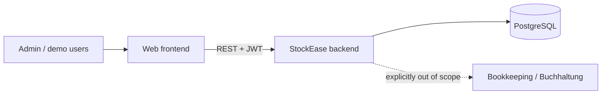

# System Context

The backend is the system boundary: a REST API consumed by exactly one
client, the Angular frontend in this repository's `frontend/` directory,
deployed separately and in production. Users authenticate with JWT; public
demo accounts exercise the same paths as the admin.

There are no third-party integrations - no payment providers, no external
inventory feeds. The one neighboring system worth drawing is the one
deliberately NOT integrated: bookkeeping. Payment is recorded as a fact,
interest and penalties are displayed but never computed - where accounting
begins, this system stops (ADR 011).

[Back to Architecture Index](index.md)
