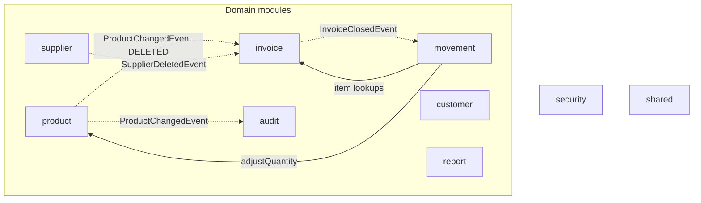

# Building Blocks

StockEase is one deployable divided into nine domain modules plus a global
infrastructure package, organized package-per-module under Spring Modulith.
The boundaries below are not conventions - they are verified by a test on
every build and violating them fails CI.

## Module map

Solid arrows are service calls in the natural dependency direction; dashed
arrows are application events, used exactly where a call would create a
cycle or where a module must react to another without being known to it.

Reading the two directions between invoice and movement: the movement module
calls invoice's exposed services to validate and resolve invoice items - the
natural direction. When an invoice closes, the dependency must run the other
way; a call would close the cycle, so the invoice module publishes
`InvoiceClosedEvent` and a synchronous listener in the movement module books
the stock inside the same transaction. The module graph stays acyclic and
the atomicity story stays intact (ADR 007).

The two dashed arrows into invoice are deletion vetoes: the invoice module
listens for supplier and product deletion events and throws inside the
deleting transaction while open invoices pin the party - the deletion rolls
back whole. Veto listeners are pinned to run before all other listeners.

Not on the diagram: the `report` module has no arrows because it has no Java
dependencies at all - it answers aggregations with native SQL and returns
its own records (ADR 006). Web layers across modules use `shared` (response
envelopes, global exception handling) and resolve their principal through
the `security` module's user service.

## Module anatomy

Every module follows the same three-level layout:

| Location            | Contents                                     | Visibility |
|---------------------|----------------------------------------------|------------|
| module root         | entities, enums, services, commands, events  | exposed API |
| `<module>.internal` | repositories                                 | module-private |
| `<module>.web`      | controllers, single-consumer DTOs            | module-private |

Only what sits in the module root is callable from other modules.
Repositories are never reachable across a boundary: cross-module data access
happens through exposed services or events, never through another module's
persistence layer.

## Enforcement

`ModularityTest` verifies the module structure on every build without
booting a Spring context. One lesson is part of the record: Spring Modulith
treats the base package as an implicit root module and verifies it too -
there is no exemption-by-location anywhere in the tree. Dead infrastructure
discovered by this rule was deleted rather than relocated.

## The config package

`config` holds global infrastructure (Flyway ordering, JPA auditing) and is
deliberately not a domain module: it has no domain API, publishes no events,
and exists so that framework wiring never hides inside a domain package.

## Module reference

Per-module detail - exposed API, internals, events published and consumed,
invariants - lives in the [Domain modules](05-domains/index.md) pages.

[Back to Architecture Index](index.md)
