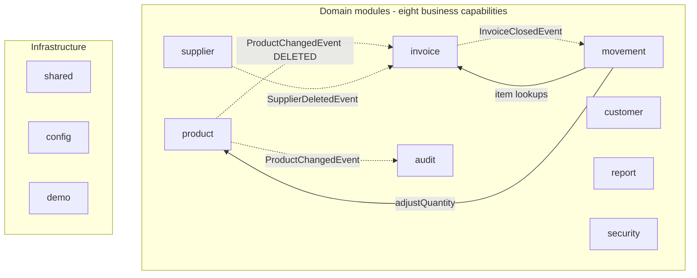

# Building Blocks

StockEase is one deployable divided into **eight domain modules** - counting
bounded business capabilities, whether or not they own persistence - plus
three infrastructure packages: `shared`, `config` and `demo`. The eight are
`product`, `supplier`, `customer`, `invoice`, `movement`, `audit`, `report`
and `security`. Every one is a direct sub-package of the application's root
package, organized package-per-module under Spring Modulith. The boundaries
below are not conventions - they are verified by a test on every build and
violating them fails CI.

Two of the eight are worth naming explicitly, because a definition drawn
around persistence would exclude one and admit the other. `report` owns no
entity and no repository at all - it answers aggregations with native SQL
over other modules' tables (ADR 006) - and is a domain module because
reporting is a business capability with its own boundary, not because it
stores anything. `security` does own an aggregate, the application's user,
and is a domain module for the same reason: authentication and authorization
are a capability, not plumbing. The three infrastructure packages are
excluded because none of them answers a business question: `shared` carries
response envelopes and global exception handling, `config` holds framework
wiring, and `demo` seeds and resets demonstration data.

## Module map

Solid arrows are service calls in the natural dependency direction; dashed
arrows are application events, used exactly where a call would create a
cycle or where a module must react to another without being known to it.

```mermaid
graph TD
  subgraph Domain modules - eight business capabilities
    product[product]
    supplier[supplier]
    customer[customer]
    invoice[invoice]
    movement[movement]
    audit[audit]
    report[report]
    security[security]
  end
  subgraph Infrastructure
    shared[shared]
    config[config]
    demo[demo]
  end

  movement -->|item lookups| invoice
  movement -->|adjustQuantity| product
  invoice -.->|InvoiceClosedEvent| movement
  product -.->|ProductChangedEvent| audit
  product -.->|ProductChangedEvent DELETED| invoice
  supplier -.->|SupplierDeletedEvent| invoice
```

Reading the two directions between invoice and movement: the movement module
calls invoice's exposed services to validate and resolve invoice items - the
natural direction. When an invoice closes, the dependency must run the other
way; a call would close the cycle, so the invoice module publishes
`InvoiceClosedEvent` and a synchronous listener in the movement module books
the stock inside the same transaction. The module graph stays acyclic and
the atomicity story stays intact (ADR 007).

The two dashed arrows into invoice are deletion vetoes: the invoice module
listens for supplier and product deletion events and throws inside the
deleting transaction while open invoices pin the party - the deletion rolls
back whole. Veto listeners are pinned to run before all other listeners.

Two modules carry no arrows, for different reasons. `report` has no Java
dependencies at all - it answers aggregations with native SQL and returns its
own records (ADR 006). `security` is reached by every web layer rather than by
any one module, so drawing it would add eight edges that say the same thing.
The infrastructure packages are undrawn for the same reason: web layers across
modules use `shared` for response envelopes and global exception handling, and
resolve their principal through `security`'s user service.

## Module anatomy

Every module follows the same three-level layout:

| Location            | Contents                                     | Visibility |
|---------------------|----------------------------------------------|------------|
| module root         | entities, enums, services, commands, events  | exposed API |
| `<module>.internal` | repositories                                 | module-private |
| `<module>.web`      | controllers, single-consumer DTOs            | module-private |

Only what sits in the module root is callable from other modules.
Repositories are never reachable across a boundary: cross-module data access
happens through exposed services or events, never through another module's
persistence layer.

## Enforcement

`ModularityTest` verifies the module structure on every build without
booting a Spring context. One lesson is part of the record: Spring Modulith
treats the base package as an implicit root module and verifies it too -
there is no exemption-by-location anywhere in the tree. Dead infrastructure
discovered by this rule was deleted rather than relocated.

## The config package

`config` holds global infrastructure (Flyway ordering, JPA auditing) and is
deliberately not a domain module: it has no domain API, publishes no events,
and exists so that framework wiring never hides inside a domain package.

## Module reference

Per-module detail - exposed API, internals, events published and consumed,
invariants - lives in the [Domain modules](05-domains/index.md) pages.

[Back to Architecture Index](index.md)
