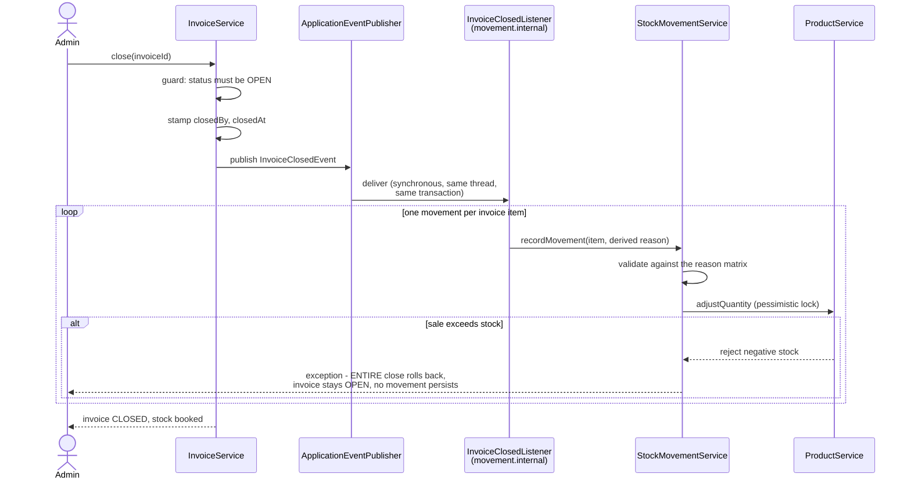

# Runtime View

Three flows carry the interesting behavior: closing an invoice (the
stock-booking act), creating one, and returning against one. Everything else
is conventional CRUD.

## Close-books-stock: the flagship flow

Closing is where the event inversion (ADR 007) and the booking model
(ADR 004) meet. The whole flow is one transaction.

Properties worth naming:

- **All or nothing.** The listener runs inside the closing transaction. A
  sale item exceeding stock does not produce a partially booked invoice - the
  close itself fails and the invoice remains OPEN and correctable.
- **Derived snapshots.** Each booked movement copies its price from its
  invoice item at this moment; nothing is caller-supplied.
- **Acyclic modules.** The invoice module knows nothing of movement types;
  it publishes one event and is done. The listener lives in the movement
  module's internals.

This rollback behavior is not aspirational: it is exercised by an
integration test through the real event pipeline - a standing requirement
for every event-listener change in this codebase.

## Creating an invoice

`InvoiceService.createInvoice` persists the invoice and all items atomically:
counterparty rules per type (purchase: supplier required, no customer; sale:
no supplier, customer optional), line validation, and no stock effect - an
OPEN invoice is a recorded draft. Wrong drafts are deleted and recreated;
there are no edit methods (ADR 004).

## Returns

`InvoiceService.registerReturn` accepts returns only against CLOSED invoices.
In one transaction it validates the cap (returned plus requested never
exceeds the item quantity), records the return movement with the price
derived from the original item, and - when the last outstanding unit comes
back - flips the invoice to its terminal FULLY_RETURNED state. A full return
is the de facto cancellation of a closed invoice.

## Demo reset (planned)

The demo-mode phase rebuilds demo data through these same flows - creating
and closing invoices so that stock arrives the way it does in production,
rather than by inserting rows. Demo accounts are exempt from reset.

[Back to Architecture Index](index.md)
