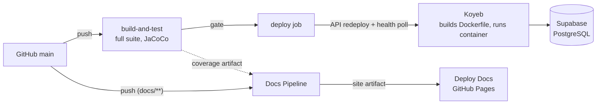

# Deployment View

Everything deploys from `main`; nothing deploys from anywhere else. Merging
is the release act.

## Backend delivery

One workflow, two jobs. `build-and-test` runs the full suite (Testcontainers
against real PostgreSQL) and uploads the coverage report as an artifact; it
is the required status check on every pull request. The `deploy` job runs
only outside pull requests, gated on the tests: it triggers a redeploy
through the Koyeb API and polls until the service reports healthy - CI does
not build or push the image. Koyeb builds the repository's Dockerfile
itself, so the deployed artifact is always exactly what `main` describes.

A biweekly scheduled run rebuilds even without commits, picking up patched
base images.

## The image

Multi-stage: a Maven/JDK stage builds the jar (dependency layers cached
separately from sources), a slim JRE stage runs it as a non-root user with a
fixed entrypoint. The image contains the jar and nothing else - no sources,
no docs, no build tooling.

## Documentation delivery

A separate pipeline, deliberately decoupled from production: docs changes
build and publish to GitHub Pages without touching the backend, and backend
runs feed fresh coverage into the next docs build via artifact. The
gh-pages branch is disposable build output - the site is a pure function of
`main` and can be regenerated wholesale at any time.

## Configuration and secrets

Runtime configuration reaches the container as environment variables.
Koyeb's model has two layers worth naming because confusing them costs
debugging time: the account-level secrets store holds values; a service only
sees a secret once it is explicitly mapped into that service's environment.
Deploy credentials (API key, service id) live in GitHub Actions secrets and
appear nowhere in the repository.

## Environments

There is one: production. Pull requests get the full test gate but no
deployment; there is no staging tier - a deliberate free-tier constraint
(section 02) accepted for a portfolio system whose data is disposable.

[Back to Architecture Index](index.md)
