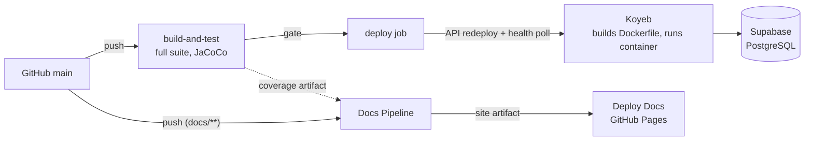

# Deployment View

Everything deploys from `main`; nothing deploys from anywhere else. Merging
is the release act.

```mermaid
graph LR
  GH[GitHub main] -->|push| BT[build-and-test<br/>full suite, JaCoCo]
  BT -->|gate| DEP[deploy job]
  DEP -->|API redeploy + health poll| KOYEB[Koyeb<br/>builds Dockerfile, runs container]
  KOYEB --> DB[(Supabase<br/>PostgreSQL)]
  BT -.->|coverage artifact| DOCS[Docs Pipeline]
  GH -->|"push (docs/**)"| DOCS
  DOCS -->|site artifact| PAGES[Deploy Docs<br/>GitHub Pages]
```

## Backend delivery

One workflow, two jobs. `build-and-test` runs the full suite (Testcontainers
against real PostgreSQL) and uploads the coverage report as an artifact; it
is the required status check on every pull request. The `deploy` job runs
only outside pull requests, gated on the tests: it triggers a redeploy
through the Koyeb API, takes the deployment id from the redeploy reply and
polls that deployment until it reports healthy - CI does not build or push
the image. Koyeb builds the repository's Dockerfile itself, so the deployed
artifact is always exactly what `main` describes.

The poll watches the deployment the redeploy triggered rather than the
service, because Koyeb builds the new deployment alongside the running one:
the service keeps answering healthy on behalf of the old instance for as
long as the build takes, so watching it would pass the gate before the
build had begun.

Every deployment status resolves to one of three outcomes: shipped (healthy,
or asleep on this scale-to-zero service), superseded by a later deployment,
or failed. Each of the last two fails the step immediately rather than
polling out the clock, and a status the gate does not recognise fails it
too, naming the value - there is no fall-through that keeps polling. The
budget is 2100 seconds, sized to Koyeb's thirty-minute build cap plus the
phases after it so the gate cannot give up before the platform does, with
the job timeout just above it and a wall-clock bound on every request. ADR
042 records the full reasoning.

A biweekly scheduled run rebuilds even without commits, picking up patched
base images.

## The image

Multi-stage: a Maven/JDK stage builds the jar (dependency layers cached
separately from sources), a slim JRE stage runs it as a non-root user with a
fixed entrypoint. The image contains the jar and nothing else - no sources,
no docs, no build tooling.

## Documentation delivery

A separate pipeline, deliberately decoupled from production: docs changes
build and publish to GitHub Pages without touching the backend, and backend
runs feed fresh coverage into the next docs build via artifact. The
gh-pages branch is disposable build output - the site is a pure function of
`main` and can be regenerated wholesale at any time.

## Health checks

Koyeb probes `GET /actuator/health` on port 8081 - the application's single
server port (`server.port` in `application.properties`), permitted anonymously in
`SecurityConfig` so the probe needs no credentials. The grace period is 240
seconds, which is generous on purpose: Flyway runs its migrations before the
port opens, and a probe that gave up sooner would kill a container that was
still doing legitimate work. Thereafter the probe runs every 80 seconds with a
10-second timeout, and five consecutive failures trigger a restart.

This configuration lives in the Koyeb console, not in the repository. The
in-repo `koyeb.yaml` was deleted (#176) once its values had drifted from the
live service and it had become a misleading second source of truth; this
section is the record instead.

## Configuration and secrets

Runtime configuration reaches the container as environment variables.
Koyeb's model has two layers worth naming because confusing them costs
debugging time: the account-level secrets store holds values; a service only
sees a secret once it is explicitly mapped into that service's environment.
Deploy credentials (API key, service id) live in GitHub Actions secrets and
appear nowhere in the repository.

## Environments

There is one: production. Pull requests get the full test gate but no
deployment; there is no staging tier - a deliberate free-tier constraint
(section 02) accepted for a portfolio system whose data is disposable.

[Back to Architecture Index](index.md)
