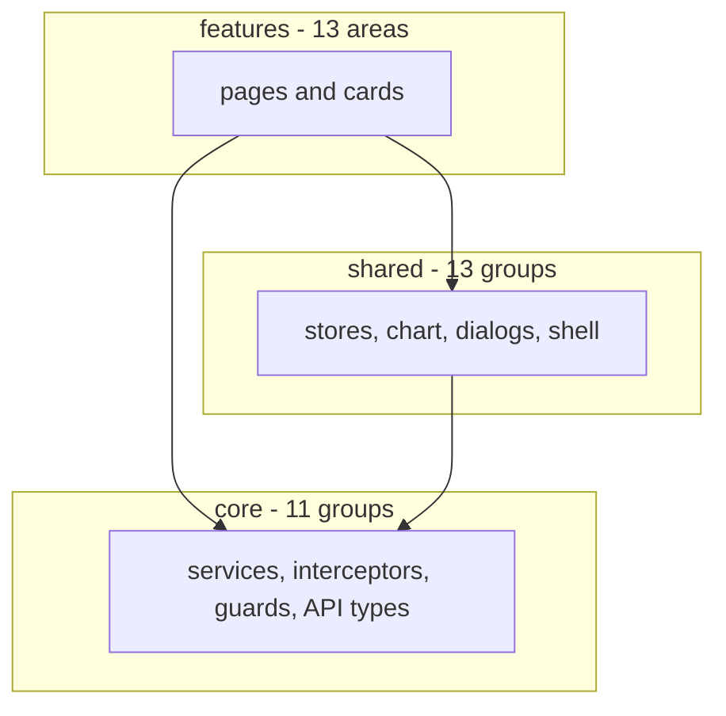

# Building Blocks

The application is one Angular build divided into three layers under
`frontend/src/app`: `core/` for the singletons every feature depends on,
`shared/` for the reusable pieces features compose from, and `features/` for the
areas a route lands in. The direction of dependency is one way - features use
shared and core, shared uses core, core uses neither - and it is a review
convention rather than a tool-enforced boundary.

## Layer map

## The three layers

| Layer       | Holds                                                                                                                          | Earns a place by |
|-------------|--------------------------------------------------------------------------------------------------------------------------------|------------------|
| `core/`     | `api`, `auth`, `config`, `format`, `guards`, `health`, `i18n`, `interceptors`, `layout`, `notifications`, `theme`               | Being a root-provided singleton, or a type or constant the whole application reads. Nothing here renders. |
| `shared/`   | `chart`, `confirm-dialog`, `csv`, `dialog`, `footer`, `forms`, `format`, `language-toggle`, `list`, `public-header`, `shell`, `theme-toggle`, `typeahead` | Being consumed by more than one feature, or being the frame the features sit in. |
| `features/` | `audit`, `auth`, `customers`, `dashboard`, `help`, `invoices`, `landing`, `movements`, `not-found`, `products`, `reports`, `settings`, `suppliers` | Being the destination of a route. Each folder owns its pages, its cards, its dialogs and its feature service. |

`core/` holds no components. Its services are `providedIn: 'root'`, they expose
signals rather than observables where a consumer only needs the current value,
and the two interceptors are functions registered once in `app.config.ts`.
`core/api` is the odd member: it holds no behaviour at all, only the generated
API types and the response envelope every feature service unwraps.

A fourth folder, `src/app/testing/`, holds spec support - the global setup that
clears storage between spec files, and helpers for breakpoints, charts and
translation. It is not a runtime layer and ships in no bundle.

## Shell, pages and cards

Three roles divide the work inside a feature, and the division settled into its
current form over the reports and dashboard extractions.

**The shell** (`shared/shell`) is the frame around every authenticated page:
toolbar, navigation drawer, the routed outlet and the footer. It exists only
behind the auth guard, which is what makes it the right owner of the idle-logout
timer - the countdown cannot run while a visitor reads a public page, and it
stops when the shell is destroyed.

**A page** owns everything that is not rendering. It calls the feature service,
holds the loaded rows, owns the single progress bar and the single error banner
for the whole page, computes every figure its children draw, and decides what is
fetched lazily.

**A card** is presentational. Its figures arrive as inputs already computed, and
its controls announce a decision through an output rather than acting on it. A
card that fetched, or that derived what its page could hand it, would be a
finding in review.

### The reports page, in full

`features/reports/reports-page` is the worked example. The page component
declares seven tabs - profit, cash flow, stock, losses, due dates, changes and
analytics - and imports seven card components, one per tab body, alongside a
period toggle, a view toggle and a supplier-product picker.

Everything the cards need is computed above them. The page holds one `loading`
signal and one `error` signal for all seven tabs, so a failure in any tab raises
the same banner in the same place. Chart options, sorted rows, filtered rows and
totals are all `computed` on the page and passed down. The stock card is
representative: its totals, its chart option and its filtered rows all arrive as
inputs, and its four outputs each answer a decision the page owns - which view
the tab is on, the filter term the export also reads, the sort that reorders the
page's row signal, and the download itself, which needs the CSV service.

One deliberate exception is recorded in the card itself: the stock tab's view
toggle lives inside the card rather than beside the other tabs' toggles, because
it shares a flex row with the totals strip and that row is one layout that
cannot be split across a component boundary.

## Reusable seams

Five patterns recur, and each is a named thing rather than a habit.

**The list-page store** (`shared/list/list-page-store.ts`) is a factory, not a
class: `createListPageStore(fetch)` returns the rows, loading and error signals,
the page index and size, and a `visibleRows` computed slice. Paging is
client-side by design - these registers are bounded master data the page already
holds in full - and the store takes a `fetch` callback rather than a service, so
a spec hands it a stub directly. Two behaviours are built in: a failed load
empties the rows rather than leaving stale ones beside an error, and a
successful load pulls the page index back when the rows behind it are gone.

**The dialog-submit store** (`shared/dialog/dialog-submit-store.ts`) is the same
shape for form dialogs: `createDialogSubmitStore(close)` returns `pending` and
`errorMessage` signals and a `submit` that runs the save. A failed save keeps the
dialog open with the message above the buttons, because the values that caused
the failure are the ones the user has to fix. A second submit while one is in
flight is dropped. Closing is a plain callback rather than a `MatDialogRef`,
which keeps the store free of Angular Material and lets a spec assert on what it
closed with.

**Component-scoped collaborators** carry a page concern that is too large for the
page but has no life outside it. They are `@Injectable()` without
`providedIn: 'root'`, listed in the component's own `providers`, and so share
the component's lifetime. `ProductRecycleBin` is the clearest: it is provided by
the product list, and it writes the page's own `loading` and `error` signals
through a small host interface rather than holding its own, because one progress
bar and one banner serve the whole page. `InvoiceDetailActions` and
`InvoiceDetailReturns` follow the same pattern on the invoice detail page.

**The chart context** (`shared/chart/chart-context.ts`) exists to be a
dependency. A chart option that read a translated label or a formatted number
directly would be built once and keep whatever it was built with - which is how
a remainder bucket kept saying "Other" after a reader switched to German. The
context is a `computed` over language, format and theme, so every option that
depends on it rebuilds when any of the three moves. It also carries the gauge
colour ramp, three sanctioned literals per theme rather than tokens, because
M3 defines no success or warning role and a canvas-painted gauge sits outside
the DOM cascade a custom property would resolve in.

**Injection seams** are what the specs substitute at. There are no module mocks:
a spec provides a stub for the real token. The seams used most are the feature
services, `NotificationService`, `HealthService`, `AuthService`, `MatDialog` and
`MatDialogRef`, `BreakpointObserver` for viewport-dependent behaviour, and
`ThemeService` and `TranslateService` where rendering depends on them. Because
`core/` services are ordinary root-provided classes and the two stores are
factories taking callbacks, none of this needs a testing module of its own.

## Bootstrap

`app.config.ts` is the single composition root: the router with the route table,
`HttpClient` with the two interceptors, the translate service with its loader,
two app initializers for language and theme, and the localized paginator
provider. `main.ts` does nothing but bootstrap the root component with it.

[Back to Introduction and Goals](index.md)
