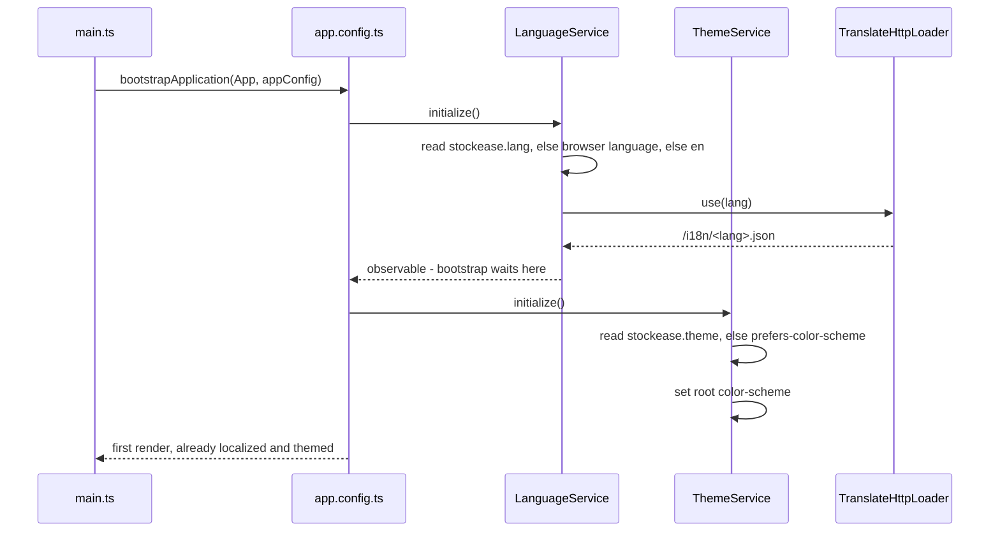
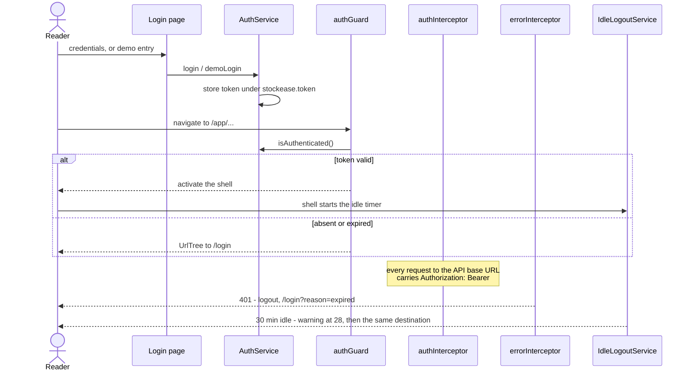
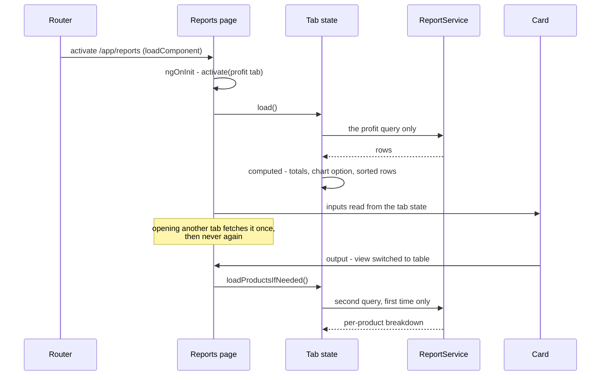

# Runtime View

Four sequences carry the behaviour worth tracing: what happens before the first
render, how a session starts and ends, how a data page loads, and what moves
when the reader switches language. Everything else is a form posting to a
service.

## Startup

Bootstrap is held open until the interface can be rendered in the right
language. `app.config.ts` registers two initializers, and the language one
returns the loader observable rather than firing and forgetting - which is what
stops the login page flashing raw translation keys.

Three services resolve state from `localStorage` before anything renders, each
under its own key: `LanguageService` reads `stockease.lang`, `ThemeService`
reads `stockease.theme`, and `FormatService` reads `stockease.format.date` and
`stockease.format.number`. All four follow the same rule - a stored value that
this build does not recognise is ignored rather than overwritten, because it is
the reader's choice and not this build's to discard.

With nothing stored, each falls back differently and deliberately: language to
the browser's language when it starts with `de`, otherwise English; theme to the
operating system's `prefers-color-scheme`; both format preferences to `auto`,
meaning "follow the interface language". `AuthService` restores its token in its
constructor rather than through an initializer, which is what keeps a session
alive across a reload.

Applying the theme is one property. Material emits every system colour through
`light-dark()`, so setting `color-scheme` on the root element repaints the whole
application.

## Sign-in and the authenticated session

A session is one JWT in `localStorage` under `stockease.token`, and every
question about it is derived from the token rather than tracked beside it:
whether a session exists is the `exp` claim read against the clock, the role is
the `role` claim, and the sign-in time is `iat`. There is nothing to ask the
server, because the token is the whole session.

Details that matter at runtime:

- **The guard returns a `UrlTree`, not a boolean false.** An unauthenticated
  visit to a deep link redirects rather than dead-ending.
- **The interceptor attaches the token only to the configured API base URL**, so
  a request to any third-party host never carries it.
- **A 401 signs out and redirects with `replaceUrl`**, keeping the dead deep
  link out of history. The login endpoint is excluded, or a rejected login would
  redirect to the page it is already on. A guard against navigating when already
  on `/login` handles the page that fired several requests and got several 401s.
- **Idle logout lands on exactly the same destination** - `/login` with
  `reason=expired` - so a client-side idle expiry and a server-side rejection
  are one tested experience rather than two that drift apart.
- **The idle timer belongs to the shell**, arms for 30 minutes, raises a warning
  at 28, and re-arms on pointer, keyboard, touch, wheel and route change,
  throttled to once a second. The throttle is lifted while the warning is on
  screen, because dismissing it is the whole point of the click.

## A data page's lifecycle

The reports page shows the full pattern, including the two-stage lazy fetch.

Reading it in order:

1. **Route activation.** Every route in the table uses `loadComponent`, so the
   page's code arrives with the navigation rather than in the initial bundle.
2. **First fetch.** `ngOnInit` activates the profit tab and nothing else.
   Loading all seven would fire seven aggregate queries for tabs the reader may
   never open, so each tab fetches on its first activation and is left alone
   afterwards. A `Set` of activated tab indexes is the whole mechanism, and an
   explicit refresh refetches only the visible tab.
3. **The error banner arms once.** One `loading` signal and one `error` signal
   serve all seven tabs, held by `ReportStatus` - a collaborator the page
   provides and every tab state injects. Each tab reports its own failure
   through it, so whichever tab fails raises the same banner in the same place,
   and no card carries error state of its own.
4. **The lazy second fetch.** The cash-flow tab's chart needs a timeline; its
   table needs a per-product breakdown that the chart never shows. The
   breakdown is therefore not fetched when the tab opens. Switching that tab's
   view to `table` triggers it, once - a boolean inside the tab state guards the
   fetch rather than the rows, so a reader who never opens the table half never
   pays for the query. The page decides that a view was switched; the tab state
   decides whether that means a query. Afterwards a period change refetches both, because by then the reader
   has the table open. The dashboard's due card uses the same guard for the
   same reason.

## Switching language

The switch is a runtime event, not a reload. `LanguageService.setLanguage` calls
`translate.use`, persists the choice and updates its signal; ngx-translate
resolves keys through the pipe, so every template binding re-renders on its own.

Two things do not re-render on their own, and both are handled explicitly:

**Chart options are snapshots.** An option object is built once from translated
labels and formatted numbers, and nothing about a language change invalidates a
plain object. That is why the chart context is a `computed` over language,
number format and theme, and why every option is itself computed from it - the
dependency is what forces the rebuild.

**Material's paginator reads its labels once per render.** The strings are plain
properties on `MatPaginatorIntl` and the range label is a function the component
calls while rendering, so no `translate` pipe can reach them. The application
registers `LocalizedPaginatorIntl` as the provider, which re-resolves the five
labels on `onLangChange` and then emits `changes`. Without that emission every
paginator already on screen would keep the previous language until something
else happened to redraw it. The range label is also why a plain object of
strings would not do: it reports which slice of how many, so it takes
parameters, and the word order around them differs between English and German -
which an interpolated message resolves and a concatenation cannot.

Date and currency rendering follows the same runtime rule. The application
registers no `LOCALE_ID`, because that is fixed at bootstrap while this
application changes language while running; `FormatService` decides per call
instead, honouring an explicit stored preference and otherwise following the
interface language.

[Back to Introduction and Goals](index.md)
