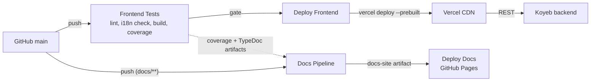

# Deployment View

Everything deploys from `main`; nothing deploys from anywhere else. Merging is
the release act.

## What CI checks

One workflow, `Frontend Tests`, runs on pull requests and pushes to `main` that
touch `frontend/**` or the workflow's own file. It reports under the same
required check name the
backend and docs workflows use, so whichever side a pull request touches, a job
with the required name reports on it.

Its steps, in order:

1. **Lint** - `ng lint` over the TypeScript and the templates.
2. **The i18n drift check** - re-assembles the shipped translation bundles from
   their authored sources and fails if the committed files differ. It runs before
   the build so a mismatch fails fast rather than after a full compile.
3. **Production build** - `ng build --configuration production`, which is also
   the type check.
4. **Unit tests with coverage** - one command, `npm run test:coverage`. The
   coverage thresholds in `angular.json` gate this step.

The order is deliberate: the cheap checks that can fail for unrelated reasons run
before the expensive one.

Two artifacts are uploaded. The Vitest coverage HTML uploads on every run
including pull requests, with `always()`, because a failing suite's numbers are
exactly what a reviewer wants. The TypeDoc API reference uploads on success only
- a reference built from a tree that failed to compile is not something to
publish over the last good one.

## How the bundle reaches the CDN

`Deploy Frontend` runs on the completion of `Frontend Tests` on `main`, gated on
that run having succeeded and not having been a pull request. It checks out the
exact commit the test run used, then builds and deploys through the Vercel CLI:
`vercel build --prod` on the runner, followed by `vercel deploy --prebuilt`.

Building on the runner rather than letting Vercel rebuild from the repository is
the point of the arrangement. What is published is exactly the artifact this run
produced, from the commit that passed the gate - there is no second build, on
another machine, with another toolchain resolution, that could differ from the
one the tests ran against. It also means the deploy step performs no
verification of its own and needs none.

The application is a static bundle on a CDN rather than a served application
(ADR 012). A rewrite rule sends every path that is not an asset to `index.html`,
which is what makes client-side routing work on a direct visit to a deep link.

## Documentation delivery

The docs site is built by `Docs Pipeline` and published by `Deploy Docs to
GitHub Pages`; the pipeline builds and uploads, the deploy workflow publishes,
and neither does the other's job. The pipeline is triggered both by a push
touching `docs/**` and by the completion of a test workflow on `main`.

Which reports a given run can include depends on what triggered it, and this is
the mechanism worth understanding:

- A `Frontend Tests` run brings the Vitest coverage report and the TypeDoc
  reference.
- A `Backend Tests` run brings JaCoCo.
- A docs-only push brings none of them.

Each run therefore publishes what its trigger produced, and the deploy step
preserves the published copy of anything a given build did not regenerate. This
is also why the link checker excludes those three trees: they are legitimately
absent from any single build and present on the deployed site.

**The frontend API reference is generated in the frontend workflow, not the docs
pipeline.** TypeDoc needs the frontend's installed `node_modules`, and the docs
pipeline installs only Pandoc and the OpenAPI tooling. Producing it where the
dependencies already exist is cheaper than installing a second copy of them in a
workflow that otherwise needs none; the docs build copies in the downloaded
artifact exactly as it does for the two coverage reports.

Pull requests touching documentation get their own check, `Docs PR Check`, which
builds the site and runs the link checker without uploading or deploying
anything.

## Configuration

The frontend needs one value at build time: the API base URL. It is not an
environment variable - it is committed in `src/environments/`, and the Angular
build swaps the file per configuration. `environment.ts` carries the production
values and is what a production build uses; `environment.development.ts`
replaces it under the development configuration and points at a local backend on
port 8081.

A second flag, `demo`, marks the deployment rather than the user: this build is
the demo, so the flag is true in the production file and dies naturally the day a
non-demo deployment exists.

Deploy credentials - the Vercel token, organisation and project identifiers -
live in GitHub Actions secrets and appear nowhere in the repository.

## Environments

There is one: production. Pull requests get the full check suite and no
deployment. There is no staging tier, which is the same free-tier constraint the
backend accepts, for a portfolio system whose data resets nightly.

[Back to Introduction and Goals](index.md)
