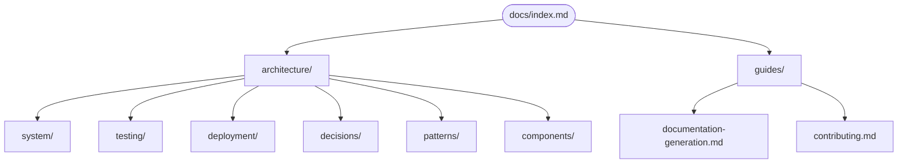

# StockEase Documentation

**Live site**: https://keglev.github.io/stockease/
**Repository**: https://github.com/keglev/stockease

---

## What Is StockEase?

StockEase is an enterprise-grade inventory management system built with Spring Boot 3.5.7, PostgreSQL, React 18, and TypeScript. It provides role-based product management via a REST API with JWT authentication, containerized deployment on Koyeb, and automated CI/CD via GitHub Actions.

---

## Documentation Map

---

## Start Here by Role

**New to the project** — [System Overview](./architecture/system/overview.md) → [Backend Architecture](./architecture/system/backend.md)

**Backend Developer** — [Backend Architecture](./architecture/system/backend.md) → [Service Layers](./architecture/system/layers.md) → [Testing Architecture](./architecture/testing/testing-architecture.md)

**Frontend Developer** — [Frontend Integration](./architecture/system/frontend-integration.md) → [Security Architecture](./architecture/system/security.md)

**DevOps / CI Engineer** — [Infrastructure](./architecture/deployment/infrastructure.md) → [CI/CD Pipeline](./architecture/deployment/ci-pipeline.md) → [Docker Strategy](./architecture/deployment/docker-strategy.md)

**QA / Test Engineer** — [Test Pyramid](./architecture/testing/pyramid.md) → [Coverage Matrix](./architecture/testing/matrix.md) → [Naming Conventions](./architecture/testing/naming-conventions.md)

**Security reviewer** — [Security Architecture](./architecture/system/security.md) → [Security Patterns](./architecture/patterns/security-patterns.md) → [ADR 003 Authentication](./architecture/decisions/003-authentication-mechanism.md)

---

## Topic Flows

**Authentication & Security**
[System Overview](./architecture/system/overview.md) → [Security Architecture](./architecture/system/security.md) → [Security Patterns](./architecture/patterns/security-patterns.md) → [ADR 003](./architecture/decisions/003-authentication-mechanism.md)

**Database & Data Access**
[System Overview](./architecture/system/overview.md) → [Service Layers](./architecture/system/layers.md) → [Repository Pattern](./architecture/patterns/repository-pattern.md) → [ADR 001](./architecture/decisions/001-database-choice.md)

**Testing**
[Testing Architecture](./architecture/testing/testing-architecture.md) → [Test Pyramid](./architecture/testing/pyramid.md) → [Coverage Matrix](./architecture/testing/matrix.md) → [CI Pipeline Tests](./architecture/testing/ci-pipeline-tests.md)

**Deployment**
[Infrastructure](./architecture/deployment/infrastructure.md) → [CI/CD Pipeline](./architecture/deployment/ci-pipeline.md) → [Docker Strategy](./architecture/deployment/docker-strategy.md) → [Staging & Config](./architecture/deployment/staging-config.md)

---

## Directory Indexes

Each directory has its own index with full document lists and role-based reading paths:

- [Architecture root index](./architecture/index.md)
- [System index](./architecture/system/index.md)
- [Testing index](./architecture/testing/testing-architecture.md)
- [Deployment index](./architecture/deployment/index.md)
- [Decisions index](./architecture/decisions/index.md)
- [Patterns index](./architecture/patterns/index.md)
- [Components index](./architecture/components/index.md)

---

## Guides

- [Documentation Generation](./guides/documentation-generation.md) — how the pipeline converts markdown to HTML and deploys to GitHub Pages
- [Contributing](./guides/contributing.md) — how to write, update, and maintain documentation

---

**Last Updated**: June 2026
**Status**: Current
